# 微信公众号矩阵管理系统 设计文档

> 面向教学课题的系统设计 · v1.1 · 2026-07-03
> 技术栈:Python 3.11 / FastAPI / Celery / MySQL 8.0 / Redis 7 · Playwright(发布通道)· Vue 3 / TypeScript / Element Plus / wangEditor · Docker Compose 部署
>
> **v1.1 修订要点**:发布通道由"微信发布 API"改为"浏览器自动化模拟人工发表",详见下方《重要设计声明》。

本文档针对客户提出的六项需求——公众号管理、员工(运营)账号分配、内容编排、内容采集、采集内容与自有公众号的映射、全自动化发文——给出完整的系统设计。设计遵循三条主线:**微信 API 调用单点收口(wx-gateway)**、**发文全生命周期由统一状态机驱动**、**采集与转载严守合规红线(默认人工审核、授权登记、Mock 教学通道)**。

**目录**

1. 项目概述与总体架构
2. 数据库设计(18 张表,唯一数据字典事实源)
3. 公众号管理与员工权限模块
4. 内容中心(内容编排)
5. 采集中心
6. 映射引擎
7. 发布引擎与微信 API 网关
8. 合规风险与教学实施规划
- 附录A 全局字典(状态机 / 权限点 / API 前缀 / 参数速查)

---

## 重要设计声明(v1.1 修订):发布通道采用浏览器模拟,不走微信发布 API

> 本声明优先级**高于正文中一切"经 `freepublish` / 发布 API 提交"的旧表述**。凡冲突处以本声明为准。

**背景与决策。** 微信"发布能力"(`/cgi-bin/freepublish/*`)与群发(`/cgi-bin/message/mass/sendall`)接口**仅对已认证公众号开放**。本课题目标用户(学生 / 中小运营)实际持有的多为**未认证个人订阅号**,不具备任何草稿 / 发布 / 群发的 API 权限——若坚持走 API,需求 6"全自动发文"在其真实账号上无法落地。故**发布通道整体改为浏览器自动化**:由 Playwright 驱动 Chromium 登录并操作公众号后台(mp.weixin.qq.com),模拟人工完成建稿与发表,**彻底不使用发布 API**,任意账号类型(含未认证订阅号)均可发布。

**机制。** 登录(首次扫码,之后复用 `storage_state` 持久化的 cookies)→ 新建图文 → 填标题 / 作者 / 正文 / 封面(正文图片经**编辑器上传**,不再调 `uploadimg` API)→ 保存草稿 → **发表**(发布到公众号主页 / 合集,不推送粉丝,可自动化)→ 回读结果。"群发"(推送粉丝)因每次需管理员扫码 / 短信确认,作为**显式人工动作**,不纳入自动流水线。

**架构影响。**
- wx-gateway 的真实发布通道由 `RealChannel`(httpx→api.weixin.qq.com)**替换为 `BrowserChannel`(Playwright→mp.weixin.qq.com)**;原 `MockChannel` 更名 `MockBrowserChannel`,仍为教学验收主线。
- 发布路径不再需要 `access_token` 中控与服务器出口 IP 白名单(登录态改为浏览器 cookies / `storage_state`)。
- `publish_log` 的 phase 由 `DRAFT_ADD / FREEPUBLISH_SUBMIT / FREEPUBLISH_POLL` 改为页面步骤 `LOGIN / NEW_DRAFT / FILL / UPLOAD_IMG / SAVE / PUBLISH / RESULT`。
- 统一发文状态机**不变**(`SCHEDULED→PUBLISHING→PUBLISHED / FAILED`,重试 `FAILED→SCHEDULED`)。
- **移除"必须提供已认证公众号"的硬前置**(原 8.3 节 M2 前置条件):浏览器模拟对未认证订阅号即可发布;真实链路终验改为"用户以自有订阅号扫码登录一次,即可在真实后台自动发表"。

**合规红线(如实告知,教学须显著讲解)。**
1. **脆弱性**:强依赖后台页面 DOM 结构,微信改版即失效,须持续维护选择器配置;
2. **性能**:单篇发布需数秒至十几秒,必须**串行、限频**,不可并发批量;
3. **平台风控与规范**:微信有反自动化机制(登录扫码、群发管理员确认、操作频控、异常登录风控),《微信公众平台运营规范》对自动化 / 批量操作有约束。**教学演示一律走 `MockBrowserChannel` 本地模拟,不触碰真实微信**;学生若用真实账号验证,须用**自己的账号、低频、自担风险**,禁止规模化滥用、禁止代他人操作、禁止绕过任何验证机制;
4. **数据安全**:浏览器登录态(cookies / `storage_state`)等同账号凭据,须加密存储、最小权限、可一键失效。

**教学落地。** `MockBrowserChannel`(不出网、可配置成功 / 失败 / 需确认等分支)为主线验收路径,全状态机与告警链路照常跑通;`BrowserChannel`(真实 Playwright 自动化,`account_type` 非模拟号时启用)作为"用自有账号真跑"的实现提供,因页面结构随微信版本变化,以结构化步骤 + 可维护选择器配置的形式交付,真实可用性以届时页面为准。

**真实通道实现状态(v1.1)。** `BrowserChannel` 已按**未认证个人订阅号**补为可运行实现:支持 `publish_type=1` 发表(发布到主页、不推粉丝、可全自动)与 `publish_type=2` 群发(推粉丝、需管理员扫码 / 短信确认、半自动),含 `WX_PUBLISH_DRY_RUN` 安全试跑(只建草稿不发表)、每步截图排障、`WX_SELECTORS` 可维护选择器表;配套 `scripts/wx_login.py`(扫码捕获登录态 storage_state)。选择器需按实际后台校准,详见《浏览器发布运行手册》(`docs/浏览器发布运行手册.md`)。登录态与截图落 `secrets/` 与 `media/`(均 gitignore,等同凭据)。

---


## 1 项目概述与总体架构

### 1.1 需求解读

本课题面向 MCN 机构/新媒体运营团队的典型场景:一个团队同时运营几十个微信公众号,需要"多号统一管理、员工分权操作、内容一处编排、外部内容合规采集、采集内容自动流转到自有号、最终全自动发布"。下面对客户六大需求逐条解读,并给出与系统模块、核心数据表的映射关系。

**需求 1:公众号的管理。** 系统需集中托管矩阵内所有公众号的基础档案:AppID/AppSecret、账号类型(订阅号/服务号)、认证状态、头像与简介、IP 白名单配置状态、access_token 健康状态等。难点在于凭据安全存储(AppSecret 加密落库)与 token 生命周期管理——微信规定 access_token 有效期 7200 秒且必须中控统一刷新,因此该需求拆为两块:静态档案管理归 `mp-manager`,动态凭据/token 归 `wx-gateway`。

**需求 2:员工(运营)账号分配管理。** 系统内部用户的账号、角色、权限管理,以及"哪个运营负责哪些公众号"的分配关系。系统角色定为五个:超级管理员(`super_admin`)、管理员(`admin`)、主编(`chief_editor`)、运营(`operator`)、审核员(`auditor`)。这是典型 RBAC + 数据权限(行级权限)问题:功能权限由角色决定,数据可见范围由 `mp_account_assign` 决定——运营(operator)只能看到并操作分配给自己的公众号及其内容。归 `auth-rbac` 模块。

**需求 3:公众号内容编排。** 自有图文的创作与编排:富文本编辑(wangEditor)、多图文组合(一次草稿最多 8 篇)、素材库(封面图、正文图——正文图必须经 `/cgi-bin/media/uploadimg` 换取微信域内 URL 才能在正文中引用)、定时排期。归 `content-center`,发布排期与 `publish-engine`、`scheduler` 协作。

**需求 4:公众号内容采集。** 从**授权或公开的内容源**(内容方自行发布的公开 RSS/API、人工授权后手工导入的内容、教学用 Mock 数据源)定时抓取文章,结构化入库、去重。**合规红线**:仅采集公开可访问或已获授权的内容、遵守 robots 协议与合理抓取频率、不得破解或绕过任何访问控制;采集所得仅进入内部候选池,是否发布必须过人工审核。归 `collector`,由 `scheduler` 定时触发。

**需求 5:采集内容与自有公众号的映射。** 回答"采集到的这篇文章应该流向矩阵里的哪个号"。通过 `mapping_rule` 定义"采集源/关键词/分类 → 目标公众号 + 转换策略(如统一尾部签名、来源声明模板、封面裁剪规格)"的规则,由 `mapping-engine` 执行匹配与内容转换。**合规红线**:带"原创"标的文章转载,须由运营线下取得源公众号授权(即源号将目标号加入其转载白名单),并在 `collect_source` 上人工登记授权状态(`whitelist_confirmed=1`,留存授权凭证链接 `auth_proof_url`);微信未提供任何可查询他人公众号转载白名单的 API,系统不做自动校验,授权状态一律以人工登记为准。映射引擎对带"原创"标且其采集源未完成授权登记(`whitelist_confirmed=0`)的文章直接拦截——置 `UNMATCHED` 并记录拦截原因,不进入发布流。

**需求 6:全自动化发文。** 内容经审核后自动完成:建草稿(`/cgi-bin/draft/add`)→ 按排期提交发布(`/cgi-bin/freepublish/submit`,得 `publish_id`)→ 轮询发布结果(`/cgi-bin/freepublish/get`)→ 回写状态与日志。全程遵守统一状态机(状态全集与合法迁移以第 2 章定义为唯一事实源,本章仅引用),从 `COLLECTED` 一路推进至 `PUBLISHED`,失败进 `FAILED` 并支持按策略重试(`FAILED → SCHEDULED`)。注意发布能力仅发布到公众号主页、不推送粉丝;若需推送粉丝须走群发接口且受频次限制(认证订阅号 1 次/天、服务号 4 次/月),系统必须做频次配额控制。归 `publish-engine` + `wx-gateway` + `scheduler`。

**需求—模块—数据表映射表:**

| # | 客户需求 | 主责模块 | 协作模块 | 核心数据表 |
|---|---------|---------|---------|-----------|
| 1 | 公众号的管理 | mp-manager | wx-gateway(token/白名单探测) | `mp_account` |
| 2 | 员工账号分配管理 | auth-rbac | mp-manager | `sys_user`, `sys_role`, `sys_user_role`, `mp_account_assign` |
| 3 | 公众号内容编排 | content-center | wx-gateway(素材上传)、publish-engine | `content_article`, `content_material` |
| 4 | 公众号内容采集 | collector | scheduler(定时触发) | `collect_source`, `collect_article` |
| 5 | 采集内容映射 | mapping-engine | content-center(转换落库) | `mapping_rule`, `collect_article`, `content_article` |
| 6 | 全自动化发文 | publish-engine | wx-gateway、scheduler、content-center(审核) | `publish_task`, `publish_log`, `audit_record` |

### 1.2 总体架构

系统采用经典四层架构,单体应用 + 逻辑模块化(Modular Monolith)的形态,适合教学规模,又保留日后拆微服务的边界:

1. **接入层**:Nginx 统一入口,静态资源(Vue 3 构建产物)直出,`/api` 反向代理到 FastAPI;
2. **应用层**:FastAPI 进程承载八大业务模块的同步 API;耗时任务(采集、转换、发文、轮询)全部下沉为 Celery 任务,由 worker 异步执行,Celery Beat 负责周期调度;
3. **网关层(对外)**:`wx-gateway` 是系统内唯一允许直连微信 API 的组件,统一维护各公众号 access_token(中控刷新,缓存于 Redis,TTL = `expires_in - 300`,约 6900s),对内提供带限流、重试、错误码翻译的封装接口——其余模块一律不得自行调用微信接口;
4. **存储层**:MySQL 8.0 持久化全部业务数据,Redis 7 兼任缓存(token、会话)与 Celery broker/backend。

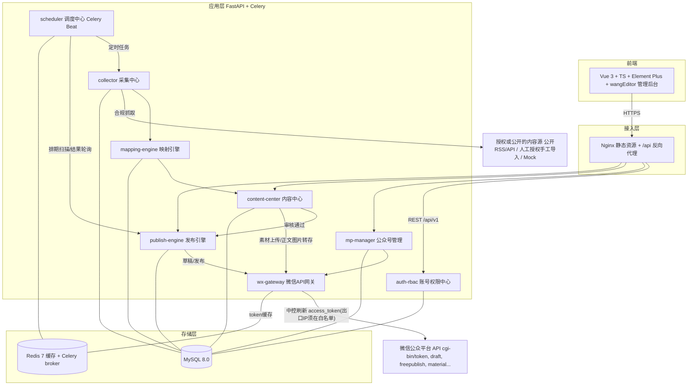

关键架构约束(教学时作为"设计红线"强调):

- **微信调用单点收口**:只有 wx-gateway 持有 AppSecret 解密权与外呼权,天然满足"access_token 须中控统一刷新"的平台要求,也便于统一处理 `40001`(token 失效)、`45009`(频控)等错误码;
- **状态机驱动**:一篇文章从采集到发布的全生命周期由统一状态机管理,状态全集与合法迁移定义见第 2 章(唯一事实源,本章及其他章节仅引用),任何模块只能沿合法迁移路径改状态,`audit_record` / `publish_log` 留痕;
- **同步/异步分离**:HTTP 请求只做读写与任务投递,任何可能超过 1~2 秒的操作(抓取、调用微信、图片转存)一律进 Celery 队列。

### 1.3 技术选型与理由

| 技术 | 选型 | 选择理由 | 教学适配性 |
|------|------|---------|-----------|
| 后端框架 | FastAPI(Python 3.11) | 原生 async 适合大量 IO(调微信 API、抓取);Pydantic 模型即接口契约;自动生成 OpenAPI/Swagger 文档 | 类型标注即文档,学生可用 `/docs` 交互调试,降低前后端联调成本 |
| ORM | SQLAlchemy 2.0 | 2.0 风格统一了 Core/ORM 写法,支持类型提示;配 Alembic 做迁移 | 业界事实标准,声明式模型直接对应统一表设计,便于讲解范式与索引 |
| 异步任务 | Celery + Redis broker | 采集、发文、轮询天然是异步/定时任务;Beat 提供 cron 级调度;失败重试、任务链(chain)开箱即用 | 一套框架同时讲清"消息队列、延时任务、幂等重试"三个工程概念 |
| 数据库 | MySQL 8.0 | 业务为典型关系型(账号-分配-文章-任务多对多/一对多);JSON 字段可存微信原始报文 | 学生最熟悉的关系库,便于讲索引、事务、行级数据权限 |
| 缓存 | Redis 7 | access_token 缓存(TTL = `expires_in - 300`,约 6900s)、分布式锁(防并发刷新 token)、Celery broker 三合一 | 一个组件覆盖三种用法,教学性价比高 |
| 前端框架 | Vue 3 + TypeScript + Vite | Composition API + TS 类型安全;Vite 秒级热更新 | 中文资料丰富、上手曲线平缓,适合课程周期内完成 |
| UI / 编辑器 | Element Plus + wangEditor | 后台管理组件齐全;wangEditor 是国产开源富文本,中文文档好,可定制图片上传钩子(对接 `uploadimg`) | 免去自研组件,学生聚焦业务逻辑 |
| 部署 | Docker Compose + Nginx | 单机一条 `docker compose up` 拉起全栈;Nginx 统一入口并固定出口 IP(配合微信 IP 白名单) | 屏蔽环境差异,机房/云主机均可复现 |

### 1.4 模块职责一览表

| 模块 | 核心职责 | 对外 API 前缀 | 读写的核心表 | 不做什么(边界) |
|------|---------|--------------|-------------|----------------|
| auth-rbac | 登录(JWT)、用户/角色/权限管理(五角色:super_admin/admin/chief_editor/operator/auditor)、运营-公众号分配、数据权限过滤 | `/api/v1/auth`, `/api/v1/users`, `/api/v1/roles` | `sys_user`, `sys_role`, `sys_user_role`, `mp_account_assign` | 不管理公众号档案本身 |
| mp-manager | 公众号档案 CRUD、AppSecret 加密存储、账号健康检查(token 可用性、IP 白名单探测) | `/api/v1/mp-accounts` | `mp_account` | 不直接调微信 API(委托 wx-gateway) |
| content-center | 自有图文编排、多图文组稿(≤8 篇/草稿)、素材库、提审管道(正文外链图片经 `/cgi-bin/media/uploadimg` 转存为微信域内 URL,按号+文件哈希去重)、审核流(`PENDING_REVIEW → APPROVED/REJECTED`) | `/api/v1/articles`, `/api/v1/materials`, `/api/v1/audits` | `content_article`, `content_material`, `audit_record` | 不负责发布执行 |
| collector | 采集源管理(含转载授权人工登记 `whitelist_confirmed`/`auth_proof_url`)、定时抓取、正文清洗与结构化、URL/标题指纹去重,产出 `COLLECTED` 态文章 | `/api/v1/collect/sources`, `/api/v1/collect/articles` | `collect_source`, `collect_article` | 不做内容改写与目标号选择 |
| mapping-engine | 规则匹配(源/关键词/分类 → 目标号)、内容转换(签名、来源声明、外链图片仅标记待转存清单,不实际上传),推进 `COLLECTED → MAPPED → TRANSFORMED`(无规则命中置 `UNMATCHED`);拦截带"原创"标且采集源未人工登记转载授权(`whitelist_confirmed=0`)的文章,置 `UNMATCHED` 并记录拦截原因 | `/api/v1/mapping/rules`, `/api/v1/mapping/executions` | `mapping_rule`, `collect_article`, `content_article` | 不做人工审核决策 |
| publish-engine | 发布任务编排:建草稿、按排期提交发布、失败重试与配额控制,推进 content_article `APPROVED → DRAFT_CREATED` 与 publish_task `SCHEDULED → PUBLISHING → PUBLISHED/FAILED`(重试迁移 `FAILED → SCHEDULED`,状态机定义见第 2 章) | `/api/v1/publish/tasks`, `/api/v1/publish/logs` | `publish_task`, `publish_log` | 不直接持有 token |
| wx-gateway | 唯一微信外呼出口:token 中控刷新与缓存、`draft/*`、`freepublish/*`、`material/add_material`、`media/uploadimg` 封装,限流、重试、错误码翻译 | 仅内部 Python 接口/内部路由 | `mp_account`(读)、Redis(token) | 不含业务逻辑 |
| scheduler | Celery Beat 周期任务:采集调度、排期扫描、发布结果轮询、token 预刷新、失败任务重试扫描 | 无 HTTP(配置化 beat_schedule) | 各任务表(读) | 不实现业务本体,只负责"何时触发" |

### 1.5 部署架构

单机 Docker Compose 部署,共 6 类服务;`api`、`worker`、`beat` 共用同一份代码镜像(不同启动命令),保证任务代码与接口代码永远同版本。

| 服务 | 镜像/构建 | 启动命令(要点) | 端口 | 所属网络 |
|------|----------|----------------|------|---------|
| nginx | `nginx:1.25-alpine` | 挂载 `nginx.conf` 与前端 `dist/` | `80/443` → 宿主机 | frontend, backend |
| api | 本地构建 `app:latest` | `uvicorn app.main:app --host 0.0.0.0 --port 8000` | 仅内网 8000 | backend |
| worker | 同 `app:latest` | `celery -A app.celery_app worker -Q collect,mapping,publish,wxapi -c 4` | 无 | backend |
| beat | 同 `app:latest` | `celery -A app.celery_app beat` | 无 | backend |
| mysql | `mysql:8.0` | `--character-set-server=utf8mb4` | 仅内网 3306 | backend |
| redis | `redis:7-alpine` | `--appendonly yes --requirepass ***` | 仅内网 6379 | backend |

**任务→队列对照表**(worker `-Q` 参数所列四个队列与 Celery 任务的对应关系):

| Celery 任务 | 队列 |
|------------|------|
| `collect_scan` / `collect_fetch`(采集源扫描与抓取) | `collect` |
| `match_article` / `transform_article`(规则匹配与内容转换) | `mapping` |
| `execute_publish` / `poll_publish_result`(发布执行与结果轮询) | `publish` |
| token 预刷新与微信重调用类任务 | `wxapi` |

```yaml
# docker-compose.yml(骨架)
services:
  nginx:
    image: nginx:1.25-alpine
    ports: ["80:80", "443:443"]
    volumes:
      - ./nginx/nginx.conf:/etc/nginx/nginx.conf:ro
      - ./frontend/dist:/usr/share/nginx/html:ro
      - media_data:/data/media:ro          # 素材文件直出
    networks: [frontend, backend]
    depends_on: [api]

  api:
    build: ./backend
    command: uvicorn app.main:app --host 0.0.0.0 --port 8000
    env_file: .env                          # DB/Redis/加密密钥,不进镜像
    volumes: [media_data:/data/media]
    networks: [backend]
    depends_on: [mysql, redis]

  worker:
    build: ./backend
    command: celery -A app.celery_app worker -Q collect,mapping,publish,wxapi -c 4
    env_file: .env
    volumes: [media_data:/data/media]
    networks: [backend]
    depends_on: [mysql, redis]

  beat:
    build: ./backend
    command: celery -A app.celery_app beat
    env_file: .env
    networks: [backend]
    depends_on: [redis]

  mysql:
    image: mysql:8.0
    command: --character-set-server=utf8mb4 --collation-server=utf8mb4_unicode_ci
    env_file: .env
    volumes: [mysql_data:/var/lib/mysql]
    networks: [backend]

  redis:
    image: redis:7-alpine
    command: redis-server --appendonly yes --requirepass ${REDIS_PASSWORD}
    volumes: [redis_data:/data]
    networks: [backend]

networks:
  frontend: {}                              # 仅 nginx 暴露对外
  backend:
    internal: true                          # 业务与存储不可被外网直达

volumes:
  mysql_data: {}
  redis_data: {}
  media_data: {}                            # 采集图片/素材本地暂存
```

部署要点:

- **双网络隔离**:`backend` 设为 internal,MySQL/Redis/api 不暴露宿主端口,外部流量只能经 nginx 进入;
- **出口 IP 白名单**:worker(经 wx-gateway)调用微信 API 的出口即宿主机公网 IP,部署后须将该 IP 逐一加入每个公众号后台的 IP 白名单,否则调用报 `40164`;
- **队列划分**:`wxapi` 队列单独限并发,配合令牌桶限流,防止触发微信频控;`collect` 队列低优先级慢速跑,控制抓取礼貌性;`mapping` 队列承载规则匹配与内容转换,与采集、发布互相隔离,避免相互阻塞;
- **数据卷**:`mysql_data`/`redis_data` 保证持久化;`media_data` 在 api/worker 间共享,用于"采集图片下载 → 转存微信"的中转。

### 1.6 端到端核心流程总览

以"一篇外部文章被采集并全自动发到自有公众号"为主线,串起八大模块与统一状态机(粗体为状态迁移点;状态全集与合法迁移定义见第 2 章,本章仅引用)。

```mermaid
sequenceDiagram
    autonumber
    participant B as scheduler(Beat)
    participant C as collector
    participant M as mapping-engine
    participant CC as content-center
    participant U as 审核员(前端)
    participant P as publish-engine
    participant G as wx-gateway
    participant WX as 微信公众平台API

    B->>C: 定时触发采集任务(按 collect_source)
    C->>C: 抓取+清洗+去重, 写 collect_article【COLLECTED】
    C-->>M: 投递映射任务(Celery mapping 队列)
    M->>M: 匹配 mapping_rule, 选定目标 mp_account【MAPPED】(无规则命中→【UNMATCHED】)
    Note over M: 带"原创"标且采集源未人工登记转载授权(whitelist_confirmed=0)→ 置【UNMATCHED】并记录拦截原因, 不进发布流
    M->>CC: 套用转换模板生成 content_article【TRANSFORMED→PENDING_REVIEW】, 外链图片仅标记待转存清单, 计算建议排期写入 suggested_publish_at
    CC->>G: 提审管道: 正文外链图片转存 /cgi-bin/media/uploadimg(按 mp_account_id+file_hash 去重)
    G->>WX: uploadimg(带中控缓存的 access_token)
    WX-->>G: 返回微信域内图片URL(回填正文)
    U->>CC: 人工审核(内容安全/版权把关), 写 audit_record
    CC->>CC: 通过【APPROVED】(驳回则【REJECTED】终止)
    CC-->>P: 审核通过回调: 按 suggested_publish_at 创建 publish_task(scheduled_at)【SCHEDULED】
    B->>P: 排期扫描: 到点的 publish_task
    Note over P: 兜底校验: 建草稿前发现正文残留非微信域名图片 → 任务置【FAILED】并给出明确错误
    P->>G: 建草稿 /cgi-bin/draft/add(≤8篇图文)
    G->>WX: draft/add
    WX-->>G: media_id
    P->>P: draft_media_id 回写 content_article【APPROVED→DRAFT_CREATED】
    P->>G: /cgi-bin/freepublish/submit(media_id)
    G->>WX: freepublish/submit
    WX-->>G: publish_id
    P->>P: publish_task【SCHEDULED→PUBLISHING】写 publish_log
    loop 轮询直至成功/失败(指数退避)
        B->>P: 触发结果轮询
        P->>G: /cgi-bin/freepublish/get(publish_id)
        G->>WX: freepublish/get
        WX-->>G: publish_status + article_url
    end
    P->>P: 成功【PUBLISHED】/ 失败【FAILED→按策略重试, 重试迁移 FAILED→SCHEDULED, 不重复建稿】
    Note over P,WX: 发布仅上主页不推送粉丝; 如需推送走群发接口, 受配额约束(订阅号1次/天, 服务号4次/月), 由 publish-engine 做配额校验
```

该主流程中,`wx-gateway` 对每次外呼透明地完成 token 获取/续期(`GET /cgi-bin/token`,Redis 缓存 TTL = `expires_in - 300`,约 6900s,配合 Redis 分布式锁防并发刷新);人工审核(`PENDING_REVIEW`)是全自动链路中默认开启的人工卡点(仅可通过全局 `PUBLISH_REVIEW_ENABLED` 与号级 `mp_account.need_review` 双层审核开关配置自动过审,且每次自动过审均写 `audit_record` 留痕,见第 7 章)——这是内容安全与版权合规的底线设计,后续章节的各模块设计均以本流程与本章模块边界为基准展开。

## 2 数据库设计

本章给出本系统在 MySQL 8.0 下的完整物理模型。设计遵循三条总原则:

1. **表名与《统一模块划分》《统一数据表命名》严格一致**,其他章节(mp-manager、collector、mapping-engine、publish-engine 等)引用的表均以本章 DDL 为准;
2. **发文链路三表(collect_article / content_article / publish_task)的状态取值与《统一发文状态机》一一对应**,任何模块不得私自增删状态枚举(采集源运行态、多图文组状态等表局部状态字段不属于该状态机,见各表注释);
3. **敏感数据(AppSecret、用户密码)绝不明文落库**,`access_token` 一律**不进 MySQL**(由 wx-gateway 写入 Redis,TTL=`expires_in - 300`(约 6900 秒)并提前刷新),数据库中不出现任何可直接调用微信 API 的活凭据。

### 2.1 ER 总览

下图覆盖统一命名的全部 **18 张表**。四条主链路:**账号权限链**(sys_user → sys_user_role / mp_account_assign)、**内容生产链**(collect_source → collect_article → content_article → publish_task → publish_log)、**内容组织链**(content_draft_group / content_style_template / content_article_version / content_material + content_material_wx_ref)、**支撑链**(mapping_rule + mapping_rule_source、audit_record)。

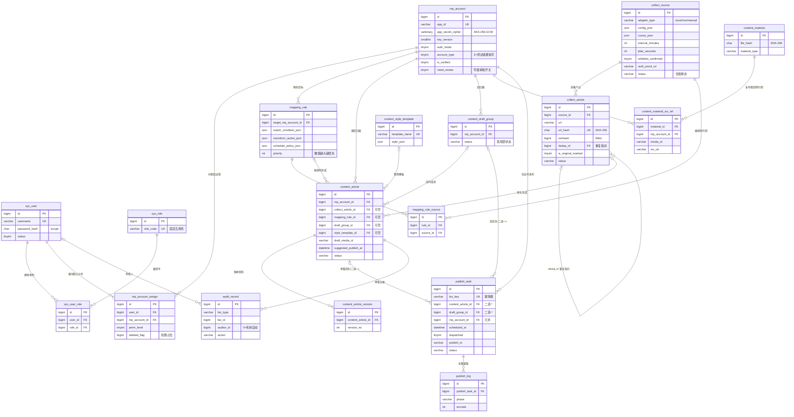

说明:`collect_article → content_article` 为零或一对多(人工自建图文时 `collect_article_id` 为 NULL);同一篇采集文章命中多条规则时,**每个目标号最多生成一篇** content_article(`uk_collect_mp` 同源同目标去重);`content_article → publish_task` 与 `content_draft_group → publish_task` **二选一非空**(CHECK 约束),同文/同组可多次排期(改期重发、freepublish 与 mass 各一次意图各占一行),但自动重试在原任务行内以 FAILED → SCHEDULED 完成、不新建行;`collect_article.dedup_of` 自关联指向近似去重命中时留存的那一行;`audit_record` 通过 `biz_type + biz_id` 弱关联业务表,当前只有 `content_article` 一种取值,预留扩展。

### 2.2 逐表 DDL

**通用约定**(所有表适用,不再逐条解释):

| 约定项 | 取值 |
|---|---|
| 引擎 / 字符集 | `InnoDB` / `utf8mb4` + `utf8mb4_0900_ai_ci`(公众号内容含 emoji,必须 utf8mb4) |
| 主键 | `id BIGINT UNSIGNED AUTO_INCREMENT`,业务上不复用、不暴露含义 |
| 时间字段 | `created_at` / `updated_at` 用 `DATETIME DEFAULT CURRENT_TIMESTAMP [ON UPDATE ...]`,统一存北京时间由应用层保证(容器内 `TZ=Asia/Shanghai`) |
| 软删除 | 业务实体表带 `is_deleted TINYINT`;`mp_account_assign` 用 `deleted_flag` 特殊方案(见 2.3.2);日志/流水/版本表(publish_log、audit_record、content_article_version)**只追加、物理删除或归档**,不做软删除;纯关系表(sys_user_role、mapping_rule_source)物理删除 |
| 外键 | 教学环境保留物理外键便于理解约束;生产可改逻辑外键并在服务层校验(见 2.3.6) |
| 状态列 | 用 `VARCHAR(32)` 存状态机枚举字符串而非 MySQL `ENUM`,避免加状态时 `ALTER TABLE`;合法值以 Python 侧 `StrEnum` 为单一事实来源 |

#### 2.2.1 auth-rbac:sys_user / sys_role / sys_user_role

```sql
CREATE TABLE sys_user (
    id            BIGINT UNSIGNED NOT NULL AUTO_INCREMENT,
    username      VARCHAR(64)  NOT NULL COMMENT '登录名; 软删时改写为 username#id 以释放唯一键',
    password_hash CHAR(60)     NOT NULL COMMENT 'bcrypt 哈希(cost=12), 形如 $2b$12$..., 永不存明文',
    real_name     VARCHAR(64)  NOT NULL DEFAULT '' COMMENT '姓名',
    phone         VARCHAR(20)  NOT NULL DEFAULT '' COMMENT '手机号',
    email         VARCHAR(128) NOT NULL DEFAULT '' COMMENT '邮箱',
    status        TINYINT      NOT NULL DEFAULT 1 COMMENT '1=启用 0=禁用(禁用即时踢下线)',
    last_login_at DATETIME     NULL,
    is_deleted    TINYINT      NOT NULL DEFAULT 0 COMMENT '软删除: 0=正常 1=已删',
    created_at    DATETIME     NOT NULL DEFAULT CURRENT_TIMESTAMP,
    updated_at    DATETIME     NOT NULL DEFAULT CURRENT_TIMESTAMP ON UPDATE CURRENT_TIMESTAMP,
    PRIMARY KEY (id),
    UNIQUE KEY uk_username (username),
    KEY idx_status (status)
) ENGINE=InnoDB DEFAULT CHARSET=utf8mb4 COLLATE=utf8mb4_0900_ai_ci
  COMMENT='系统用户(角色维度固定五角色, 见 sys_role.role_code)';
```

```sql
CREATE TABLE sys_role (
    id          BIGINT UNSIGNED NOT NULL AUTO_INCREMENT,
    role_code   VARCHAR(32)  NOT NULL COMMENT '角色编码, 固定五角色: super_admin/admin/chief_editor/operator/auditor',
    role_name   VARCHAR(64)  NOT NULL COMMENT '角色显示名',
    is_builtin  TINYINT      NOT NULL DEFAULT 0 COMMENT '1=内置角色不可删(五个预置角色均为1)',
    remark      VARCHAR(255) NOT NULL DEFAULT '',
    created_at  DATETIME     NOT NULL DEFAULT CURRENT_TIMESTAMP,
    updated_at  DATETIME     NOT NULL DEFAULT CURRENT_TIMESTAMP ON UPDATE CURRENT_TIMESTAMP,
    PRIMARY KEY (id),
    UNIQUE KEY uk_role_code (role_code)
) ENGINE=InnoDB DEFAULT CHARSET=utf8mb4 COLLATE=utf8mb4_0900_ai_ci
  COMMENT='角色(功能权限维度, 数据权限见 mp_account_assign); 角色→权限点映射固化为代码常量 ROLE_PERMISSIONS(见第3章与附录A全局权限点字典), 本表不存权限配置';
```

```sql
CREATE TABLE sys_user_role (
    id         BIGINT UNSIGNED NOT NULL AUTO_INCREMENT,
    user_id    BIGINT UNSIGNED NOT NULL,
    role_id    BIGINT UNSIGNED NOT NULL,
    created_at DATETIME NOT NULL DEFAULT CURRENT_TIMESTAMP,
    PRIMARY KEY (id),
    UNIQUE KEY uk_user_role (user_id, role_id),
    KEY idx_role (role_id),
    CONSTRAINT fk_ur_user FOREIGN KEY (user_id) REFERENCES sys_user (id),
    CONSTRAINT fk_ur_role FOREIGN KEY (role_id) REFERENCES sys_role (id)
) ENGINE=InnoDB DEFAULT CHARSET=utf8mb4 COLLATE=utf8mb4_0900_ai_ci
  COMMENT='用户-角色多对多(纯关系表, 物理删除)';
```

#### 2.2.2 mp-manager:mp_account / mp_account_assign

```sql
CREATE TABLE mp_account (
    id                BIGINT UNSIGNED NOT NULL AUTO_INCREMENT,
    mp_name           VARCHAR(64)  NOT NULL COMMENT '公众号名称',
    wx_original_id    VARCHAR(32)  NOT NULL DEFAULT '' COMMENT '原始ID(gh_ 开头)',
    app_id            VARCHAR(32)  NOT NULL COMMENT '开发者 AppID',
    app_secret_cipher VARBINARY(512) NOT NULL
        COMMENT 'AppSecret 密文, AES-256-GCM; 布局 nonce(12B)||ciphertext||tag(16B); 主密钥仅存环境变量 MP_SECRET_MASTER_KEY(base64); AAD=app_id+key_version',
    auth_mode         TINYINT      NOT NULL DEFAULT 1 COMMENT '接入方式: 1=开发者密钥直连 2=第三方平台授权(预留, 本期不实现)',
    key_version       SMALLINT UNSIGNED NOT NULL DEFAULT 1 COMMENT '加密主密钥版本; 解密按本行版本取密钥, 支持密钥轮换(新写入用当前最新版本)',
    account_type      TINYINT      NOT NULL COMMENT '1=订阅号 2=服务号 3=测试或模拟号; 群发配额: 认证订阅号1次/天, 认证服务号4次/月; 测试号不支持草稿箱(/cgi-bin/draft/*)与发布(/cgi-bin/freepublish/*)接口, =3 时 wx-gateway 将 draft/freepublish 调用路由到内置 MockChannel',
    is_verified       TINYINT      NOT NULL DEFAULT 0 COMMENT '是否微信认证; 群发接口(/cgi-bin/message/mass/sendall)仅认证号可用; 未认证订阅号无群发, 其草稿/发布接口可用性存在权限不确定性, 设计上按不可用做保守假设(以官方《接口权限说明》与真机验证为准)',
    need_review       TINYINT      NOT NULL DEFAULT 1 COMMENT '号级审核开关(默认开): 与全局 PUBLISH_REVIEW_ENABLED 构成双层开关, 两层同时关闭才允许 TRANSFORMED→APPROVED 自动过审; 仅 super_admin 可修改, 修改与每次自动过审均写 audit_record(见 2.2.7)',
    avatar_url        VARCHAR(512) NOT NULL DEFAULT '',
    qrcode_url        VARCHAR(512) NOT NULL DEFAULT '',
    ip_whitelist_ok   TINYINT      NOT NULL DEFAULT 0 COMMENT '服务器出口IP是否已加入该号后台IP白名单(接入检查项, wx-gateway 调用前置校验)',
    last_verified_at  DATETIME     NULL COMMENT '最近一次凭据验证成功时间(成功取到 access_token 即刷新)',
    status            TINYINT      NOT NULL DEFAULT 1 COMMENT '1=正常 2=凭据异常(40125等) 0=停用',
    remark            VARCHAR(255) NOT NULL DEFAULT '',
    created_by        BIGINT UNSIGNED NOT NULL COMMENT '录入人(管理员)',
    is_deleted        TINYINT      NOT NULL DEFAULT 0,
    created_at        DATETIME     NOT NULL DEFAULT CURRENT_TIMESTAMP,
    updated_at        DATETIME     NOT NULL DEFAULT CURRENT_TIMESTAMP ON UPDATE CURRENT_TIMESTAMP,
    PRIMARY KEY (id),
    UNIQUE KEY uk_app_id (app_id),
    KEY idx_status (status)
) ENGINE=InnoDB DEFAULT CHARSET=utf8mb4 COLLATE=utf8mb4_0900_ai_ci
  COMMENT='公众号档案; access_token 不落本表, 由 wx-gateway 统一维护在 Redis(key: wx:token:{app_id}, TTL=expires_in-300)';
```

`app_secret_cipher` 的加解密是**全系统唯一入口**,收敛在 `app/core/crypto.py`,由 mp-manager 服务层在写入/读取 `app_secret_cipher` 时显式调用(AAD 依赖同行的 `app_id` 与 `key_version`,故不采用单列 TypeDecorator 自动加解密),业务代码永远拿到的是明文 `str`、存的是密文 `bytes`:

```python
# app/core/crypto.py
import base64
import os
from cryptography.hazmat.primitives.ciphers.aead import AESGCM

# 主密钥: base64 解码后 32 字节 → AES-256; 只存部署环境变量, 不进代码库/镜像
# 轮换时以 {版本: 密钥} 追加新版本, 旧密文仍按行内 key_version 解密
_KEYS = {1: base64.b64decode(os.environ["MP_SECRET_MASTER_KEY"])}
_CURRENT_VERSION = max(_KEYS)

def _aad(app_id: str, key_version: int) -> bytes:
    return f"{app_id}:{key_version}".encode()   # AAD 绑定归属号与密钥版本, 防密文跨行/跨版本挪用

def encrypt_secret(plain: str, app_id: str) -> tuple[bytes, int]:
    nonce = os.urandom(12)                       # GCM 要求 nonce 每次随机且不重复
    ct = AESGCM(_KEYS[_CURRENT_VERSION]).encrypt(
        nonce, plain.encode(), _aad(app_id, _CURRENT_VERSION))
    return nonce + ct, _CURRENT_VERSION          # nonce(12B) || ciphertext || tag(16B); 版本号回写 key_version 列

def decrypt_secret(blob: bytes, app_id: str, key_version: int) -> str:
    return AESGCM(_KEYS[key_version]).decrypt(
        blob[:12], blob[12:], _aad(app_id, key_version)).decode()
```

选 AES-GCM 而非 CBC 的原因:GCM 自带完整性校验(auth tag),密文被篡改会直接抛异常而不是解出乱码去调微信接口;密码则相反——登录密码只需**验证**不需还原,必须用单向的 bcrypt(`passlib.CryptContext(schemes=["bcrypt"], bcrypt__rounds=12)`),绝不用可逆加密。

```sql
CREATE TABLE mp_account_assign (
    id            BIGINT UNSIGNED NOT NULL AUTO_INCREMENT,
    user_id       BIGINT UNSIGNED NOT NULL COMMENT '运营用户',
    mp_account_id BIGINT UNSIGNED NOT NULL COMMENT '被分配的公众号',
    perm_level    TINYINT NOT NULL DEFAULT 2
        COMMENT '号内权限级别: 1=只读 2=编辑 3=编辑+提审 4=可触发发布(逐级包含)',
    assigned_by   BIGINT UNSIGNED NOT NULL COMMENT '分配人(管理员)',
    deleted_flag  BIGINT UNSIGNED NOT NULL DEFAULT 0
        COMMENT '软删占位: 0=有效; 取消分配时 UPDATE 为本行 id, 使唯一键可被重新占用(见 2.3.2)',
    created_at    DATETIME NOT NULL DEFAULT CURRENT_TIMESTAMP,
    updated_at    DATETIME NOT NULL DEFAULT CURRENT_TIMESTAMP ON UPDATE CURRENT_TIMESTAMP,
    PRIMARY KEY (id),
    UNIQUE KEY uk_user_mp (user_id, mp_account_id, deleted_flag),
    KEY idx_mp (mp_account_id),
    CONSTRAINT fk_asg_user FOREIGN KEY (user_id) REFERENCES sys_user (id),
    CONSTRAINT fk_asg_mp   FOREIGN KEY (mp_account_id) REFERENCES mp_account (id)
) ENGINE=InnoDB DEFAULT CHARSET=utf8mb4 COLLATE=utf8mb4_0900_ai_ci
  COMMENT='运营-公众号分配(多对多+权限属性), operator 数据权限的唯一依据; super_admin/admin/chief_editor/auditor 全号可见为角色特权, 不走本表';
```

#### 2.2.3 collector:collect_source / collect_article

```sql
CREATE TABLE collect_source (
    id                  BIGINT UNSIGNED NOT NULL AUTO_INCREMENT,
    source_name         VARCHAR(64)  NOT NULL COMMENT '采集源名称',
    adapter_type        VARCHAR(32)  NOT NULL COMMENT '适配器类型: mock/rss/manual(适配器模型见第5章; 其他类型仅保留扩展点, 本系统不实现)',
    config_json         JSON NULL COMMENT '适配器私有配置, 例 rss: {"feed_url":"https://..."}; mock: {"dataset":"campus_news"}',
    cursor_json         JSON NULL COMMENT '增量采集游标, 适配器自管理, 例 {"last_pub_time":"2026-07-01 08:00:00","last_guid":"..."}',
    interval_minutes    INT UNSIGNED NOT NULL DEFAULT 120 COMMENT '采集间隔(分钟); Celery Beat 每5分钟扫描 interval 到期的源并投递采集任务',
    jitter_seconds      INT UNSIGNED NOT NULL DEFAULT 60 COMMENT '随机抖动上限(秒), 每次实际执行时间加 random(0, jitter), 防止同刻并发抓取',
    next_run_at         DATETIME NULL COMMENT '下次应执行时间 = 上次完成时间 + interval_minutes + random(0, jitter_seconds)',
    whitelist_confirmed TINYINT NOT NULL DEFAULT 0 COMMENT '原创转载授权已人工确认: 微信没有任何API可查询他人公众号的转载白名单, 只能由运营线下取得授权后手工置位; freepublish 返回 publish_status=2(原创校验失败)时自动回写为0并告警',
    auth_proof_url      VARCHAR(512) NOT NULL DEFAULT '' COMMENT '授权凭证链接(授权邮件/截图存档地址)',
    status              VARCHAR(16) NOT NULL DEFAULT 'ACTIVE' COMMENT '源运行状态(表局部字段, 不属于统一发文状态机): ACTIVE=正常 PAUSED=人工停用 CIRCUIT_OPEN=熔断(连续失败达阈值自动进入并告警, 人工排查后恢复 ACTIVE)',
    fail_count          INT UNSIGNED NOT NULL DEFAULT 0 COMMENT '连续失败次数, >=5 置 CIRCUIT_OPEN',
    created_by          BIGINT UNSIGNED NOT NULL,
    is_deleted          TINYINT NOT NULL DEFAULT 0,
    created_at          DATETIME NOT NULL DEFAULT CURRENT_TIMESTAMP,
    updated_at          DATETIME NOT NULL DEFAULT CURRENT_TIMESTAMP ON UPDATE CURRENT_TIMESTAMP,
    PRIMARY KEY (id),
    KEY idx_scan (status, next_run_at) COMMENT 'Beat 扫描: WHERE status=ACTIVE AND next_run_at<=NOW() AND is_deleted=0'
) ENGINE=InnoDB DEFAULT CHARSET=utf8mb4 COLLATE=utf8mb4_0900_ai_ci
  COMMENT='采集源配置(适配器模型, 见第5章); 采集手段的合规边界见采集中心章节';
```

```sql
CREATE TABLE collect_article (
    id                  BIGINT UNSIGNED NOT NULL AUTO_INCREMENT,
    source_id           BIGINT UNSIGNED NOT NULL,
    title               VARCHAR(255)  NOT NULL,
    author              VARCHAR(64)   NOT NULL DEFAULT '' COMMENT '原文作者(版权溯源必填项之一)',
    url                 VARCHAR(1024) NOT NULL COMMENT '原文链接(版权溯源, 转载声明引用)',
    url_hash            CHAR(64)      NOT NULL COMMENT 'SHA-256(规范化URL), 精确去重指纹, 见 2.3.1',
    simhash             BIGINT UNSIGNED NOT NULL DEFAULT 0 COMMENT '正文 64bit SimHash, 近似去重指纹',
    simhash_b0          SMALLINT UNSIGNED GENERATED ALWAYS AS ((simhash >> 48) & 0xFFFF) STORED,
    simhash_b1          SMALLINT UNSIGNED GENERATED ALWAYS AS ((simhash >> 32) & 0xFFFF) STORED,
    simhash_b2          SMALLINT UNSIGNED GENERATED ALWAYS AS ((simhash >> 16) & 0xFFFF) STORED,
    simhash_b3          SMALLINT UNSIGNED GENERATED ALWAYS AS ( simhash        & 0xFFFF) STORED,
    dedup_of            BIGINT UNSIGNED NULL COMMENT '近似去重命中时指向留存的那篇 collect_article.id, 同时本行置 UNMATCHED(见 2.3.1); NULL=非重复',
    digest              VARCHAR(255)  NOT NULL DEFAULT '' COMMENT '摘要',
    raw_html            LONGTEXT      NOT NULL COMMENT '抓取到的原始HTML留档(图片仍为源站URL; 采集侧只做图片本地化落盘防盗链, 不调微信接口)',
    clean_html          LONGTEXT      NOT NULL COMMENT '清洗后正文HTML(去脚本/样式/跟踪像素), 映射转换与指纹计算的输入',
    cover_url           VARCHAR(512)  NOT NULL DEFAULT '',
    is_original_marked  TINYINT       NOT NULL DEFAULT 0 COMMENT '源文是否带原创标(采集侧尽力识别); =1 且源 whitelist_confirmed=0 时, 映射引擎将本文置 UNMATCHED 并记录拦截原因',
    source_publish_time DATETIME      NULL COMMENT '原文发布时间',
    status              VARCHAR(32)   NOT NULL DEFAULT 'COLLECTED' COMMENT '本表状态段: COLLECTED/UNMATCHED/MAPPED/TRANSFORMED, 迁移白名单见 2.3.3',
    collected_at        DATETIME      NOT NULL DEFAULT CURRENT_TIMESTAMP,
    is_deleted          TINYINT       NOT NULL DEFAULT 0,
    created_at          DATETIME      NOT NULL DEFAULT CURRENT_TIMESTAMP,
    updated_at          DATETIME      NOT NULL DEFAULT CURRENT_TIMESTAMP ON UPDATE CURRENT_TIMESTAMP,
    PRIMARY KEY (id),
    UNIQUE KEY uk_url_hash (url_hash),
    KEY idx_source_status (source_id, status),
    KEY idx_dedup (dedup_of),
    KEY idx_sb0 (simhash_b0), KEY idx_sb1 (simhash_b1),
    KEY idx_sb2 (simhash_b2), KEY idx_sb3 (simhash_b3),
    CONSTRAINT fk_ca_source FOREIGN KEY (source_id) REFERENCES collect_source (id),
    CONSTRAINT fk_ca_dedup  FOREIGN KEY (dedup_of) REFERENCES collect_article (id)
) ENGINE=InnoDB DEFAULT CHARSET=utf8mb4 COLLATE=utf8mb4_0900_ai_ci
  COMMENT='采集文章库(全网内容池, 未绑定任何自有公众号)';
```

#### 2.2.4 content-center:content_article / content_material / content_material_wx_ref / content_draft_group / content_style_template / content_article_version

```sql
CREATE TABLE content_article (
    id                    BIGINT UNSIGNED NOT NULL AUTO_INCREMENT,
    mp_account_id         BIGINT UNSIGNED NOT NULL COMMENT '归属公众号(一篇自有图文只属于一个号)',
    collect_article_id    BIGINT UNSIGNED NULL COMMENT '来源采集文章; NULL=运营手工创建',
    mapping_rule_id       BIGINT UNSIGNED NULL COMMENT '由哪条映射规则生成; NULL=手工创建',
    draft_group_id        BIGINT UNSIGNED NULL COMMENT '所属多图文组(content_draft_group); NULL=单篇',
    group_position        TINYINT       NOT NULL DEFAULT 0 COMMENT '组内顺序(0起); 组任务按此排序组装 articles 数组, 一次 draft/add 最多8篇',
    style_template_id     BIGINT UNSIGNED NULL COMMENT '编排时套用的排版模板(content_style_template); NULL=未套用',
    title                 VARCHAR(64)   NOT NULL COMMENT '标题(微信草稿限制64字, 应用层校验)',
    author                VARCHAR(64)   NOT NULL DEFAULT '',
    digest                VARCHAR(120)  NOT NULL DEFAULT '' COMMENT '摘要(微信限制约120字)',
    content_html          LONGTEXT      NOT NULL COMMENT '编排后正文; 提审时由 content-center 的HTML处理管道将外链图片经 /cgi-bin/media/uploadimg 转存为微信域URL(按 content_material_wx_ref 以 (mp_account_id, file_hash) 去重, 避免重复上传)',
    thumb_media_id        VARCHAR(128)  NOT NULL DEFAULT '' COMMENT '封面永久素材 media_id(material/add_material 上传)',
    draft_media_id        VARCHAR(128)  NOT NULL DEFAULT '' COMMENT '草稿箱 media_id, draft/add 成功后回填, 状态同步进入 DRAFT_CREATED; publish_task 不冗余存此字段',
    suggested_publish_at  DATETIME      NULL COMMENT '建议排期时间: 映射引擎 transform 完成时按规则 schedule_policy_json 计算暂存(不直接建任务); 审核通过回调按此创建 publish_task; NULL=由运营手动排期',
    need_open_comment     TINYINT       NOT NULL DEFAULT 0,
    only_fans_can_comment TINYINT       NOT NULL DEFAULT 0,
    status                VARCHAR(32)   NOT NULL DEFAULT 'TRANSFORMED'
        COMMENT '本表状态段: TRANSFORMED/PENDING_REVIEW/APPROVED/REJECTED/DRAFT_CREATED, 迁移白名单见 2.3.3',
    created_by            BIGINT UNSIGNED NOT NULL COMMENT '创建人; 规则自动生成时为系统账号 id=1',
    is_deleted            TINYINT       NOT NULL DEFAULT 0,
    created_at            DATETIME      NOT NULL DEFAULT CURRENT_TIMESTAMP,
    updated_at            DATETIME      NOT NULL DEFAULT CURRENT_TIMESTAMP ON UPDATE CURRENT_TIMESTAMP,
    PRIMARY KEY (id),
    UNIQUE KEY uk_collect_mp (collect_article_id, mp_account_id)
        COMMENT '同一篇采集文章在同一个号只生成一篇, 幂等防重(命中多条规则也只此一篇, 同源同目标去重; NULL 不参与唯一约束, 手工文不受限)',
    KEY idx_mp_status (mp_account_id, status),
    KEY idx_rule (mapping_rule_id),
    KEY idx_group (draft_group_id, group_position),
    CONSTRAINT fk_art_mp   FOREIGN KEY (mp_account_id) REFERENCES mp_account (id),
    CONSTRAINT fk_art_col  FOREIGN KEY (collect_article_id) REFERENCES collect_article (id),
    CONSTRAINT fk_art_rule FOREIGN KEY (mapping_rule_id) REFERENCES mapping_rule (id),
    CONSTRAINT fk_art_grp  FOREIGN KEY (draft_group_id) REFERENCES content_draft_group (id),
    CONSTRAINT fk_art_tpl  FOREIGN KEY (style_template_id) REFERENCES content_style_template (id)
) ENGINE=InnoDB DEFAULT CHARSET=utf8mb4 COLLATE=utf8mb4_0900_ai_ci
  COMMENT='自有图文(绑定具体公众号的可发布内容)';
```

素材采用**两层模型**:`content_material` 登记与公众号无关的本地文件实体(SHA-256 全库去重),`content_material_wx_ref` 登记该文件在某个公众号微信素材库中的引用(微信素材库按号隔离,media_id 跨号不可用)。转存图片时先查 ref 表,同号同文件直接复用,避免重复上传:

```sql
CREATE TABLE content_material (
    id            BIGINT UNSIGNED NOT NULL AUTO_INCREMENT,
    material_type VARCHAR(16)   NOT NULL COMMENT 'image/thumb/video/voice',
    file_hash     CHAR(64)      NOT NULL COMMENT '文件内容 SHA-256, 全库去重指纹',
    file_size     INT UNSIGNED  NOT NULL DEFAULT 0,
    file_path     VARCHAR(512)  NOT NULL DEFAULT '' COMMENT '本地存储路径(采集图片本地化落盘位置)',
    origin_url    VARCHAR(1024) NOT NULL DEFAULT '' COMMENT '原始来源URL(采集图片本地化前的地址)',
    created_by    BIGINT UNSIGNED NOT NULL,
    created_at    DATETIME      NOT NULL DEFAULT CURRENT_TIMESTAMP,
    PRIMARY KEY (id),
    UNIQUE KEY uk_hash_type (file_hash, material_type)
        COMMENT '同一文件全库只登记一次(本地素材与公众号无关)',
    KEY idx_origin (origin_url(255))
) ENGINE=InnoDB DEFAULT CHARSET=utf8mb4 COLLATE=utf8mb4_0900_ai_ci
  COMMENT='本地素材库(与公众号无关的文件实体登记, SHA-256 去重)';
```

```sql
CREATE TABLE content_material_wx_ref (
    id            BIGINT UNSIGNED NOT NULL AUTO_INCREMENT,
    material_id   BIGINT UNSIGNED NOT NULL COMMENT '本地素材(content_material)',
    mp_account_id BIGINT UNSIGNED NOT NULL COMMENT '素材被上传到的公众号',
    media_id      VARCHAR(128) NOT NULL DEFAULT '' COMMENT '永久素材 media_id(material/add_material 返回); uploadimg 场景为空',
    wx_url        VARCHAR(512) NOT NULL DEFAULT '' COMMENT '微信侧URL(uploadimg 或 add_material 返回, 正文可直接引用)',
    created_at    DATETIME     NOT NULL DEFAULT CURRENT_TIMESTAMP,
    PRIMARY KEY (id),
    UNIQUE KEY uk_mat_mp (material_id, mp_account_id)
        COMMENT '同号同素材只上传一次, 保护永久素材配额(图片上限5000)',
    KEY idx_mp_media (mp_account_id, media_id),
    CONSTRAINT fk_ref_mat FOREIGN KEY (material_id) REFERENCES content_material (id),
    CONSTRAINT fk_ref_mp  FOREIGN KEY (mp_account_id) REFERENCES mp_account (id)
) ENGINE=InnoDB DEFAULT CHARSET=utf8mb4 COLLATE=utf8mb4_0900_ai_ci
  COMMENT='素材在各公众号的微信侧引用; 图片转存按 (mp_account_id, file_hash) 查本表决定复用还是上传';
```

```sql
CREATE TABLE content_draft_group (
    id            BIGINT UNSIGNED NOT NULL AUTO_INCREMENT,
    mp_account_id BIGINT UNSIGNED NOT NULL COMMENT '归属公众号(组内文章必须同号, 服务层校验)',
    group_name    VARCHAR(64) NOT NULL DEFAULT '' COMMENT '组名(运营侧标识)',
    status        VARCHAR(16) NOT NULL DEFAULT 'EDITING'
        COMMENT '组状态(表局部字段, 不属于统一发文状态机): EDITING=编排中 READY=组内全部文章已 APPROVED、可建发布任务 PUBLISHED=已发布; 任一篇未过审则整组不可建任务(前端阻断)',
    created_by    BIGINT UNSIGNED NOT NULL,
    is_deleted    TINYINT NOT NULL DEFAULT 0,
    created_at    DATETIME NOT NULL DEFAULT CURRENT_TIMESTAMP,
    updated_at    DATETIME NOT NULL DEFAULT CURRENT_TIMESTAMP ON UPDATE CURRENT_TIMESTAMP,
    PRIMARY KEY (id),
    KEY idx_mp_status (mp_account_id, status),
    CONSTRAINT fk_grp_mp FOREIGN KEY (mp_account_id) REFERENCES mp_account (id)
) ENGINE=InnoDB DEFAULT CHARSET=utf8mb4 COLLATE=utf8mb4_0900_ai_ci
  COMMENT='多图文组(一次 draft/add 最多8篇); 成员经 content_article.draft_group_id + group_position 关联; 发布闭环见 2.3.4';
```

```sql
CREATE TABLE content_style_template (
    id            BIGINT UNSIGNED NOT NULL AUTO_INCREMENT,
    template_name VARCHAR(64)  NOT NULL COMMENT '模板名',
    description   VARCHAR(255) NOT NULL DEFAULT '',
    style_json    JSON NULL COMMENT '排版样式配置: 标题/正文/引用等元素→内联样式映射(微信正文只识别内联 style)',
    header_html   LONGTEXT NULL COMMENT '页首装饰HTML片段(如关注引导)',
    footer_html   LONGTEXT NULL COMMENT '页尾装饰HTML片段(转载声明占位符 {author}/{url} 等)',
    is_builtin    TINYINT NOT NULL DEFAULT 0 COMMENT '1=内置模板不可删',
    enabled       TINYINT NOT NULL DEFAULT 1,
    created_by    BIGINT UNSIGNED NOT NULL,
    is_deleted    TINYINT NOT NULL DEFAULT 0,
    created_at    DATETIME NOT NULL DEFAULT CURRENT_TIMESTAMP,
    updated_at    DATETIME NOT NULL DEFAULT CURRENT_TIMESTAMP ON UPDATE CURRENT_TIMESTAMP,
    PRIMARY KEY (id),
    UNIQUE KEY uk_name (template_name)
) ENGINE=InnoDB DEFAULT CHARSET=utf8mb4 COLLATE=utf8mb4_0900_ai_ci
  COMMENT='排版样式模板(内容中心编排时套用, content_article.style_template_id 引用)';
```

```sql
CREATE TABLE content_article_version (
    id                 BIGINT UNSIGNED NOT NULL AUTO_INCREMENT,
    content_article_id BIGINT UNSIGNED NOT NULL,
    version_no         INT UNSIGNED NOT NULL COMMENT '版本号, 从1递增',
    title              VARCHAR(64)  NOT NULL,
    digest             VARCHAR(120) NOT NULL DEFAULT '',
    content_html       LONGTEXT     NOT NULL COMMENT '该版本正文快照',
    change_note        VARCHAR(255) NOT NULL DEFAULT '' COMMENT '修改说明(如驳回后的修改点)',
    created_by         BIGINT UNSIGNED NOT NULL,
    created_at         DATETIME NOT NULL DEFAULT CURRENT_TIMESTAMP,
    PRIMARY KEY (id),
    UNIQUE KEY uk_art_ver (content_article_id, version_no),
    CONSTRAINT fk_ver_art FOREIGN KEY (content_article_id) REFERENCES content_article (id)
) ENGINE=InnoDB DEFAULT CHARSET=utf8mb4 COLLATE=utf8mb4_0900_ai_ci
  COMMENT='图文版本快照(每次保存/提审生成一版, 只追加; 驳回修改可对照历史版本)';
```

#### 2.2.5 mapping-engine:mapping_rule / mapping_rule_source

映射规则采用**多源模型**:一条规则可关联多个采集源(多对一汇聚到一个目标号),同一采集源也可被多条规则引用(一对多分发)。源关联放在独立关联表 `mapping_rule_source` 而非 JSON 数组,保住可索引的外键与"按源反查规则"的高效查询:

```sql
CREATE TABLE mapping_rule (
    id                    BIGINT UNSIGNED NOT NULL AUTO_INCREMENT,
    rule_name             VARCHAR(64) NOT NULL,
    target_mp_account_id  BIGINT UNSIGNED NOT NULL COMMENT '映射目标: 自有公众号(一条规则一个目标; 采集源经 mapping_rule_source 关联, 支持多源)',
    match_condition_json  JSON NULL
        COMMENT '筛选条件, 例 {"title_include":["AI"],"title_exclude":["广告"],"min_words":600,"exclude_original":true}',
    transform_action_json JSON NULL
        COMMENT '转换动作, 例 {"title_template":"{title}","replace_words":{"原公司名":"通用表述"},"mark_images_for_rehost":true,"append_source_note":"本文转载自{author}, 原文: {url}"}; 图片仅标记待转存清单, 实际转存由 content-center 在提审管道执行',
    schedule_policy_json  JSON NULL
        COMMENT '排期策略, 例 {"mode":"next_slot","slots":["09:00","18:00"]}; transform 完成时据此计算 content_article.suggested_publish_at 并暂存, 不直接创建 publish_task(任务在审核通过后创建)',
    priority              INT      NOT NULL DEFAULT 100 COMMENT '优先级: 数值越大越优先, 候选规则按 priority DESC 匹配, 命中即停',
    enabled               TINYINT  NOT NULL DEFAULT 1,
    created_by            BIGINT UNSIGNED NOT NULL,
    is_deleted            TINYINT  NOT NULL DEFAULT 0,
    created_at            DATETIME NOT NULL DEFAULT CURRENT_TIMESTAMP,
    updated_at            DATETIME NOT NULL DEFAULT CURRENT_TIMESTAMP ON UPDATE CURRENT_TIMESTAMP,
    PRIMARY KEY (id),
    KEY idx_target (target_mp_account_id),
    KEY idx_enabled_priority (enabled, priority DESC) COMMENT '候选规则按优先级降序匹配',
    CONSTRAINT fk_rule_mp FOREIGN KEY (target_mp_account_id) REFERENCES mp_account (id)
) ENGINE=InnoDB DEFAULT CHARSET=utf8mb4 COLLATE=utf8mb4_0900_ai_ci
  COMMENT='映射规则(筛选+转换+排期策略); 源关联见 mapping_rule_source; 映射引擎自身不提供任何跳过审核的配置, 跳过由发布引擎的审核开关统一控制且留痕';
```

```sql
CREATE TABLE mapping_rule_source (
    id         BIGINT UNSIGNED NOT NULL AUTO_INCREMENT,
    rule_id    BIGINT UNSIGNED NOT NULL COMMENT '映射规则',
    source_id  BIGINT UNSIGNED NOT NULL COMMENT '采集源',
    created_at DATETIME NOT NULL DEFAULT CURRENT_TIMESTAMP,
    PRIMARY KEY (id),
    UNIQUE KEY uk_rule_source (rule_id, source_id),
    KEY idx_source (source_id) COMMENT '按源反查规则: 新文章入库后由 source_id 召回候选规则, 再按 priority DESC 匹配',
    CONSTRAINT fk_mrs_rule FOREIGN KEY (rule_id) REFERENCES mapping_rule (id),
    CONSTRAINT fk_mrs_src  FOREIGN KEY (source_id) REFERENCES collect_source (id)
) ENGINE=InnoDB DEFAULT CHARSET=utf8mb4 COLLATE=utf8mb4_0900_ai_ci
  COMMENT='规则-采集源关联(纯关系表, 物理删除); 多源→一规则, 一源→多规则均由本表表达';
```

同一篇 collect_article 命中多条规则时,**每个目标号最多生成一篇** content_article,由 `content_article.uk_collect_mp (collect_article_id, mp_account_id)` 唯一键兜底(同源同目标去重)。

#### 2.2.6 publish-engine:publish_task / publish_log

```sql
CREATE TABLE publish_task (
    id                   BIGINT UNSIGNED NOT NULL AUTO_INCREMENT,
    biz_key              VARCHAR(64) NOT NULL
        COMMENT '幂等键: 创建方生成, 如 article:{content_article_id} / group:{draft_group_id}; 同文/同组改期重发生成新键(追加序号), 防同一意图重复建任务',
    content_article_id   BIGINT UNSIGNED NULL COMMENT '单篇任务; 与 draft_group_id 二选一非空(CHECK 约束)',
    draft_group_id       BIGINT UNSIGNED NULL COMMENT '多图文组任务; 组内全部文章 APPROVED 才允许创建(服务层校验), 执行时按 group_position 组装 articles 数组一次 draft/add 提交(<=8篇)',
    mp_account_id        BIGINT UNSIGNED NOT NULL
        COMMENT '冗余自 content_article/content_draft_group 的归属号, 服务层创建任务时校验二者一致(见 2.3.4)',
    publish_type         TINYINT  NOT NULL DEFAULT 1
        COMMENT '1=freepublish(发布到主页, 不推送粉丝, 无次数限制) 2=mass(群发推送, 仅认证号可用, 受认证订阅号1次/天、认证服务号4次/月配额约束)',
    scheduled_at         DATETIME NOT NULL COMMENT '计划发布时间, 调度中心按此扫表; 来源: 运营手动排期或审核通过回调取 content_article.suggested_publish_at',
    dispatched           TINYINT  NOT NULL DEFAULT 0
        COMMENT '是否已投递 Celery: 扫表命中先 UPDATE dispatched=1(条件 dispatched=0)再投递, 防重复投递; 重试置回 SCHEDULED 时同步重置为0',
    status               VARCHAR(32) NOT NULL DEFAULT 'SCHEDULED'
        COMMENT '本表状态段: SCHEDULED/PUBLISHING/PUBLISHED/FAILED; 重试迁移为 FAILED→SCHEDULED, 见 2.3.3',
    publish_id           VARCHAR(64)  NOT NULL DEFAULT ''
        COMMENT 'freepublish/submit 返回, 用于 freepublish/get 轮询发布结果; 任务只存发布回执, 不存 draft_media_id(归 content_article)',
    published_article_id VARCHAR(64)  NOT NULL DEFAULT '' COMMENT '发布成功后微信返回的 article_id',
    published_url        VARCHAR(512) NOT NULL DEFAULT '' COMMENT '成文链接',
    retry_count          TINYINT  NOT NULL DEFAULT 0,
    max_retry            TINYINT  NOT NULL DEFAULT 5 COMMENT '重试上限5次; 耗尽后停留 FAILED 终态并告警',
    next_retry_at        DATETIME NULL COMMENT '指数退避: 60s 起步、2倍递增、封顶3600s; 到期由重试调度执行 FAILED→SCHEDULED 并重置 dispatched=0',
    last_errcode         INT      NULL COMMENT '微信 errcode, 如 45028 群发配额不足',
    last_errmsg          VARCHAR(512) NOT NULL DEFAULT '',
    created_by           BIGINT UNSIGNED NOT NULL,
    is_deleted           TINYINT  NOT NULL DEFAULT 0,
    created_at           DATETIME NOT NULL DEFAULT CURRENT_TIMESTAMP,
    updated_at           DATETIME NOT NULL DEFAULT CURRENT_TIMESTAMP ON UPDATE CURRENT_TIMESTAMP,
    PRIMARY KEY (id),
    UNIQUE KEY uk_biz_key (biz_key),
    KEY idx_scan (status, dispatched, scheduled_at)
        COMMENT '调度扫表: WHERE status=SCHEDULED AND dispatched=0 AND scheduled_at<=NOW()',
    KEY idx_mp_sched (mp_account_id, publish_type, scheduled_at) COMMENT '按号按类型频控校验',
    KEY idx_article (content_article_id),
    KEY idx_group (draft_group_id),
    CONSTRAINT chk_task_target CHECK ((content_article_id IS NULL) <> (draft_group_id IS NULL)),
    CONSTRAINT fk_task_art FOREIGN KEY (content_article_id) REFERENCES content_article (id),
    CONSTRAINT fk_task_grp FOREIGN KEY (draft_group_id) REFERENCES content_draft_group (id),
    CONSTRAINT fk_task_mp  FOREIGN KEY (mp_account_id) REFERENCES mp_account (id)
) ENGINE=InnoDB DEFAULT CHARSET=utf8mb4 COLLATE=utf8mb4_0900_ai_ci
  COMMENT='发布任务(单篇或多图文组二选一; 仅在文章/组全部 APPROVED 后创建; 改期重发每次一行, 自动重试在原行内完成)';
```

```sql
CREATE TABLE publish_log (
    id              BIGINT UNSIGNED NOT NULL AUTO_INCREMENT,
    publish_task_id BIGINT UNSIGNED NOT NULL,
    phase           VARCHAR(32)  NOT NULL COMMENT '环节: DRAFT_ADD/FREEPUBLISH_SUBMIT/FREEPUBLISH_POLL/MASS_SEND/CALLBACK',
    from_status     VARCHAR(32)  NOT NULL DEFAULT '',
    to_status       VARCHAR(32)  NOT NULL DEFAULT '',
    wx_api          VARCHAR(128) NOT NULL DEFAULT '' COMMENT '微信接口路径, 如 /cgi-bin/freepublish/submit',
    request_digest  VARCHAR(1024) NOT NULL DEFAULT '' COMMENT '请求摘要(脱敏: 绝不记录 access_token/app_secret)',
    errcode         INT          NULL COMMENT '0=成功',
    errmsg          VARCHAR(512) NOT NULL DEFAULT '',
    cost_ms         INT UNSIGNED NOT NULL DEFAULT 0,
    created_at      DATETIME     NOT NULL DEFAULT CURRENT_TIMESTAMP,
    PRIMARY KEY (id),
    KEY idx_task_time (publish_task_id, created_at),
    CONSTRAINT fk_log_task FOREIGN KEY (publish_task_id) REFERENCES publish_task (id)
) ENGINE=InnoDB DEFAULT CHARSET=utf8mb4 COLLATE=utf8mb4_0900_ai_ci
  COMMENT='发布流水日志(只追加不更新; 量大时按月归档, 教学环境保留全量)';
```

#### 2.2.7 audit_record

```sql
CREATE TABLE audit_record (
    id          BIGINT UNSIGNED NOT NULL AUTO_INCREMENT,
    biz_type    VARCHAR(32) NOT NULL DEFAULT 'content_article' COMMENT '业务类型, 当前仅 content_article, 预留扩展',
    biz_id      BIGINT UNSIGNED NOT NULL COMMENT '业务主键(弱关联, 不建物理外键)',
    action      VARCHAR(16) NOT NULL COMMENT 'SUBMIT=提审 APPROVE=通过 REJECT=驳回 AUTO_APPROVE=自动过审(双层审核开关同时关闭时); 审核开关本身的修改同样写本表留痕',
    from_status VARCHAR(32) NOT NULL COMMENT '如 TRANSFORMED/PENDING_REVIEW',
    to_status   VARCHAR(32) NOT NULL COMMENT '如 PENDING_REVIEW/APPROVED/REJECTED',
    auditor_id  BIGINT UNSIGNED NULL COMMENT '操作人; 0=系统自动动作(AUTO_APPROVE 固定记0); 因0无对应用户行, 本列用弱关联、不建物理外键',
    opinion     VARCHAR(512) NOT NULL DEFAULT '' COMMENT '审核意见/驳回原因',
    created_at  DATETIME NOT NULL DEFAULT CURRENT_TIMESTAMP,
    PRIMARY KEY (id),
    KEY idx_biz (biz_type, biz_id, created_at),
    KEY idx_auditor (auditor_id)
) ENGINE=InnoDB DEFAULT CHARSET=utf8mb4 COLLATE=utf8mb4_0900_ai_ci
  COMMENT='审核记录(只追加, 内容责任追溯的法定留痕)';
```

### 2.3 关键设计决策

#### 2.3.1 采集去重指纹:url_hash 精确去重 + simhash 近似去重

去重分两层,分别对应两个指纹字段:

**第一层:`url_hash`(精确去重,入库前拦截)。** 对原文 URL(`collect_article.url`)先做规范化——host 转小写、去掉 fragment、剔除跟踪型 query 参数(公众号链接的 `chksm`、`scene`、`srcid` 等,仅保留 `__biz`、`mid`、`idx`、`sn`)——再取 SHA-256 十六进制。列上有唯一约束,采集 worker 用 `INSERT ... ON DUPLICATE KEY UPDATE id=id` 实现幂等写入,同一篇文章被多个入口重复抓到也只落一行。

**第二层:`simhash`(近似去重,拦截"同文异链")。** 同一篇稿件被多个站点转载、URL 完全不同但正文雷同,url_hash 无能为力。做法:`clean_html` 去 HTML 标签后 jieba 分词,按词频加权计算 64 位 SimHash;两篇文章 SimHash 的**海明距离 ≤ 3 判定为重复**。难点在于不能全表两两比较,因此用抽屉原理优化:把 64 位切成 4 段各 16 位(即 DDL 中的生成列 `simhash_b0..b3`,各自建索引)——若两指纹海明距离 ≤ 3,则差异位最多落在 3 段里,**至少有一段完全相等**。查询时先按四段索引召回候选集,再精确过滤:

```sql
-- 新文章指纹 :sh, 四段值 :b0..:b3
SELECT id FROM collect_article
WHERE is_deleted = 0
  AND (simhash_b0 = :b0 OR simhash_b1 = :b1 OR simhash_b2 = :b2 OR simhash_b3 = :b3)
  AND BIT_COUNT(simhash ^ :sh) <= 3
LIMIT 1;   -- 命中则新文章 dedup_of=命中行id 并置 UNMATCHED(拦截原因=重复), 不再进入映射
```

候选召回走索引(每段等值匹配),`BIT_COUNT` 只作用于小候选集,教学规模(十万级)下毫秒级完成。该指纹方案(simhash 生成列 + 分段索引)是全系统去重的唯一实现,采集中心与映射引擎章节均引用本节字段定义(映射引擎的相似判定用"simhash + 归一化标题"组合)。

#### 2.3.2 软删除策略与"唯一键冲突"问题

- **业务实体表**(mp_account、collect_source、content_article、mapping_rule 等)用 `is_deleted TINYINT`,SQLAlchemy 侧通过 `with_loader_criteria` 全局事件默认追加 `is_deleted=0`,业务代码无感;删除即 UPDATE,保住外键引用链(已发布的 publish_task 仍能回溯到文章)。
- **软删除与唯一约束天然冲突**:若 `mp_account_assign` 只用 is_deleted,则"分配→取消→再次分配"会撞 `uk_user_mp` 唯一键(旧的已删行还占着 (user_id, mp_account_id))。解法是 **deleted_flag 占位法**:该列默认 0 并纳入唯一键 `(user_id, mp_account_id, deleted_flag)`;取消分配时执行 `UPDATE ... SET deleted_flag = id`——每行 id 唯一,历史删除行互不冲突,而"有效行"永远只可能存在一条(deleted_flag=0)。查询有效分配统一加 `deleted_flag = 0`。
- **sys_user 的 username 唯一键**用简化变体:删除用户时把 username 改写为 `username#id`,原登录名即刻可复用,历史行仍可追溯。
- **日志与关系表不软删**:publish_log、audit_record、content_article_version 只追加(审计留痕与版本历史不允许"删除");sys_user_role、mapping_rule_source 是纯关系表,取消授权/解除关联直接物理删除,历史由 audit_record 承担。

#### 2.3.3 状态字段与统一状态机的对应

统一状态机全集共 **12 个状态**(任何模块不得私自增删):`COLLECTED, UNMATCHED, MAPPED, TRANSFORMED, PENDING_REVIEW, APPROVED, REJECTED, DRAFT_CREATED, SCHEDULED, PUBLISHING, PUBLISHED, FAILED`,贯穿三张表,**每个状态段有唯一属主表**,避免同一事实双写导致不一致(TRANSFORMED 是两表交接点:collect_article 的终点与 content_article 的初始态,在产出 content_article 的同一事务内写入):

| 状态机区段 | 属主表.字段 | 说明 |
|---|---|---|
| COLLECTED →(无规则命中/被拦截)UNMATCHED;COLLECTED →(命中)MAPPED →(转换完成)TRANSFORMED | `collect_article.status` | UNMATCHED 涵盖三种拦截并记录原因:无任何规则命中;近似去重命中(同时写 dedup_of);`is_original_marked=1` 且源 `whitelist_confirmed=0`(原创未授权)。TRANSFORMED 表示已产出 content_article |
| TRANSFORMED → PENDING_REVIEW → APPROVED \| REJECTED;APPROVED → DRAFT_CREATED | `content_article.status` | TRANSFORMED 为初始态;**自动过审** TRANSFORMED → APPROVED 仅当双层审核开关(全局 `PUBLISH_REVIEW_ENABLED` + 号级 `mp_account.need_review`)同时关闭,且每次写 audit_record(action=AUTO_APPROVE, auditor_id=0);DRAFT_CREATED 在 `/cgi-bin/draft/add` 成功、回填 draft_media_id 的同一事务内置位;人工编排的自有文章直接以草稿态创建,从 PENDING_REVIEW 起点汇入同一状态机 |
| SCHEDULED → PUBLISHING → PUBLISHED \| FAILED;FAILED →(重试)SCHEDULED | `publish_task.status` | publish_task 仅在 content_article(或多图文组全部文章)达到 APPROVED 后创建;重试迁移为 **FAILED → SCHEDULED**(在原任务行内完成,retry_count 累加、dispatched 重置,不回 APPROVED、不重复建稿);重试耗尽(max_retry=5)停留 FAILED 终态并告警 |
| REJECTED(人工驳回) | `content_article.status` | 驳回后可编辑修改重新提审(REJECTED → PENDING_REVIEW) |

配套约束:

1. 枚举值与迁移白名单以 Python 侧单一来源定义,三张表共用,禁止各模块自造字符串:

```python
class ArticleStatus(StrEnum):
    COLLECTED = "COLLECTED";  UNMATCHED = "UNMATCHED";  MAPPED = "MAPPED"
    TRANSFORMED = "TRANSFORMED";  PENDING_REVIEW = "PENDING_REVIEW"
    APPROVED = "APPROVED";  REJECTED = "REJECTED";  DRAFT_CREATED = "DRAFT_CREATED"
    SCHEDULED = "SCHEDULED";  PUBLISHING = "PUBLISHING";  PUBLISHED = "PUBLISHED"
    FAILED = "FAILED"

ALLOWED = {  # 服务层状态机白名单(全量): 非法迁移直接抛 409
    # collect_article 段
    "COLLECTED":      {"UNMATCHED", "MAPPED"},
    "UNMATCHED":      set(),                    # 拦截终态(授权补齐后人工重跑映射属管理操作, 不在自动迁移白名单)
    "MAPPED":         {"TRANSFORMED"},
    # content_article 段
    "TRANSFORMED":    {"PENDING_REVIEW", "APPROVED"},  # →APPROVED 仅双层审核开关同时关闭时的自动过审
    "PENDING_REVIEW": {"APPROVED", "REJECTED"},
    "REJECTED":       {"PENDING_REVIEW"},
    "APPROVED":       {"DRAFT_CREATED"},
    "DRAFT_CREATED":  set(),                    # 文章侧终态; 后续发布状态在 publish_task
    # publish_task 段
    "SCHEDULED":      {"PUBLISHING"},
    "PUBLISHING":     {"PUBLISHED", "FAILED"},
    "PUBLISHED":      set(),
    "FAILED":         {"SCHEDULED"},            # 重试: 不回 APPROVED、不重复建稿
}
```

2. 状态只能经服务层的 `transition(entity, to_status)` 修改,乐观锁写法 `UPDATE ... SET status=:to WHERE id=:id AND status=:from`(影响行数=0 即并发冲突),同时落 audit_record(审核段)或 publish_log(发布段),保证每次迁移可追溯。
3. 前端需要展示"全链路状态"时不做冗余列,由服务层聚合:`publish_task.status ?? content_article.status ?? collect_article.status`。

#### 2.3.4 publish_task 与 content_article / content_draft_group / mp_account 的关系

- **content_article(或 content_draft_group): publish_task = 1 : N,且二选一**。任务行经 `CHECK ((content_article_id IS NULL) <> (draft_group_id IS NULL))` 强约束"单篇任务"与"多图文组任务"必居其一。发布是"事件"而非文章属性:同一篇文章可先 freepublish 上主页、择日再 mass 群发,或人工改期重发,每次意图各占一行任务(biz_key 各不相同),互不覆盖,历史完整;**自动重试不新建行**,由 FAILED → SCHEDULED 在原行内完成并累加 retry_count。这也是发布状态(SCHEDULED 之后)放在 publish_task 而不放在 content_article 的根本原因。组任务要求组内**全部文章 APPROVED**(任一篇未过审则整组不可建任务,前端阻断),执行时按 `content_article.group_position` 排序组装 articles 数组,一次 `/cgi-bin/draft/add` 提交(≤8 篇)。
- **biz_key + dispatched 双保险幂等**:`biz_key` UNIQUE 防同一发布意图重复建任务(重复 INSERT 撞唯一键即幂等返回);`dispatched` 防调度扫表重复投递——扫表命中先 `UPDATE publish_task SET dispatched=1 WHERE id=:id AND dispatched=0`,影响行数=1 才投递 Celery,重试置回 SCHEDULED 时同步重置 dispatched=0。
- **mp_account_id 是有意冗余**(本可经 content_article / content_draft_group 联表得到),换取三处收益:① 调度中心扫表 `WHERE status='SCHEDULED' AND dispatched=0 AND scheduled_at<=NOW()` 后直接按 `mp_account_id` 分组投递 Celery 队列(**同号任务串行**,防止并发打微信接口),免联表;② 群发频控(认证订阅号 1 次/天、认证服务号 4 次/月)靠索引 `idx_mp_sched(mp_account_id, publish_type, scheduled_at)` 一条 COUNT 完成校验;③ 运营的数据权限过滤直接 `JOIN mp_account_assign` 而无需三表连接。冗余的一致性由服务层保证:创建任务时断言 `task.mp_account_id == article(或 group).mp_account_id`,且文章/组的归属号字段创建后禁止修改。
- publish_task 持有微信侧回执字段(`publish_id` → `freepublish/get` 轮询凭据、`published_article_id`、`published_url`),而草稿凭据 `draft_media_id` 留在 content_article、**任务表不存 draft_media_id**——草稿属于文章(一篇一稿,重发复用),发布回执属于任务(一次一份)。

#### 2.3.5 多对多分配表 mp_account_assign 的设计

员工与公众号是典型多对多,但**不用纯 junction 表**,而是带属性的关系实体,原因是客户需求 2"员工账号分配管理"要求的不只是"谁管哪个号",还有"管到什么程度、谁分配的、何时生效":

- `perm_level` 把号内操作分为 1 只读 / 2 编辑 / 3 编辑+提审 / 4 可发布,**逐级包含**,鉴权只需一次 `>=` 比较:

```sql
-- FastAPI 依赖项 require_mp_access(mp_id, need_level) 的核心查询
SELECT 1 FROM mp_account_assign
WHERE user_id = :uid AND mp_account_id = :mp_id
  AND deleted_flag = 0 AND perm_level >= :need_level
LIMIT 1;
```

- 与 RBAC 形成**两层正交模型**:`sys_role`(功能维度,决定"能用哪些菜单/接口",五角色→权限点映射为代码常量 ROLE_PERMISSIONS,如 auditor 才有 `content:article:audit`)× `mp_account_assign`(数据维度,决定"对哪些号生效")。operator 的列表接口数据范围统一注入 `JOIN mp_account_assign a ON a.mp_account_id = t.mp_account_id AND a.user_id = :uid AND a.deleted_flag = 0`;super_admin/admin/chief_editor/auditor 对全部公众号可见是**角色特权**,跳过该 JOIN。审核人回避规则(不能审自己创建的文章)在服务层用 `content_article.created_by != auditor_id` 校验。
- `assigned_by` + created_at 让每次分配自带审计信息;取消/重新分配依赖 2.3.2 的 deleted_flag 占位法,既保留历史又不撞唯一键。

#### 2.3.6 其他工程决策

- **物理外键的取舍**:教学环境保留 FOREIGN KEY,让约束错误在开发期暴露;文档同时说明生产大表(collect_article、publish_log)常改为逻辑外键 + 服务层校验,以降低锁开销、方便归档分区——两种做法的迁移只需删约束,不改表结构。
- **JSON 字段边界**:`match_condition_json / transform_action_json / schedule_policy_json / config_json / cursor_json / style_json` 只存"读多改少、不参与 WHERE 过滤"的配置;任何需要索引或统计的字段(status、priority、enabled、interval_minutes)一律拉平为普通列,避免 JSON 路径查询滥用。
- **凭据零落库红线复述**:MySQL 中与微信凭据相关的只有 `app_secret_cipher`(AES-256-GCM 密文,主密钥 `MP_SECRET_MASTER_KEY`(base64)在环境变量,AAD=app_id+key_version,支持 key_version 轮换)与各类 media_id/publish_id(无密级回执);`access_token` 只存 Redis(TTL=`expires_in - 300`)且不出现在任何日志字段(publish_log.request_digest 强制脱敏)。
- **合规留痕内置于模型**:collect_article 强制保留 `url / author / is_original_marked`(转载声明与版权溯源的数据基础);微信没有任何 API 可查询他人公众号的转载白名单,原创转载授权采用**人工登记模式**——运营线下取得授权后手工置位 `collect_source.whitelist_confirmed` 并存 `auth_proof_url` 凭证,`is_original_marked=1` 且 `whitelist_confirmed=0` 的文章在映射阶段置 UNMATCHED 并记录拦截原因;audit_record 与 publish_log 只追加不可删,构成"谁采的、谁改的、谁批的、谁发的"完整责任链,这是本系统规避著作权与平台规则风险的底层保障。

## 3 公众号管理与员工权限模块

本章覆盖 **mp-manager(公众号管理)** 与 **auth-rbac(账号权限中心)** 两个模块。二者共同回答三个问题:系统里有哪些公众号(资产)、系统里有哪些人(账号与角色)、谁可以对哪个公众号做什么(分配与数据权限)。本模块不直接调用微信 API 拉取 access_token——凭据登记后交由 wx-gateway 统一维护,本模块只做"资产台账 + 权限闸门"。

### 3.1 模块定位与边界

| 模块 | 职责 | 不做的事 |
| --- | --- | --- |
| mp-manager | 公众号档案 CRUD、app_id/app_secret 登记与加密存储、公众号启停用、运营-公众号分配关系维护、凭据有效性校验(委托 wx-gateway 试取 token) | 不缓存/刷新 access_token;不直接调用草稿箱、发布等业务 API |
| auth-rbac | 员工账号(sys_user)管理、角色(sys_role)与授权(sys_user_role)、登录认证(JWT 双令牌)、接口级权限校验、数据权限(可见公众号集合)注入 | 不感知内容/采集/发布的业务语义,只输出"当前用户是谁、什么角色、能看哪些公众号" |

下游依赖关系:content-center、collector、mapping-engine、publish-engine 的所有接口都必须通过 auth-rbac 提供的依赖注入获得"可见公众号集合"后才能查询/写入数据;wx-gateway 从 mp-manager 读取解密后的凭据(仅内部调用),对外统一供给 access_token。

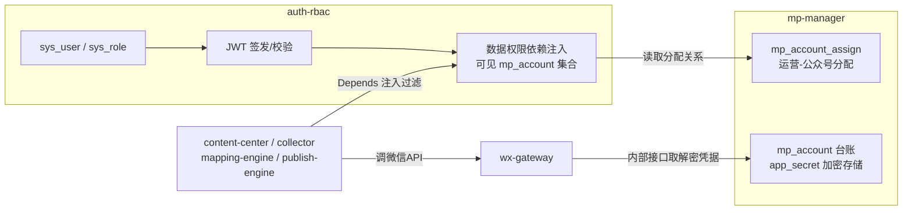

### 3.2 公众号接入方式对比与选型

系统把公众号纳管有两条技术路线,必须在设计初期定死,因为它决定凭据模型与 wx-gateway 的实现复杂度:

| 对比维度 | 方式A:直连(app_id + app_secret) | 方式B:微信开放平台第三方授权托管 |
| --- | --- | --- |
| 原理 | 每个公众号管理员把 AppID/AppSecret 录入本系统,系统以该号身份直接调 API | 本系统注册为开放平台"第三方平台",公众号管理员扫码授权,系统用 component_access_token + authorizer_access_token 代运营 |
| 凭据形态 | 每号一对 app_id/app_secret,需人工录入 | 授权后由微信回推 authorizer_refresh_token,无需知道对方 secret |
| IP 白名单 | 每个公众号后台都要把本系统出口 IP 加白 | 只需第三方平台配置,授权号无需逐个加白 |
| 接入门槛 | 无,注册测试号即可练习 | 需企业主体开放平台账号、全网发布审核、加密消息回调(AES + Ticket 每 10 分钟推送),门槛高 |
| 适用规模 | 数个~数十个自有/受托公众号 | 上百号的商业 SaaS 矩阵 |
| 风险 | secret 泄露即等于账号 API 权限泄露,必须加密存储 | 平台资质、类目权限集审核等运营成本 |
| 教学可实现性 | ✅ 高 | ❌ 需要企业资质,课堂无法完成闭环 |

**本课题选型结论:采用方式A直连。** 教学环境的账号能力按以下保守口径设计(与第 2、8 章统一):

- **测试号**([微信公众平台测试号](https://mp.weixin.qq.com/debug/cgi-bin/sandboxinfo)):可即时获得 app_id/app_secret,适合调通 token 与临时素材/uploadimg 类接口;永久素材受限;**草稿箱(/cgi-bin/draft/\*)与发布(/cgi-bin/freepublish/\*)接口不可用**,须自有认证号或走 Mock 通道。
- **学生/教师自有未认证订阅号**:**无群发接口**(/cgi-bin/message/mass/sendall 仅认证号可用);草稿箱/发布接口的可用性存在权限不确定性,设计上按"不可用"做保守假设,须在 M1 里程碑以官方《接口权限说明》页与真机验证为准逐项确认(见第 8 章)。
- **真实链路终验依赖教师/课程组提供至少一个已认证公众号**(第 8 章 8.3 里程碑 M2 的硬性前置条件);无认证号条件下,全部功能与状态机通过 wx-gateway 内置 MockChannel(`mp_account.account_type=3` 测试/模拟号,draft/freepublish 调用路由到本地模拟实现)演示,MockAdapter + Mock 发布通道为主线验收路径(见第 7 章)。

数据模型中保留 `account_type` 与 `auth_mode` 字段,为将来平滑升级到第三方托管留扩展点,但 wx-gateway 教学版只实现直连分支。

**合规红线(设计文档必须写明,实现必须遵守):** 只能纳管取得管理员本人授权的公众号;禁止收集/买卖他人公众号凭据;凭据仅用于本系统功能,不得外传;后续章节的采集与发文同样受平台"原创转载白名单"等规则约束(见第 5、7 章),本模块通过审计与最小权限从源头收敛风险。

### 3.3 mp_account 表设计与 app_secret 加密存储

#### 3.3.1 表结构

本表 DDL 与字段命名(`mp_name / wx_original_id / app_id / app_secret_cipher`)为**全文唯一基准**,第 2 章 ER 图与 DDL 清单、第 7/8 章的引用均以此为准。

```sql
CREATE TABLE mp_account (
  id                BIGINT UNSIGNED PRIMARY KEY AUTO_INCREMENT,
  mp_name           VARCHAR(64)  NOT NULL COMMENT '公众号名称',
  account_type      TINYINT      NOT NULL COMMENT '1=订阅号 2=服务号 3=测试/模拟号(走 MockChannel,见第7章)',
  is_verified       TINYINT(1)   NOT NULL DEFAULT 0 COMMENT '是否微信认证',
  auth_mode         TINYINT      NOT NULL DEFAULT 1 COMMENT '1=直连 2=第三方托管(预留)',
  wx_original_id    VARCHAR(32)  NULL COMMENT 'gh_ 开头原始ID',
  app_id            VARCHAR(32)  NOT NULL,
  app_secret_cipher VARBINARY(512) NOT NULL COMMENT 'AES-256-GCM 密文(含nonce+tag)',
  key_version       INT          NOT NULL DEFAULT 1 COMMENT '加密主密钥版本,支持轮换',
  need_review       TINYINT(1)   NOT NULL DEFAULT 1 COMMENT '号级审核开关,与全局 PUBLISH_REVIEW_ENABLED 叠加,仅 super_admin 可改(见第7章)',
  ip_whitelist_ok   TINYINT(1)   NOT NULL DEFAULT 0 COMMENT '最近一次凭据校验是否通过(40164 置0)',
  last_verified_at  DATETIME     NULL COMMENT '最近凭据校验时间',
  status            TINYINT      NOT NULL DEFAULT 1 COMMENT '1=启用 0=停用(停用后各引擎跳过该号)',
  remark            VARCHAR(255) NULL,
  created_by        BIGINT UNSIGNED NOT NULL COMMENT 'sys_user.id',
  created_at        DATETIME     NOT NULL DEFAULT CURRENT_TIMESTAMP,
  updated_at        DATETIME     NOT NULL DEFAULT CURRENT_TIMESTAMP ON UPDATE CURRENT_TIMESTAMP,
  UNIQUE KEY uk_app_id (app_id)
) ENGINE=InnoDB COMMENT='公众号台账';
```

#### 3.3.2 app_secret 加密方案

原则:**数据库中绝不出现明文 secret;任何查询接口绝不回显 secret(包括脱敏形式也只显示末 4 位);加密主密钥不进代码仓库。**

- 算法:AES-256-GCM(带认证标签,防篡改)。存储格式 `nonce(12B) || ciphertext || tag(16B)` 拼接后入 `app_secret_cipher`。
- 主密钥 `MP_SECRET_MASTER_KEY`(32 字节,base64)通过 Docker Compose 的 env_file 注入容器环境变量,该 env 文件列入 `.gitignore`;`key_version` 字段支持密钥轮换(新密钥加密新数据,读取时按版本选钥,后台任务渐进重加密)。
- AAD(附加认证数据)绑定 `app_id`,防止密文被搬移到其他记录。

本加密方案(AES-256-GCM + `MP_SECRET_MASTER_KEY` + AAD=app_id + key_version 轮换)为全文统一版本,其他章节引用时不得另行描述。

```python
# mp_manager/crypto.py
from cryptography.hazmat.primitives.ciphers.aead import AESGCM
import os, base64

_KEYS = {1: base64.b64decode(os.environ["MP_SECRET_MASTER_KEY"])}  # {key_version: key}

def encrypt_secret(app_id: str, plain: str, ver: int = 1) -> bytes:
    nonce = os.urandom(12)
    ct = AESGCM(_KEYS[ver]).encrypt(nonce, plain.encode(), app_id.encode())
    return nonce + ct                      # ct 已含 16B tag

def decrypt_secret(app_id: str, blob: bytes, ver: int) -> str:
    nonce, ct = blob[:12], blob[12:]
    return AESGCM(_KEYS[ver]).decrypt(nonce, ct, app_id.encode()).decode()
```

解密函数仅供两处调用:① wx-gateway 内部接口 `GET /internal/mp-accounts/{app_id}/credential`(仅容器内网可达,Nginx 不暴露,另加内部服务共享密钥头 `X-Internal-Token` 校验);② 凭据校验动作(见 3.3.3)。业务代码任何其他位置不得 import 该函数。

#### 3.3.3 IP 白名单运维说明

微信要求:调用 `GET /cgi-bin/token` 的**服务器出口 IP 必须加入该公众号后台"IP 白名单"**,否则返回错误码 `40164`。运维 SOP:

1. 确认出口 IP:在部署服务器执行 `curl https://ifconfig.me`(注意是 NAT 后的公网出口 IP,不是内网 IP;教学生产机为 `8.140.238.26` 这类固定公网 IP,若在校园网 NAT 后则需以实际出口为准)。
2. 公众号管理员登录 mp.weixin.qq.com →「设置与开发 → 开发接口管理(基本配置)→ IP 白名单」,添加该 IP;测试号无需配置白名单(测试号接口不校验),这也是教学首选测试号的原因之一。
3. 录入公众号后,管理员在系统中点击「校验凭据」(`POST /api/v1/mp-accounts/{id}/verify`):mp-manager 委托 wx-gateway 用该凭据试取一次 token。成功→ `ip_whitelist_ok=1`;返回 40164 → 置 0 并在前端台账列表用红色标记"IP 未加白",提示具体待加白 IP。
4. 服务器迁移/扩容导致出口 IP 变化时,必须先为**所有**纳管公众号补加新 IP 再切流量;scheduler 每日凌晨对全部启用账号跑一次凭据巡检任务,异常写入 `audit_record` 并通知管理员。
5. 忘记 secret 或疑似泄露:公众号后台"重置 AppSecret"→ 旧 secret 立即失效 → 必须同步在本系统更新密文,并由 wx-gateway 强制刷新该号 token 缓存。

### 3.4 与 wx-gateway 的依赖关系

职责切分一句话:**mp-manager 管"钥匙放在哪",wx-gateway 管"用钥匙开门"。**

- mp-manager 只登记、加密保存、校验凭据;不保存、不刷新 access_token。
- wx-gateway 作为中控服务器统一调 `GET /cgi-bin/token?grant_type=client_credential&appid=xx&secret=xx`(此处 `appid/secret` 为微信官方接口的查询参数名),token 有效期 7200 秒,缓存于 Redis(key: `wx:token:{app_id}`,TTL 设为 `expires_in - 300` 秒即约 6900 秒,提前刷新),对所有业务模块提供 `get_token(app_id)` 内部接口。多副本部署时用 Redis 分布式锁避免并发刷新互踢(细节见 wx-gateway 章节,此处不展开)。
- 联动事件:mp-manager 在「凭据更新」「账号停用」时向 wx-gateway 发失效通知(直接 DEL Redis 缓存键即可),防止旧 token/旧 secret 继续被使用。

### 3.5 角色设计与权限矩阵(auth-rbac)

#### 3.5.1 角色定义

采用经典 RBAC0(用户—角色—权限点),教学场景固定五个内置角色,不做自定义角色(降低实现量,`sys_role` 预置数据即可):

| 角色 code | 名称 | 定位 | 数据权限范围 |
| --- | --- | --- | --- |
| super_admin | 超级管理员 | 系统所有者,唯一可管理"管理员"及系统级配置 | 全部公众号(角色特权) |
| admin | 管理员 | 日常管理:建员工账号、录公众号、做分配 | 全部公众号(角色特权) |
| chief_editor | 主编 | 内容负责人:统筹选题、终审发布计划 | 全部公众号(角色特权;只读台账,不可改凭据) |
| operator | 运营 | 一线编辑:采集挑选、内容编排、提交审核 | **仅 mp_account_assign 中分配给自己(deleted_flag=0)的公众号,且受 perm_level 分级约束** |
| auditor | 审核员 | 内容合规审核:通过/驳回 | 全部公众号的待审内容与发布日志(角色特权;无公众号台账权限) |

> 注:super_admin/admin/chief_editor/auditor 对全部公众号可见是**角色特权**(对应 3.6.2 的 `FULL_ACCESS_ROLES`,不走 mp_account_assign 分配关系);operator 仅见被分配号。

#### 3.5.2 权限矩阵(功能点 × 角色)

权限点以 `域:资源:动作` 编码,统一引用**附录A全局权限点字典**,接口用装饰器/依赖声明所需权限点。✔=有权,△=有权但受数据权限过滤(仅 mp_account_assign 中分配且 deleted_flag=0 的公众号,并受 perm_level 分级约束,见 3.6),✘=无权;标 ※ 者为跨全部公众号可见的**角色特权**(见 3.5.1 注)。

| 权限点 | 功能说明 | super_admin | admin | chief_editor | operator | auditor |
| --- | --- | :-: | :-: | :-: | :-: | :-: |
| mp:account:view | 查看公众号台账(不含 secret) | ✔ | ✔ | ✔※ | △ | ✘ |
| mp:account:manage | 新增公众号/录入与修改凭据/启停用/校验凭据 | ✔ | ✔ | ✘ | ✘ | ✘ |
| user:manage | 员工账号增删改/重置密码/停用、角色授予、审计日志查看 | ✔ | ✔(不能动 admin 及以上;仅可授 chief_editor/operator/auditor) | ✘ | ✘ | ✘ |
| user:assign | 维护运营-公众号分配(含 perm_level) | ✔ | ✔ | ✘ | ✘ | ✘ |
| collect:source:view | 查看采集源配置 | ✔ | ✔ | ✔ | ✘ | ✘ |
| collect:source:manage | 采集源配置(collector 入口) | ✔ | ✔ | ✔ | ✘ | ✘ |
| collect:article:view | 浏览/挑选采集文章 | ✔ | ✔ | ✔ | △ | ✘ |
| mapping:rule:view | 查看映射规则 | ✔ | ✔ | ✔ | ✘ | ✘ |
| mapping:rule:manage | 映射规则配置(mapping-engine 入口) | ✔ | ✔ | ✔ | ✘ | ✘ |
| content:article:view | 浏览图文内容 | ✔ | ✔ | ✔ | △ | ✔※ |
| content:article:edit | 图文编排 | ✔ | ✔ | ✔ | △ | ✘ |
| content:article:submit | 提交审核(→ PENDING_REVIEW) | ✔ | ✔ | ✔ | △ | ✘ |
| content:article:audit | 审核通过/驳回(→ APPROVED / REJECTED) | ✔ | ✔ | ✔ | ✘ | ✔※ |
| content:article:delete | 删除图文 | ✔ | ✔ | ✔ | ✘ | ✘ |
| content:material:view | 素材库查看 | ✔ | ✔ | ✔ | △ | ✘ |
| content:material:upload | 素材上传 | ✔ | ✔ | ✔ | △ | ✘ |
| content:template:manage | 排版模板管理 | ✔ | ✔ | ✔ | ✘ | ✘ |
| publish:task:view | 查看发布任务 | ✔ | ✔ | ✔ | △ | ✘ |
| publish:task:manage | 创建/取消/重试发布任务(publish-engine 入口) | ✔ | ✔ | ✔ | ✘ | ✘ |
| publish:log:view | 查看发布日志 | ✔ | ✔ | ✔ | ✘ | ✔※ |
| system:config:manage | 审核开关等全局配置 | ✔ | ✘ | ✘ | ✘ | ✘ |

> 审计日志查看归入 `user:manage`(用户与角色管理)域,教学版不单设权限点。

矩阵体现两条设计纪律:① **凭据与分配只归管理员**,内容线角色(主编/运营/审核员)碰不到 secret 与权限结构;② **运营的一切能力都叠加数据权限过滤(△)并受 perm_level 分级约束**,功能权限回答"能不能用这个菜单",数据权限回答"在菜单里能看到哪些号的数据、在这些号上能做到哪一级操作",二者正交。

#### 3.5.3 权限相关表

`sys_user`、`sys_role`、`sys_user_role` 的表结构**见第 2 章**(全库 DDL 唯一事实源),本章不重复建表语句。auth-rbac 初始化时预置五个内置角色:

```sql
INSERT INTO sys_role (role_code, role_name) VALUES
  ('super_admin',  '超级管理员'),
  ('admin',        '管理员'),
  ('chief_editor', '主编'),
  ('operator',     '运营'),
  ('auditor',      '审核员');
```

权限点→角色的映射在教学版直接固化为代码常量 `ROLE_PERMISSIONS: dict[str, set[str]]`(而非建 sys_permission 表,`sys_role` 亦不含 perms_json 列),减少一层表关联,课堂容量内换取工程简洁;文档中说明生产化时应表化。常量与 3.5.2 矩阵、附录A全局权限点字典一一对应:

```python
# auth_rbac/permissions.py — 与 3.5.2 矩阵、附录A 一一对应
ALL_PERMS: set[str] = {
    "mp:account:view", "mp:account:manage",
    "user:manage", "user:assign",
    "collect:source:view", "collect:source:manage", "collect:article:view",
    "mapping:rule:view", "mapping:rule:manage",
    "content:article:view", "content:article:edit", "content:article:submit",
    "content:article:audit", "content:article:delete",
    "content:material:view", "content:material:upload", "content:template:manage",
    "publish:task:view", "publish:task:manage", "publish:log:view",
    "system:config:manage",
}

ROLE_PERMISSIONS: dict[str, set[str]] = {
    "super_admin": ALL_PERMS,
    "admin": ALL_PERMS - {"system:config:manage"},
    "chief_editor": {
        "mp:account:view",
        "collect:source:view", "collect:source:manage", "collect:article:view",
        "mapping:rule:view", "mapping:rule:manage",
        "content:article:view", "content:article:edit", "content:article:submit",
        "content:article:audit", "content:article:delete",
        "content:material:view", "content:material:upload", "content:template:manage",
        "publish:task:view", "publish:task:manage", "publish:log:view",
    },
    "operator": {
        "mp:account:view",
        "collect:article:view",
        "content:article:view", "content:article:edit", "content:article:submit",
        "content:material:view", "content:material:upload",
        "publish:task:view",
    },
    "auditor": {
        "content:article:view", "content:article:audit", "publish:log:view",
    },
}
```

### 3.6 运营-公众号多对多分配与数据权限隔离

#### 3.6.1 mp_account_assign 表

一个运营可负责多个公众号,一个公众号可由多个运营共管,故为标准多对多中间表。**表结构见第 2 章 DDL(唯一事实源),本章不重复建表语句**;与本章数据权限实现直接相关的两个字段:

- `perm_level TINYINT`:该运营在该号上的操作级别,**1=只读,2=可编辑,3=可提审,4=可发布**,高级别蕴含低级别能力;
- `deleted_flag TINYINT`:软删占位(唯一键含 deleted_flag),分配解除时置 1 不物理删除,保留追溯;一切数据权限查询必须加 `deleted_flag=0` 条件。

分配变更采用**全量覆盖式**接口(前端穿梭框提交完整 `{user_id, perm_level}` 列表,后端 diff 后增改、软删),幂等且易实现;每次变更写一条 `audit_record`(action=`mp.assign.change`, detail 存 before/after 列表)。

#### 3.6.2 数据权限隔离:FastAPI 依赖注入统一过滤

隔离目标:运营调用任何列表/详情/写入接口,凡涉及 `mp_account_id` 维度的数据(公众号台账、content_article、publish_task、publish_log、mapping_rule 等),都只落在被分配的号内,且操作级别不超过 `perm_level`。实现要点是把"可见集合"做成一个**可复用依赖**,让所有模块的路由声明式复用,而不是每个 handler 手写 if:

```python
# auth_rbac/deps.py
from fastapi import Depends, HTTPException
from sqlalchemy import select

# 角色特权:以下角色对全部公众号可见,不走 mp_account_assign(见 3.5.1 注)
FULL_ACCESS_ROLES = {"super_admin", "admin", "chief_editor", "auditor"}

async def get_current_user(token: str = Depends(oauth2_scheme),
                           db: AsyncSession = Depends(get_db)) -> UserCtx:
    payload = decode_jwt(token)                    # 过期/伪造 → 401
    user = await db.get(SysUser, int(payload["sub"]))
    if not user or user.status != 1:
        raise HTTPException(401, "账号不存在或已停用")
    return UserCtx(id=user.id, role=payload["role"])

async def get_visible_mp_ids(user: UserCtx = Depends(get_current_user),
                             db: AsyncSession = Depends(get_db)) -> set[int] | None:
    """返回 None 表示全量可见(角色特权);返回集合表示只可见集合内的公众号(可能为空集)。"""
    if user.role in FULL_ACCESS_ROLES:
        return None
    rows = await db.scalars(
        select(MpAccountAssign.mp_account_id)
        .where(MpAccountAssign.user_id == user.id,
               MpAccountAssign.deleted_flag == 0))
    return set(rows)

def apply_mp_scope(stmt, mp_col, visible: set[int] | None):
    """所有涉及 mp_account_id 的查询必须经过它——数据权限唯一出口。"""
    return stmt if visible is None else stmt.where(mp_col.in_(visible or {-1}))

def require_mp_access(need_level: int = 1):
    """详情/写入类接口守卫(依赖工厂):越权访问单个公众号 → 403(不泄露该号是否存在)。
    need_level 对应 mp_account_assign.perm_level:1=只读 2=可编辑 3=可提审 4=可发布。"""
    async def _guard(mp_account_id: int,                 # 取自路径/入参
                     user: UserCtx = Depends(get_current_user),
                     db: AsyncSession = Depends(get_db)) -> int:
        if user.role in FULL_ACCESS_ROLES:               # 角色特权:全号可达
            return mp_account_id
        perm_level = await db.scalar(
            select(MpAccountAssign.perm_level)
            .where(MpAccountAssign.user_id == user.id,
                   MpAccountAssign.mp_account_id == mp_account_id,
                   MpAccountAssign.deleted_flag == 0))
        if perm_level is None or perm_level < need_level:
            raise HTTPException(403, "无权访问该公众号")
        return mp_account_id
    return _guard
```

使用方式(以本模块台账列表和 publish-engine 的任务接口为例,其余模块同理):

```python
@router.get("/api/v1/mp-accounts")
async def list_mp_accounts(visible=Depends(get_visible_mp_ids), db=Depends(get_db)):
    stmt = apply_mp_scope(select(MpAccount).where(MpAccount.status == 1),
                          MpAccount.id, visible)
    return [MpAccountOut.from_orm(x) for x in await db.scalars(stmt)]
    # MpAccountOut 无 app_secret 字段 → 序列化层面杜绝 secret 泄露

@router.get("/api/v1/publish-tasks")                     # publish-engine 复用同一依赖
async def list_tasks(visible=Depends(get_visible_mp_ids), db=Depends(get_db)):
    stmt = apply_mp_scope(select(PublishTask), PublishTask.mp_account_id, visible)
    ...

@router.post("/api/v1/publish-tasks")                    # 写操作叠加 perm_level 分级校验
async def create_task(mp_account_id: int = Depends(require_mp_access(need_level=4)),
                      ...):
    ...
```

三条实现纪律:① `visible or {-1}` 保证"零分配的运营"得到空列表而不是全量数据(空集合 `IN ()` 的 SQL 边界);② 过滤发生在 SQL 层而非取出后内存过滤,分页/统计天然正确;③ 写操作入参中的 `mp_account_id` 必须走 `require_mp_access(need_level=…)`——编辑用 2、提审用 3、建/取消发布任务用 4——既防止"列表看不见但直接 POST 猜 id"的水平越权(课堂上讲解 IDOR 漏洞的现成案例),也保证只读分配(perm_level=1)的运营无法写入。

### 3.7 登录认证:JWT 双令牌方案

| 项 | 访问令牌 access_token | 刷新令牌 refresh_token |
| --- | --- | --- |
| 有效期 | 30 分钟 | 7 天 |
| 载荷 | `sub`(user_id)、`role`、`jti`、`exp`、`typ:"access"` | `sub`、`jti`、`exp`、`typ:"refresh"` |
| 存放 | 前端内存(Pinia),请求头 `Authorization: Bearer` | 前端 localStorage(教学版;生产建议 HttpOnly Cookie) |
| 服务端状态 | 无状态校验 + Redis 黑名单 `jwt:block:{jti}`(登出/停用时写入,TTL=剩余有效期) | Redis 白名单 `jwt:refresh:{user_id}:{jti}`,TTL 7 天 |

流程约定:

1. **登录** `POST /api/v1/auth/login`:bcrypt 校验密码 → 签发两令牌(HS256,密钥 `JWT_SECRET_KEY` 走环境变量)→ 刷新令牌 jti 写 Redis 白名单 → 更新 `last_login_at`,写 audit_record(action=`auth.login`)。连续 5 次密码错误锁定 10 分钟(Redis 计数器)。
2. **续期** `POST /api/v1/auth/refresh`:校验 `typ=refresh` 且 jti 在白名单 → **旋转**:删除旧 jti、签发新的一对令牌(refresh rotation,旧刷新令牌一次性,重放即失效可发现盗用)。
3. **登出** `POST /api/v1/auth/logout`:access jti 入黑名单、refresh jti 移出白名单。
4. **强制下线**:管理员停用账号(`status=0`)时,按 user_id 前缀删光其刷新令牌白名单;access 令牌最长 30 分钟自然失效,且 `get_current_user` 每次都查库校验 `status`,实际即时生效。
5. **权限变更生效**:角色/分配变更后无需重登——角色在 `get_current_user` 中可选择以 DB 为准覆盖 JWT 中的 role;分配关系本就每请求实时查询(3.6.2),天然即时生效。

### 3.8 核心 REST API 清单

统一前缀 `/api/v1`,响应包 `{code, message, data}`;下表"权限"列为所需权限点(编码见 3.5.2 与附录A全局字典),标 △ 者叠加数据权限过滤。

| # | 路径 | 方法 | 关键入参 | 出参(data) | 权限 |
| --- | --- | --- | --- | --- | --- |
| 1 | /auth/login | POST | username, password | access_token, refresh_token, user{id,name,role} | 匿名 |
| 2 | /auth/refresh | POST | refresh_token | 新 access_token + refresh_token | 持有效刷新令牌 |
| 3 | /auth/logout | POST | — (Bearer) | — | 登录即可 |
| 4 | /auth/me | GET | — | 用户信息 + 角色 + 可见公众号简表 | 登录即可 |
| 5 | /users | GET | page, keyword, role, status | 用户分页列表(含角色) | user:manage |
| 6 | /users | POST | username, real_name, password, role_code | 新用户 id | user:manage |
| 7 | /users/{id} | PUT | real_name, phone, status | — | user:manage |
| 8 | /users/{id}/roles | PUT | role_codes[] | — | user:manage |
| 9 | /users/{id}/password | PUT | new_password | —(强制其重登:清刷新令牌) | user:manage(或本人改密) |
| 10 | /users/{id}/mp-accounts | GET | — | 该运营被分配的公众号列表(含 perm_level) | user:assign(或本人) |
| 11 | /mp-accounts | GET | page, keyword, status | 台账分页(**不含 secret**,含 ip_whitelist_ok) | mp:account:view △ |
| 12 | /mp-accounts | POST | mp_name, account_type, app_id, app_secret, remark | 新公众号 id(secret 入库即加密) | mp:account:manage |
| 13 | /mp-accounts/{id} | GET | — | 台账详情 + 分配的运营列表 | mp:account:view △ |
| 14 | /mp-accounts/{id} | PUT | mp_name, app_secret?, status, remark | —(传 app_secret 则重加密并通知 wx-gateway 失效缓存) | mp:account:manage |
| 15 | /mp-accounts/{id}/verify | POST | — | {ok, errcode, hint}(40164→返回待加白IP提示) | mp:account:manage |
| 16 | /mp-accounts/{id}/assignees | GET | — | [{user_id, real_name, perm_level, assigned_at}] | user:assign |
| 17 | /mp-accounts/{id}/assignees | PUT | assignments[]: [{user_id, perm_level}](全量覆盖) | {added[], removed[], changed[]} | user:assign |
| 18 | /roles | GET | — | 5 个内置角色 | 登录即可 |
| 19 | /audit-records | GET | page, action, user_id, date range | 审计分页 | user:manage |
| 20 | /internal/mp-accounts/{app_id}/credential | GET | X-Internal-Token 头 | {app_id, app_secret 明文} | 仅 wx-gateway 内网调用,Nginx 不暴露 |

### 3.9 关键时序

#### 3.9.1 管理员为运营分配公众号

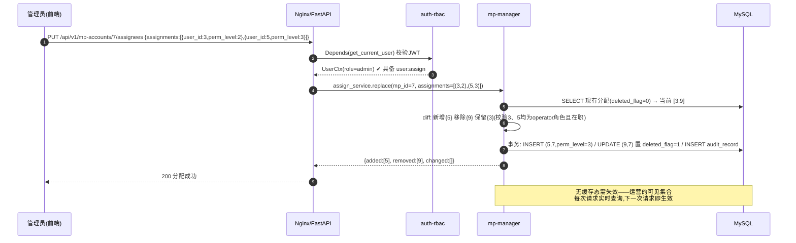

#### 3.9.2 运营登录后仅见被分配账号

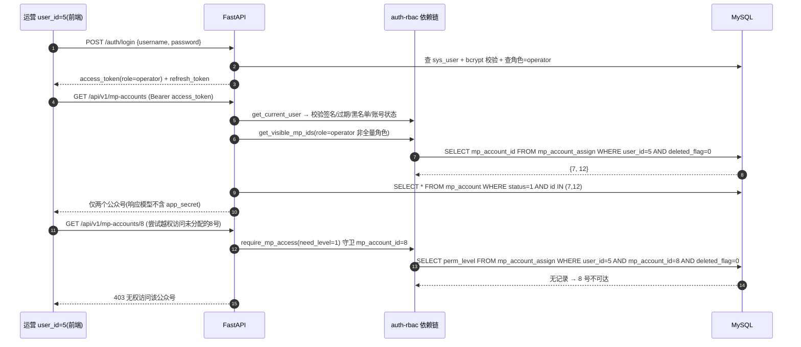

### 3.10 教学实现与安全要点小结

- **最小可跑验收路径**:建 admin → 录一个测试号凭据 → verify 通过 → 建 operator → 分配(指定 perm_level)→ 用 operator 登录验证列表隔离与 403 越权拦截(草稿/发布链路验证走 MockChannel 或认证号,见 3.2 与第 7、8 章)。该链条可作为本模块的课堂验收用例与 pytest 集成测试脚本(`tests/test_data_scope.py`)。
- **安全清单**:secret 只加密存、只内网供给 wx-gateway、响应模型永不回显;JWT 密钥与加密主密钥走环境变量;登录限流防爆破;分配/凭据/登录三类敏感操作全量写 audit_record。
- **合规清单**:仅纳管自有/获授权公众号;角色最小权限;运营数据隔离既是管理需求也是泄密面收敛手段;凭据出借、代刷等行为违反《微信公众平台服务协议》,系统在设计上不提供任何多主体凭据共享功能。

## 4 内容中心(内容编排)

content-center 是本系统所有"可发布内容"的唯一事实源(Single Source of Truth)。它向上承接 mapping-engine 转换完成的采集稿(状态 `TRANSFORMED` 写入 `content_article`,并附带 mapping-engine 计算的建议排期 `suggested_publish_at`),同时支持运营人工创建原创稿;向下在文章审核通过(`APPROVED`)时由系统按建议排期创建 `publish_task`,交由 publish-engine 调度执行(衔接细节见 4.5)。模块内部由四个子域组成:**素材库、图文编辑与 HTML 处理管道、样式模板库、多图文编排与草稿版本管理**。所有微信侧调用(素材上传、正文图片转存)一律经 wx-gateway 代理,content-center 自身不持有 access_token。

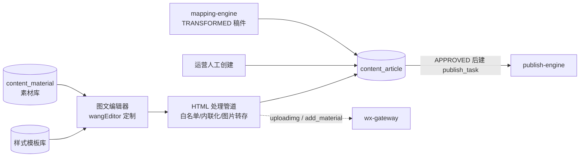

**本章状态机职责段**:content-center 负责 `TRANSFORMED → PENDING_REVIEW → APPROVED / REJECTED` 这一段;当审核开关关闭时(全局 `PUBLISH_REVIEW_ENABLED` 与号级 `mp_account.need_review` 双层开关,见第7章)允许 `TRANSFORMED → APPROVED` 自动过审,并写 `audit_record`(action=AUTO_APPROVE, auditor_id=0)留痕。人工创建的原创稿为复用同一状态机,创建即以 `TRANSFORMED` 态进入(跳过 `COLLECTED / MAPPED`),后续流转完全一致。

### 4.1 素材库设计

#### 4.1.1 设计原则:本地为主、微信按需同步

微信永久素材有配额限制(图片 5000 个、其他类型 1000 个),且 `media_id` 归属于**单个公众号**——同一张图在 A、B 两个公众号下是两个不同的 `media_id`。因此素材库采用两层模型:

1. **本地层**(`content_material`):素材的原始存储与唯一登记处,SHA-256 去重(`file_hash`),与公众号无关;
2. **微信引用层**(模块内从表 `content_material_wx_ref`):记录"某素材 × 某公众号"同步后得到的 `media_id` / 微信 URL,仅在**提审/发布链路真正需要时**才触发同步(封面必须是该号的永久素材 `thumb_media_id`;正文图在提审管道走 `uploadimg` 换 URL,不占配额)。

#### 4.1.2 表结构

两表已并入第2章全库 DDL 清单,建表细节以第2章为准,本节为业务视角说明。

`content_material`(统一命名表):

| 字段 | 类型 | 说明 |
|---|---|---|
| id | BIGINT PK | 素材ID |
| material_type | ENUM('image','thumb','video','voice') | 教学实现以 image/thumb 为主 |
| title | VARCHAR(128) | 素材名称(可检索) |
| file_name | VARCHAR(255) | 原始文件名 |
| local_path | VARCHAR(500) | 本地相对路径 `/data/materials/{yyyy}/{mm}/{file_hash}.{ext}` |
| file_hash | CHAR(64) UNIQUE | 内容去重键(SHA-256) |
| file_size / width / height | INT | 字节数、像素尺寸 |
| mime_type | VARCHAR(64) | image/jpeg 等 |
| origin | ENUM('UPLOAD','COLLECTED') | 人工上传 / 采集正文抓图落地 |
| created_by | BIGINT FK→sys_user.id | 上传人 |
| created_at / updated_at | DATETIME | — |

`content_material_wx_ref`(content-center 内部从表):

| 字段 | 类型 | 说明 |
|---|---|---|
| id | BIGINT PK | — |
| material_id | BIGINT FK→content_material.id | — |
| mp_account_id | BIGINT FK→mp_account.id | 同步到哪个公众号 |
| wx_media_id | VARCHAR(128) | 永久素材 media_id(封面用) |
| wx_url | VARCHAR(500) | 微信返回的图片 URL |
| sync_type | ENUM('MATERIAL','UPLOADIMG') | add_material / uploadimg 两条通道 |
| synced_at | DATETIME | — |
| UNIQUE(material_id, mp_account_id, sync_type) | | 防重复同步 |

由于 `file_hash` 在 `content_material` 上全局唯一(一个哈希只登记一份素材),`material_id` 与 `file_hash` 一一对应,上表唯一键即等价于按 **(mp_account_id, file_hash)** 去重——同一张图片内容在同一公众号、同一通道至多上传一次,避免重复消耗微信调用与配额。

#### 4.1.3 上传与按需同步流程

上传:`POST /api/v1/materials`(multipart)→ 校验类型(jpg/png/gif)与大小 → 计算 SHA-256,命中则直接返回已有记录(秒传)→ 落盘 → 生成缩略图 → 写 `content_material`。封面上传复用同一接口,`material_type=thumb`,前端强制裁剪为 2.35:1(头条大图)与 1:1(次条小图)两种比例。

按需同步的两类调用方:正文图 `UPLOADIMG` 通道由 4.2.3 提审管道调用(全系统唯一的正文图片转存点);封面 `MATERIAL` 通道由 publish-engine 组装草稿前调用,或编辑器选封面时预同步:

```python
def ensure_wx_media(material_id: int, mp_account_id: int,
                    channel: str) -> WxRef:
    """channel: 'MATERIAL'(封面→永久素材) | 'UPLOADIMG'(正文图→URL)"""
    ref = repo.get_ref(material_id, mp_account_id, channel)
    if ref:                                  # material_id 与 file_hash 一一对应,
        return ref                           # 此处即按 (mp_account_id, file_hash)
                                             # 维度复用既有引用,杜绝重复上传
    m = repo.get_material(material_id)
    fp = storage.open(m.local_path)
    if channel == 'MATERIAL':
        # wx-gateway 代理 POST /cgi-bin/material/add_material?type=image
        resp = wx_gateway.add_material(mp_account_id, fp, type='image')
        ref = WxRef(wx_media_id=resp['media_id'], wx_url=resp.get('url'))
    else:
        fp = image_fit_uploadimg(fp)         # 仅 jpg/png、≤1MB,超限压缩转码
        # wx-gateway 代理 POST /cgi-bin/media/uploadimg
        resp = wx_gateway.uploadimg(mp_account_id, fp)
        ref = WxRef(wx_url=resp['url'])
    repo.save_ref(material_id, mp_account_id, channel, ref)
    return ref
```

同步失败(如服务器出口 IP 未加入该公众号 IP 白名单、token 失效)统一抛结构化异常,由调用方处置:4.2.3 提审管道中失败则本次提审失败,错误随 issues 返回前端(文章停留在原状态);publish-engine 组装草稿时失败则将任务置 `FAILED` 并写 `publish_log`。content-center 不做静默重试。

### 4.2 图文编辑器方案(wangEditor 定制)

#### 4.2.1 微信图文 HTML 标签白名单

微信正文会剥离 `<style>` 块、`class` 引用的外部样式以及大部分脚本类标签,只保留内联 style 的受限标签集。编辑器输出与后端清洗共用同一份白名单配置:

| 允许标签 | 允许属性 | 备注 |
|---|---|---|
| `p, br, hr` | style | 段落基础 |
| `span, strong, em, u, s, sup, sub` | style | 行内修饰 |
| `h1–h6, blockquote` | style | 标题/引用 |
| `section` | style | 排版模板容器(135类样式的核心载体) |
| `ul, ol, li` | style | 列表 |
| `img` | src, style, width, alt, data-material-id | src 最终必须为微信域(mmbiz.qpic.cn)URL |
| `table, tr, td, th` | style, colspan, rowspan | 简单表格 |
| `a` | href, style | 微信内仅公众号文章链接可点击,其余降级(见管道第4步) |

黑名单(直接删除节点):`script, style, iframe, form, input, video`(视频教学版不做,标注为扩展点)、所有 `on*` 事件属性、`javascript:` 协议。

#### 4.2.2 前端定制点

- **粘贴过滤**:重写 wangEditor 的 `customPaste`,粘贴来自 Word/网页的内容时按白名单就地清洗,避免脏标签入库;
- **自定义菜单**:`素材库图片`(从 `content_material` 选图插入,`img` 带 `data-material-id`)、`样式模板`(见 4.3)、`微信合规检查`(前端预跑白名单校验并高亮违规节点);
- **图片插入策略**:编辑期 `img.src` 指向本站本地 URL,**不在编辑期调用微信接口**;转存统一发生在提审时的后端管道(全系统唯一转存点,见 4.2.3),保证编辑流畅且不浪费调用额度。

#### 4.2.3 后端 HTML 处理管道(核心)

保存与提审共用同一条幂等 HTML 处理管道,产物同时用于预览与发布,保证"所见即所发"。其中**第3步外链图片转存仅在提审(`POST /articles/{id}/submit`)时执行**——此时目标公众号已确定、内容已定稿,这里是**全系统唯一的正文图片转存点**:mapping-engine 的 rehost_images 算子只标记待转存外链清单、不实际上传(见第6章);publish-engine 建草稿前只做兜底校验,发现正文残留非微信域图片即将任务置 `FAILED` 并给出明确错误(见第7章);collector 仅做图片本地化落盘(防源站防盗链)。三者均不调用 `uploadimg`。

```python
def process_article_html(raw_html: str, mp_account_id: int,
                         stage: str = 'SAVE') -> ProcessResult:
    """stage: 'SAVE'   保存——执行第1/2/4/5步,不触微信接口
       stage: 'SUBMIT' 提审——追加第3步外链图片转存(全系统唯一转存点)"""
    doc = lxml.html.fromstring(raw_html)

    # ── 1. 白名单清洗 ─────────────────────────────
    for node in doc.iter():
        if node.tag not in TAG_WHITELIST:
            node.drop_tag()                       # 保留子内容,去掉标签
        strip_attrs(node, keep=ATTR_WHITELIST[node.tag])
        drop_event_handlers(node)                 # on*、javascript:

    # ── 2. 样式内联化 ─────────────────────────────
    # 模板片段自带 inline style;对残留 class 按内置样式表展开为
    # style 属性(premailer 思路),随后删除全部 class 属性
    inline_css(doc, builtin_stylesheet)

    # ── 3. 外链图片自动转存(仅提审阶段) ───────────
    replaced = []
    if stage == 'SUBMIT':
        # 采集稿中由 mapping-engine 标记的待转存外链清单,也在此步统一处理
        for img in doc.cssselect('img'):
            src = img.get('src', '')
            if src.startswith(WX_IMG_DOMAIN):     # 已是微信URL,跳过
                continue
            mid = img.get('data-material-id')
            if not mid:                           # 站外图:先抓取落地为素材
                blob = http_download(src, max_size=10*MB, timeout=10)
                # save 内部按 SHA-256(file_hash)秒传去重
                mid = material_service.save(blob, origin='COLLECTED').id
            # ensure_wx_media 内部经 content_material_wx_ref
            # 按 (mp_account_id, file_hash) 去重,命中即复用不重传
            ref = ensure_wx_media(mid, mp_account_id, channel='UPLOADIMG')
            replaced.append((src, ref.wx_url))
            img.set('src', ref.wx_url)            # 换成 uploadimg 返回的URL
            img.attrib.pop('data-material-id', None)

    # ── 4. 链接降级 ───────────────────────────────
    for a in doc.cssselect('a'):
        if not is_mp_article_url(a.get('href', '')):
            a.drop_tag()                          # 非公众号文章链接:留文字去链接
            # 需要外链时引导用户填“原文链接”字段(见4.4),由微信原生渲染

    # ── 5. 输出与体检 ─────────────────────────────
    html = lxml.html.tostring(doc, encoding='unicode')
    issues = lint(html)   # 超长告警、剩余非微信域图片(SUBMIT 阶段视为
                          # 错误、SAVE 阶段仅提示)、空正文等
    return ProcessResult(html=html, img_replaced=replaced, issues=issues)
```

图片转存时序:

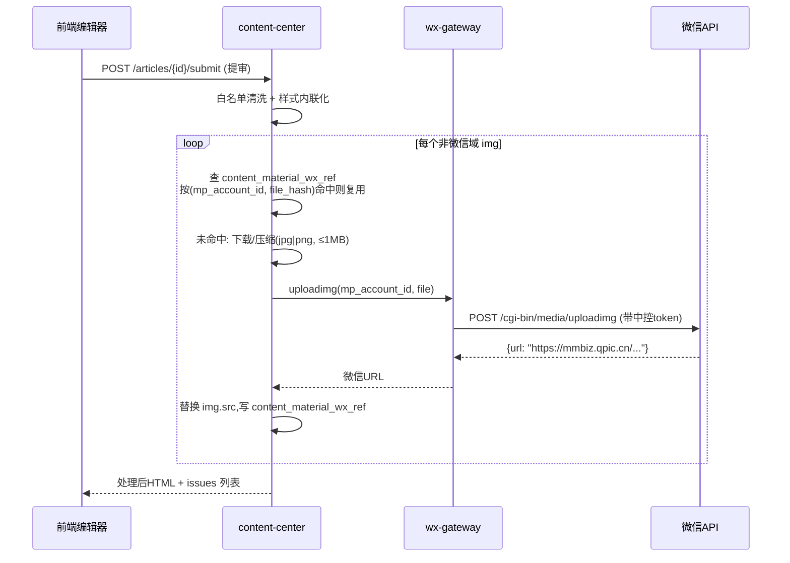

### 4.3 排版样式模板库

提供类 135 编辑器的"点选即插入"排版能力。模板本质是**已完成样式内联化的 HTML 片段**,存于模块内表 `content_style_template`(完整 DDL 见第2章,下表为业务说明):

| 字段 | 说明 |
|---|---|
| id / name / category | category:`title` 标题、`card` 卡片、`quote` 引用、`divider` 分隔线、`list` 列表 |
| html_snippet | TEXT,片段本体(仅白名单标签 + 内联 style) |
| thumbnail | 预览缩略图(素材库图片) |
| sort_order / enabled | 展示排序、上下架 |

前端在 wangEditor 注册"样式模板"下拉面板,按 category 分组展示缩略图,点击即 `editor.dangerouslyInsertHtml(snippet)`。示例片段:

```html
<!-- category=quote 左线引用 -->
<section style="margin:16px 8px;padding:12px 16px;border-left:4px solid #07c160;
  background:#f7f7f7;color:#595959;font-size:15px;line-height:1.8;">
  在此输入引用内容
</section>

<!-- category=divider 圆点分隔 -->
<section style="margin:24px 0;text-align:center;color:#c8c8c8;
  font-size:14px;letter-spacing:8px;">● ● ●</section>
```

**合规红线**:不得爬取/复制 135 编辑器、秀米等平台的付费模板资源入库;教学实现以自制片段为主,商用需采购授权。片段内引用的装饰图必须来自自有素材库,插入后同样走 4.2.3 管道转存。

### 4.4 多图文编排

微信一次草稿最多 8 篇图文。系统以模块内表 `content_draft_group` 承载"一次编排",`content_article` 通过 `group_id + position` 归组:

- `content_draft_group`:id、name、mp_account_id(目标公众号,决定素材同步归属)、article_count(≤8,DB 与 API 双重校验)、status(`EDITING` 编排中 / `READY` 组内全部文章已过审 / `TASK_CREATED` 已生成发布任务,见下文闭环)、created_by(完整 DDL 见第2章);
- `content_article` 编排相关字段(与草稿箱 `/cgi-bin/draft/add` 的 articles 字段对齐):

| 系统字段 | 微信字段 | 约束 |
|---|---|---|
| title | title | ≤64 字,必填 |
| author | author | ≤8 字 |
| digest | digest | ≤120 字,摘要;留空时微信取正文开头 |
| content_html | content | 4.2.3 管道产物 |
| thumb_material_id → ensure_wx_media(...).wx_media_id | thumb_media_id | 封面,发布前按需同步为**该公众号**永久素材 |
| source_url | content_source_url | "阅读原文"外链(站外链接的合规出口) |
| need_open_comment | need_open_comment | 0/1 是否开启评论 |
| only_fans_can_comment | only_fans_can_comment | 0/1 仅粉丝可评论 |
| position | (数组顺序) | 组内序号 1–8,1 为头条 |

**拖拽排序**:前端 vuedraggable 拖动后调用 `PATCH /draft-groups/{id}/reorder`,body 为有序 article_id 数组;后端事务内整组重写 position,并用 group 上的 `row_version` 乐观锁防止两名运营并发排序互相覆盖。头条(position=1)强制校验 2.35:1 封面,次条使用 1:1 封面。

**编排组状态与"多图文组→发布任务"闭环**:编排组的 status 由组内文章状态驱动——只要有任一篇未达 `APPROVED`,组保持 `EDITING`,前端在组详情页禁用"生成发布任务"入口并提示未过审文章清单(后端同样校验,防绕过);组内**全部**文章均为 `APPROVED` 后组置 `READY`,此时才允许创建组维度的 `publish_task`——任务以 `publish_task.draft_group_id` 指向本组,与单篇任务的 `content_article_id` **二选一非空**(CHECK 约束,DDL 见第2章),组随之置 `TASK_CREATED`。publish-engine 执行该任务时按 group 加载组内全部文章、再次校验全部 `APPROVED`、按 `position` 排序组装 articles 数组,一次 `/cgi-bin/draft/add` 合入提交(≤8 篇),执行细节见第7章。

### 4.5 草稿管理与简单版本记录

`content_article` 关键治理字段:`status`(统一状态机)、`source_type`(MANUAL/COLLECTED)、`collect_article_id`(采集稿溯源,FK→collect_article)、`suggested_publish_at`(采集稿由 mapping-engine 在转换完成时计算并暂存的建议排期,人工稿可为空)、`draft_media_id`(草稿建成后由 publish-engine 回写,对应 `APPROVED → DRAFT_CREATED`)、`row_version`(乐观锁)。**可编辑态仅限 `TRANSFORMED` 与 `REJECTED`**;`PENDING_REVIEW` 起锁定编辑,`APPROVED` 之后归 publish-engine 管辖,content-center 不再变更正文。

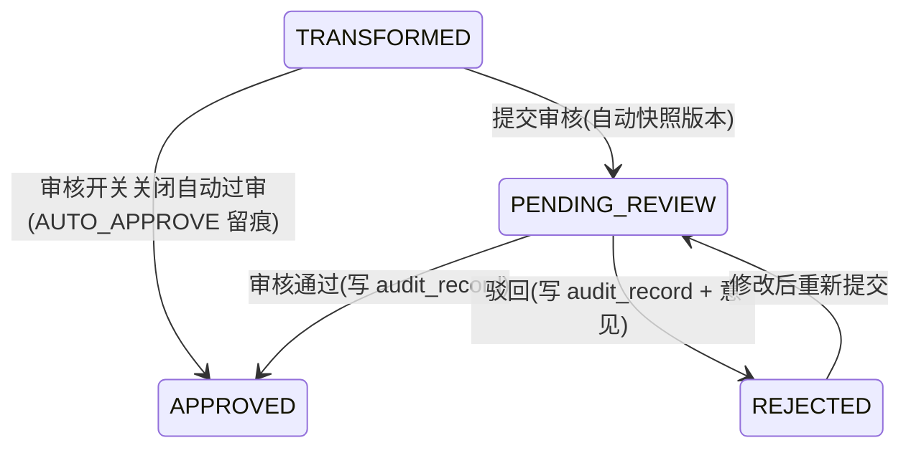

**审核与发布任务的衔接**:审核对象是 `content_article`,`POST /api/v1/articles/{id}/audit` 是**全系统唯一审核接口**(发布模块不提供任何 review 类接口)。审核通过——或双层开关(全局 `PUBLISH_REVIEW_ENABLED` + 号级 `mp_account.need_review`)关闭触发的自动过审——之后,系统在审核通过回调中按 `suggested_publish_at`(为空则取运营指定时间,未指定按立即处理)创建 `publish_task`(初始态 `SCHEDULED`),交由 publish-engine 调度执行;`APPROVED → DRAFT_CREATED` 及其后的状态迁移均由 publish-engine 负责(见第7章)。多图文组维度的建任务时机与校验见 4.4 闭环说明。

版本记录采用**全量快照**的教学级方案,表 `content_article_version`(完整 DDL 见第2章):id、article_id、version_no(组内自增)、title、digest、content_html、editor_id、change_note、created_at。触发时机:① 提交审核时自动快照;② 运营点"存为版本"手动快照(自动保存不产生版本,避免膨胀)。支持查看历史、前端逐字 diff 展示、一键回滚(回滚 = 以旧版本内容生成新的当前稿,不删除任何版本)。每篇保留最近 20 个版本,超出由 scheduler 周期清理。审核操作本身落 `audit_record`(article_id、action=PASS/REJECT/AUTO_APPROVE、auditor_id(自动过审为 0)、opinion、created_at),供第7章发布链路引用。

### 4.6 内容预览方案

| 方式 | 实现 | 适用场景 |
|---|---|---|
| 手机模拟预览 | 前端 375px iframe,套微信文章壳样式(标题/作者/正文容器 `rich_media_content` 同款排版),渲染 4.2.3 管道产物而非编辑器原始 HTML,保证与发布一致 | 编辑过程实时查看 |
| 二维码分享预览 | `POST /articles/{id}/preview-token` 生成 30 分钟有效的一次性 token,返回 H5 预览链接 + 二维码;链接不鉴权但不可枚举,供审核人手机扫码真机查看 | 提审/审核环节 |
| 微信草稿真机预览 | 走完发布链路 `DRAFT_CREATED` 后,在公众平台后台"草稿箱"中查看微信真实渲染效果(草稿接口由 publish-engine 调用,本模块仅引用) | 发布前最终确认 |

预览页对正文图片直接使用已转存的 mmbiz URL;若浏览器端因防盗链偶发加载失败,预览服务提供 `referrerpolicy="no-referrer"` 兜底,不影响微信端真实渲染。

### 4.7 核心 REST API 清单

统一前缀 `/api/v1`,鉴权与数据范围(运营只能操作被 `mp_account_assign` 分配的公众号下的内容)由 auth-rbac 网关层统一实施。

| 方法 | 路径 | 说明 | 权限点 |
|---|---|---|---|
| POST | /materials | 上传素材(multipart,SHA-256 秒传) | content:material:upload |
| GET | /materials | 素材分页检索(type/关键字/上传人) | content:material:view |
| DELETE | /materials/{id} | 删除素材(被文章引用时拒绝) | content:material:upload ① |
| POST | /materials/{id}/sync | 手动同步到指定公众号(body: mp_account_id, channel) | content:material:upload ① |
| GET | /style-templates | 样式模板列表(按 category) | content:article:edit ② |
| POST | /style-templates | 新增模板片段(管理员) | content:template:manage |
| POST | /articles | 新建图文(人工稿,初始态 TRANSFORMED) | content:article:edit |
| GET | /articles | 文章分页(状态/公众号/来源/关键字) | content:article:view |
| GET | /articles/{id} | 文章详情(含处理后 HTML) | content:article:view |
| PUT | /articles/{id} | 保存(触发 HTML 处理管道 stage=SAVE;带 row_version) | content:article:edit |
| POST | /articles/{id}/versions | 手动存版本 | content:article:edit |
| GET | /articles/{id}/versions | 版本列表 / 单版本内容 | content:article:view |
| POST | /articles/{id}/rollback | 回滚到指定 version_no | content:article:edit |
| POST | /articles/{id}/submit | 提交审核(TRANSFORMED/REJECTED→PENDING_REVIEW;触发管道 stage=SUBMIT 含图片转存) | content:article:submit |
| POST | /articles/{id}/audit | 审核(body: pass/reject + opinion,写 audit_record)——**全系统唯一审核接口**,通过后系统创建 publish_task(见 4.5) | content:article:audit |
| POST | /articles/{id}/preview-token | 生成扫码预览链接 | content:article:view |
| POST | /draft-groups | 创建多图文编排组(绑定 mp_account_id) | content:article:edit ② |
| POST | /draft-groups/{id}/articles | 组内添加文章(≥9 篇返回 422) | content:article:edit ② |
| PATCH | /draft-groups/{id}/reorder | 拖拽排序(有序 article_id 数组) | content:article:edit ② |
| DELETE | /draft-groups/{id}/articles/{aid} | 移出组 | content:article:edit ② |

权限点编码统一引用附录A全局权限点字典(格式 `域:资源:动作`)。附录A未单列的操作按就近原则复用:① 素材删除/手动同步复用 `content:material:upload`(被引用校验、数据范围校验仍生效);② 样式模板浏览与多图文编排(draft-groups 全部接口)属正文编辑活动,复用 `content:article:edit`。

错误约定:业务校验失败统一 422 + 结构化错误码(如 `GROUP_FULL`、`INVALID_STATE_TRANSITION`、`IMG_UPLOAD_FAILED`);微信侧失败透传 wx-gateway 的错误码与描述,便于教学排障。

## 5 采集中心(collector)

### 5.1 模块定位与边界

采集中心负责把外部内容源的文章"合法、稳定、干净"地引入本系统,产出统一结构的 `collect_article` 记录(初始状态 `COLLECTED`),供下游 mapping-engine 做映射、content-center 做二次编排。模块边界:

- **只做引入与清洗**:采集、净化、去重、入库。不做改写、不做审核、不做发布(分别属于 mapping-engine / content-center / publish-engine)。
- **只对接"有权获取"的数据来源**:内容方自有公开 RSS/API(博客、新闻站等允许聚合的站点)、人工授权后的运营手工导入、教学 Mock 数据。对灰色渠道仅保留适配器扩展点,**明确不实现任何反爬对抗逻辑**(见 5.3)。
- 采集任务由 scheduler(Celery Beat)统一触发,collector 自身只暴露任务函数与 REST API。

核心数据表:`collect_source`(采集源)、`collect_article`(采集文章)。字段设计如下(与第2章 DDL 对齐,完整建表语句以第2章为准;其余表仅引用):

**collect_source**

| 字段 | 类型 | 说明 |
|---|---|---|
| id | BIGINT PK | 采集源ID |
| name | VARCHAR(128) | 源名称(如"XX技术博客-RSS") |
| adapter_type | VARCHAR(32) | `mock` / `rss` / `manual`(扩展点:`wechat_rss`/`sogou`/`vendor` 仅注册不实现) |
| config_json | JSON | 适配器私有配置(RSS URL、鉴权头等) |
| cursor_json | JSON | 增量游标(见 5.8) |
| interval_minutes | INT | 采集周期,默认 60 |
| jitter_seconds | INT | 随机抖动上限,默认 300 |
| status | TINYINT | 1启用 / 0停用 / 2熔断(连续失败) |
| fail_count | INT | 连续失败次数 |
| last_run_at / last_ok_at | DATETIME | 最近执行/最近成功时间 |
| whitelist_confirmed | TINYINT | 原创转载授权已确认:0未确认 / 1已确认(人工登记,流程见 5.2) |
| auth_proof_url | VARCHAR(1024) | 授权凭证链接(授权书扫描件/邮件截图等的存储地址) |
| created_by | BIGINT FK→sys_user.id | 创建人 |

**collect_article**

| 字段 | 类型 | 说明 |
|---|---|---|
| id | BIGINT PK | 文章ID |
| source_id | BIGINT FK→collect_source.id | 来源 |
| url | VARCHAR(1024) | 原文链接(手工粘贴正文可为空) |
| url_hash | CHAR(64) **UNIQUE** | 规范化URL的SHA-256(去重第一道闸,见 5.7) |
| title / author / source_mp_name | VARCHAR | 标题/作者/原公众号名 |
| pub_time | DATETIME | 原文发布时间 |
| raw_html | MEDIUMTEXT | 原始正文 |
| clean_html | MEDIUMTEXT | 清洗后正文 |
| cover_url | VARCHAR(1024) | 本地化后的封面地址 |
| simhash | BIGINT UNSIGNED | 64位内容指纹(分段生成列与索引定义见第2章 DDL,判重逻辑见 5.7) |
| is_original_marked | TINYINT | 原文是否带"原创"标(合规提示用) |
| status | VARCHAR(32) | 统一状态机,入库即 `COLLECTED` |
| dedup_of | BIGINT NULL | 若判重命中,指向已存在文章ID |
| collected_at | DATETIME | 入库时间 |

整体流程:

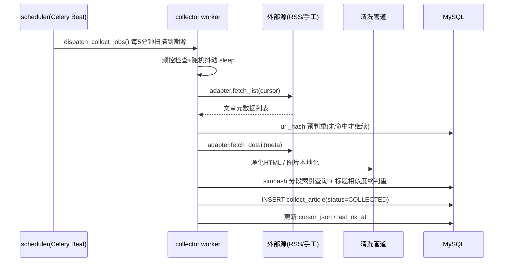

### 5.2 采集渠道现状与合规红线(设计前提)

| 渠道 | 现状 | 合规/稳定性结论 | 本系统处理 |
|---|---|---|---|
| 内容方自有公开 RSS/API(博客、新闻站、允许聚合的站点) | 内容方自己发布的公开订阅源,输出结构稳定 | **正门渠道**:数据由内容方主动公开,获取路径合法可控 | **内置 RSSAdapter,主推方案** |
| 人工授权导入(运营手工提交) | 运营在合作方授权下手工粘贴 URL/正文 | **正门渠道**:授权链路最清晰,量小 | **内置 ManualAdapter** |
| Mock 教学数据 | 样例文章随代码仓库分发,无外部依赖 | **正门渠道**:教学演示主线,全链路可离线跑通 | **内置 MockAdapter** |
| wewe-rss / RSSHub 微信公众号路由 | 依赖微信读书接口逆向或其他灰色通道获取公众号文章,随时可能失效 | **灰色渠道**:数据获取方式未获平台授权,存在协议与法律风险 | **仅保留 `wechat_rss` 适配器扩展点,不提供实现;课堂明确讲解其合规风险** |
| 搜狗微信搜索 | 有验证码、频率封禁、页面结构频繁变动,且robots与服务条款不允许程序化抓取 | **灰色渠道**:程序化抓取涉嫌违反平台协议与《反不正当竞争法》,工程上极不稳定 | **仅保留 `sogou` 适配器扩展点,不提供实现,不做任何反爬对抗(不写验证码识别、不写代理池、不伪造UA指纹)** |
| 商业数据服务商(新榜、清博等开放API) | 付费API,数据合规责任由合同约定 | 可行但有成本;教学环境不采购 | 保留 `vendor` 扩展点,文档说明接入方式即可 |

**教学数据源定稿**:MockAdapter + 教师自建博客/普通网站 RSS。本系统**不承诺采集真实微信公众号文章**;全链路功能与状态机演示以 Mock 数据为主线,RSS 渠道用教师自建博客验证真实网络路径。

**必须向学生讲清的法律红线**:① 未经授权批量抓取他人服务器数据可能触犯《反不正当竞争法》乃至刑法非法获取计算机信息系统数据罪;② 转载文章受《著作权法》保护,带"原创"标的文章必须由源公众号将本方公众号加入其**转载白名单**后方可发布,而**微信没有任何 API 可查询他人公众号的转载白名单**,因此本系统采用**人工登记模式**(流程见下):collector 负责在 `is_original_marked` 字段如实标记原创标,mapping-engine 对 `is_original_marked=1 AND 源.whitelist_confirmed=0` 的文章拦截置 `UNMATCHED` 并记录拦截原因(见第6章);③ 采集内容若含个人信息须遵守《个人信息保护法》,本系统清洗阶段不落地评论区/用户数据。

**原创转载授权登记流程(人工模式)**:

1. 运营与内容源方**线下取得转载授权**(纸质授权书、授权邮件或合作协议),并请源方将本方公众号加入其原创转载白名单;
2. 运营将授权凭证(扫描件/截图等)上传至内部存储,取得链接;
3. 经 `PUT /api/v1/collect/sources/{id}`(需 `collect:source:manage` 权限)把凭证链接填入 `auth_proof_url`,并将 `whitelist_confirmed` 置 1;
4. 发布阶段若 `freepublish/get` 返回 `publish_status=2`(原创校验失败),publish-engine 自动回写该源 `whitelist_confirmed=0` 并告警(见第7章),运营须重新线下确认授权后再次置位,形成闭环。

### 5.3 采集适配器抽象:SourceAdapter

所有渠道统一收敛到两个方法:`fetch_list()` 拉取增量元数据列表,`fetch_detail()` 拉取单篇全文。适配器**只负责取数**,清洗、判重、入库由管道统一完成,保证新增渠道零侵入。

```python
# collector/adapters/base.py
from abc import ABC, abstractmethod
from dataclasses import dataclass, field
from datetime import datetime
from typing import Any

@dataclass
class ArticleMeta:
    """fetch_list 返回的轻量元数据,用于预判重与游标推进"""
    url: str                      # 原文链接(ManualAdapter 粘贴正文时可为空串)
    title: str
    pub_time: datetime | None = None
    author: str = ""
    source_mp_name: str = ""
    extra: dict[str, Any] = field(default_factory=dict)  # 适配器私有字段

@dataclass
class ArticleDetail(ArticleMeta):
    raw_html: str = ""            # 原始正文HTML
    cover_url: str = ""           # 封面原始地址
    is_original_marked: bool = False

class SourceAdapter(ABC):
    """采集适配器抽象基类。子类禁止实现任何反爬对抗逻辑。"""
    adapter_type: str = "base"

    def __init__(self, config: dict[str, Any]):
        self.config = config      # 即 collect_source.config_json

    @abstractmethod
    def fetch_list(self, cursor: dict[str, Any]) -> tuple[list[ArticleMeta], dict[str, Any]]:
        """按游标拉取新文章元数据。
        返回 (metas, new_cursor):metas 按 pub_time 升序;new_cursor 为
        本批消费完后的新游标,由管道在整批成功后原子写回 cursor_json。"""

    @abstractmethod
    def fetch_detail(self, meta: ArticleMeta) -> ArticleDetail:
        """拉取单篇全文。失败抛 FetchError,由任务层统一重试。"""

    def healthcheck(self) -> bool:
        """源连通性自检,供 API test-run 使用。默认返回 True。"""
        return True

# 注册表:adapter_type -> class,新渠道在此登记即可
ADAPTER_REGISTRY: dict[str, type[SourceAdapter]] = {}

def register(cls: type[SourceAdapter]) -> type[SourceAdapter]:
    ADAPTER_REGISTRY[cls.adapter_type] = cls
    return cls
```

### 5.4 三种内置适配器

#### 5.4.1 MockAdapter(教学演示)

内置 10 篇样例文章(JSON 随代码仓库分发),每次 `fetch_list` 按游标吐出 1~2 篇,可让学生在**无任何外部依赖**的情况下跑通"采集→映射→转换→审核→发布"全链路。

```python
@register
class MockAdapter(SourceAdapter):
    adapter_type = "mock"
    _SAMPLES = load_json("collector/fixtures/mock_articles.json")  # 10篇样例

    def fetch_list(self, cursor):
        idx = cursor.get("next_index", 0)
        batch = self._SAMPLES[idx: idx + 2]
        metas = [ArticleMeta(url=a["url"], title=a["title"],
                             pub_time=parse_dt(a["pub_time"])) for a in batch]
        return metas, {"next_index": idx + len(batch)}

    def fetch_detail(self, meta):
        a = next(x for x in self._SAMPLES if x["url"] == meta.url)
        return ArticleDetail(**meta.__dict__, raw_html=a["html"],
                             cover_url=a["cover"], is_original_marked=a["original"])
```

#### 5.4.2 RSSAdapter(内容方公开 RSS / 教师自建博客)

`config_json` 示例:`{"feed_url": "https://blog.example.edu/feed.xml", "auth_header": {"Authorization": "Bearer ..."}, "timeout": 10}`。

- `fetch_list`:GET feed_url,用 `feedparser` 解析,过滤 `pub_time > cursor.last_pub_time` 的条目;支持 `ETag/Last-Modified` 条件请求(304 直接返回空批)。
- `fetch_detail`:若 RSS 条目自带全文(`content:encoded`,多数博客系统支持)直接取用;否则对 `entry.link` 做**单次、限速的**HTTP GET,失败即抛 `FetchError`,不重试超过任务层策略、不切换代理。
- 网络请求统一走 `httpx.Client(timeout, headers)`,UA 固定为真实的项目标识 `mcn-collector/1.0`,不伪装浏览器。

#### 5.4.3 ManualAdapter(运营手工导入)

不走 Beat 调度,由 REST API(见 5.9 的 `POST /collect/manual-import`)触发。两种模式:

| 模式 | 入参 | 行为 |
|---|---|---|
| URL 导入 | `{"source_id":1,"url":"https://mp.weixin.qq.com/s/..."}` | 后台任务对该 URL 做单次抓取;若目标站拒绝(验证码/登录墙),任务置 FAILED 并提示运营改用粘贴模式,**不做绕过** |
| 正文粘贴 | `{"source_id":1,"title":"...","html":"<p>...</p>","origin_url":"...(选填)"}` | 直接构造 `ArticleDetail` 进清洗管道;`url_hash` 用 `origin_url` 或标题+日期的替代键计算 |

实现上 `fetch_list` 从 Redis 队列 `collect:manual:{source_id}` 弹出待处理项,`fetch_detail` 按模式分派。

### 5.5 采集任务调度(Celery Beat + 频控 + 抖动)

调度分两级:Beat 只负责"每 5 分钟扫一次到期源",真正的采集是每源一个独立任务,避免单源阻塞全局。

```python
# scheduler/beat_schedule.py(scheduler 模块中登记,逻辑归 collector)
app.conf.beat_schedule = {
    "dispatch-collect": {
        "task": "collector.tasks.dispatch_collect_jobs",
        "schedule": crontab(minute="*/5"),
    },
}

# collector/tasks.py
@app.task
def dispatch_collect_jobs():
    now = utcnow()
    for src in db.query(CollectSource).filter(status=ENABLED):
        due = (src.last_run_at is None or
               now >= src.last_run_at + timedelta(minutes=src.interval_minutes))
        if due:
            delay = random.randint(0, src.jitter_seconds)   # 随机抖动:打散同刻并发
            collect_one_source.apply_async(args=[src.id], countdown=delay)

@app.task(bind=True, max_retries=3, retry_backoff=60, retry_backoff_max=1800,
          retry_jitter=True, acks_late=True)
def collect_one_source(self, source_id: int):
    # 单源频控锁:同一源任一时刻只允许一个任务在跑,锁TTL防死锁
    lock = redis.set(f"collect:lock:{source_id}", self.request.id, nx=True, ex=900)
    if not lock:
        return  # 上一轮未结束,本轮直接放弃(而非排队),防任务堆积
    try:
        run_collect_pipeline(source_id)   # 见 5.6/5.7/5.8
    except FetchError as e:
        raise self.retry(exc=e)           # 指数退避 60s/120s/240s...上限30min
    finally:
        redis.delete(f"collect:lock:{source_id}")
```

频控要点:

1. **单源互斥锁**(上例 Redis SETNX):防同源并发重复抓取。
2. **单源最小间隔**:`interval_minutes` 下限 15 分钟,API 层校验,防运营配成高频轮询压垮源站。
3. **随机抖动**:`countdown=random(0, jitter_seconds)`,避免所有源整点齐发造成流量尖峰(对被采集的源站也友好)。
4. **全局并发上限**:collector 队列独立 worker(`-Q collect -c 4`),批内每篇 `fetch_detail` 之间强制 `sleep(uniform(1, 3))` 秒。

### 5.6 内容清洗管道

清洗目标:去除脚本与危险标签(防存储型 XSS,清洗结果会进 wangEditor 与最终草稿)、剥离微信/RSS 私有噪声、**图片本地化**(微信图床 `mmbiz.qpic.cn` 有防盗链,不转存则站外无法显示,且发布时需重传素材)。

管道顺序(纯函数串联,每步可单测):

| 步骤 | 实现 | 说明 |
|---|---|---|
| 1 编码与解析 | `lxml.html.fromstring` | 修复残缺HTML |
| 2 结构剥离 | 删除 `script/style/iframe/form/link/meta` 整节点 | 去脚本、去外链样式 |
| 3 白名单过滤 | `bleach.clean(tags=ALLOW_TAGS, attributes=ALLOW_ATTRS, strip=True)` | 见下方白名单 |
| 4 属性净化 | 移除所有 `on*` 事件、`javascript:` 协议href、`style` 中 `expression/position:fixed` | 防XSS/防布局劫持 |
| 5 图片本地化 | 见下方伪代码 | 下载→转存→改写 `src` |
| 6 噪声裁剪 | 删除"点击上方蓝字关注""阅读原文"等尾部推广块(规则库,按class/文本匹配) | 可配置,默认保守 |
| 7 落库 | 产出 `clean_html`、纯文本 `text`(供 simhash) | — |

白名单(教学基线,可按需扩展):

```python
ALLOW_TAGS  = ["p","br","h1","h2","h3","h4","strong","em","u","s","blockquote",
               "ul","ol","li","a","img","table","thead","tbody","tr","th","td",
               "figure","figcaption","span","div","hr","code","pre"]
ALLOW_ATTRS = {"a": ["href","title"], "img": ["src","alt","width","height"],
               "*": ["align"]}   # 不放行 class/id/style,统一由前端样式接管
```

图片本地化转存(注意:此处只转存到**本地对象存储/静态目录**,给编辑器预览用;发布阶段由 publish-engine 调 wx-gateway 的 `/cgi-bin/media/uploadimg` 换成微信可引用URL,collector 不碰微信API):

```python
def localize_images(doc, article_id) -> None:
    for img in doc.xpath("//img"):
        src = img.get("data-src") or img.get("src") or ""   # 微信正文常用 data-src
        if not src.startswith(("http://", "https://")):
            img.drop_tree(); continue
        try:
            blob = http_get(src, timeout=10, max_bytes=5 * MB,
                            headers={"Referer": ""})        # 空Referer即可取mmbiz图,非对抗
            ext  = sniff_image_ext(blob)                    # 校验真实为图片
            path = f"/data/collect/{article_id}/{sha1(blob)[:16]}.{ext}"
            storage.save(path, blob)
            img.set("src", f"{CDN_BASE}{path}")
            img.attrib.pop("data-src", None)
        except Exception:
            img.drop_tree()                                 # 拉不下来的图直接删,不留死链
```

### 5.7 去重策略

三道闸,成本从低到高:

1. **URL 精确去重(数据库兜底)**:`url_hash = sha256(normalize(url))`,`collect_article.url_hash` 上**唯一约束**;`normalize` 统一小写 host、去 `utm_*`/`chksm`/`scene` 等跟踪参数、去尾部 `/`。插入用 `INSERT ... ON DUPLICATE KEY` 语义(SQLAlchemy 捕获 `IntegrityError`),并发下也不会重。
2. **标题相似去重**:标题去空白/标点/全半角归一后,先查精确命中,再对同源近 30 天文章算归一化编辑距离,`similarity ≥ 0.9` 视为疑似重复。
3. **正文 simhash 指纹**:清洗后纯文本分词(jieba)→ 2-gram 特征加权哈希 → 64 位 simhash,存入 `collect_article.simhash`;与近 30 天文章比 Hamming 距离,`≤ 3` 判重。工程上采用**第2章定义的 MySQL simhash 生成列 + 分段索引方案**避免全表扫:`collect_article` 上以生成列(GENERATED COLUMN)把 64 位 simhash 切成 4 段各 16 位(`simhash_seg1..simhash_seg4`,定义见第2章 DDL),每段建普通索引;查询时任一段相等的候选才进入精确 Hamming 比对(鸽笼原理保证距离≤3的必有一段全等)。该方案可持久、可解释,指纹随文章落库、生成列由数据库自动维护,无额外一致性负担;若候选集查询成为热点,可选优化是在 Redis 以段值集合缓存近 30 天指纹,但**基线实现不引入**。

判重伪代码:

```text
function dedup_check(article) -> (is_dup, dup_of_id):
    key = sha256(normalize_url(article.url or fallback_key(article)))
    if exists collect_article where url_hash = key:      # 闸1
        return (True, that.id)

    norm_t = normalize_title(article.title)
    for cand in recent_articles(same_source, 30d):        # 闸2
        if edit_similarity(norm_t, cand.norm_title) >= 0.9:
            mark_suspect(cand); break                     # 疑似,继续闸3确认

    fp = simhash64(tokenize(article.clean_text))          # 闸3
    # MySQL 分段索引召回候选(生成列 simhash_seg1..4 定义见第2章):
    cands = SELECT id, simhash FROM collect_article
            WHERE collected_at >= now() - 30d
              AND (simhash_seg1 = seg1(fp) OR simhash_seg2 = seg2(fp)
                OR simhash_seg3 = seg3(fp) OR simhash_seg4 = seg4(fp))
    for cand in cands:
        if hamming(fp, cand.simhash) <= 3:
            return (True, cand.id)

    return (False, None)   # fp 随文章 INSERT 落库,分段生成列自动维护
```

命中重复时**不丢弃**记录本身的痕迹:写入 `collect_article` 但 `status=REJECTED`(复用统一驳回态)、`dedup_of` 指向原文章,便于教学演示与排查误判;正常文章置 `COLLECTED` 进入状态机。

### 5.8 增量采集游标与失败重试

**游标**存于 `collect_source.cursor_json`,由各适配器自定义结构,管道统一维护:

| 适配器 | 游标结构 | 推进规则 |
|---|---|---|
| mock | `{"next_index": 4}` | 每批消费后 +batch |
| rss | `{"last_pub_time": "2026-07-03T08:00:00Z", "etag": "...", "last_modified": "..."}` | 取本批最大 `pub_time`;ETag/Last-Modified 随响应更新 |
| manual | 无(队列消费即游标) | — |

一致性规则:**整批文章全部处理完(含失败降级)后才写回新游标**;单篇 `fetch_detail` 失败不阻塞整批——该篇记入 Redis 重试队列 `collect:retry:{source_id}`(元素含 meta 与 `attempt` 次数),游标照常推进,避免一篇坏文卡死增量。

**失败重试分层**:

| 层级 | 失败对象 | 策略 |
|---|---|---|
| 任务级 | `fetch_list` 整体失败(源不可达) | Celery `retry_backoff=60`,指数退避+抖动,最多 3 次;仍失败则 `fail_count += 1` |
| 单篇级 | `fetch_detail`/清洗失败 | 入 `collect:retry` 队列,下轮任务开头优先重放,`attempt ≥ 3` 落库 `status=FAILED` 并写 audit_record 备查 |
| 源级熔断 | `fail_count ≥ 5` | `collect_source.status=2(熔断)`,停止调度并站内通知负责人;人工修复后 API 重置 |

### 5.9 REST API 清单

前缀 `/api/v1/collect`,鉴权走 auth-rbac(JWT + 权限点),普通运营仅能操作分配给自己的源(经 `mp_account_assign` 关联校验)。权限要求列统一引用附录A全局权限点字典;采集文章侧的写操作(手工导入/重洗/删除)归并到 `collect:source:manage`。

| 方法 | 路径 | 说明 | 权限要求 |
|---|---|---|---|
| GET | `/sources` | 采集源分页列表(名称/类型/状态过滤) | `collect:source:view` |
| POST | `/sources` | 新建采集源(校验 adapter_type ∈ 注册表、interval ≥ 15) | `collect:source:manage` |
| GET | `/sources/{id}` | 源详情(含游标、失败计数、授权登记字段) | `collect:source:view` |
| PUT | `/sources/{id}` | 编辑配置/周期/抖动/授权登记(`whitelist_confirmed`/`auth_proof_url`,见 5.2) | `collect:source:manage` |
| DELETE | `/sources/{id}` | 逻辑删除(有关联文章时禁止物理删) | `collect:source:manage` |
| POST | `/sources/{id}/enable` \| `/disable` | 启停;熔断态经此重置 `fail_count` | `collect:source:manage` |
| POST | `/sources/{id}/test-run` | 同步执行 `healthcheck` + 试拉 1 条,返回样例(不入库) | `collect:source:manage` |
| POST | `/sources/{id}/run-now` | 手动触发一次 `collect_one_source.delay` | `collect:source:manage` |
| POST | `/manual-import` | ManualAdapter 入口:URL 导入或正文粘贴(见 5.4.3) | `collect:source:manage` |
| GET | `/articles` | 文章库分页(源/状态/时间/关键词过滤) | `collect:article:view` |
| GET | `/articles/{id}` | 详情(raw_html 与 clean_html 对照) | `collect:article:view` |
| POST | `/articles/{id}/reclean` | 用最新清洗规则重跑管道(仅 `COLLECTED`/`FAILED` 态) | `collect:source:manage` |
| DELETE | `/articles/{id}` | 逻辑删除(仅 `COLLECTED`/`REJECTED`/`FAILED` 态;已进入映射流转的禁止删) | `collect:source:manage` |
| GET | `/articles/{id}/dedup-info` | 判重详情:命中哪道闸、`dedup_of`、Hamming 距离 | `collect:article:view` |
| GET | `/stats/overview` | 看板:今日采集量、去重率、各源健康度 | `collect:source:view` |

响应统一 `{code, msg, data}` 包装;列表接口统一 `page/size/total` 分页参数,与其他模块保持一致。

## 6 映射引擎(mapping-engine)

映射引擎对应客户需求5"采集内容与自有公众号的映射",是连接 collector(采集中心)与 publish-engine(发布引擎)的中枢:它决定"哪篇采集文章,以什么样子,去哪个公众号,什么时候发"。模块输入为状态 `COLLECTED` 的 `collect_article`,输出为初始态即 `TRANSFORMED` 的 `content_article`,并把计算出的**建议排期时间**写入 `content_article.suggested_publish_at`,随后移交 content-center 的审核流(进入 `PENDING_REVIEW`);`publish_task` 不由本模块创建,而是在内容审核通过(`APPROVED`)后的回调中按建议排期统一创建(见第7章)。本章出现的全部状态取值(`COLLECTED / UNMATCHED / MAPPED / TRANSFORMED / PENDING_REVIEW` 等)均引用**第2章统一状态机**(唯一事实源),其中 `UNMATCHED`(无规则命中)是该状态机的正式枚举成员。

### 6.1 模块定位与设计原则

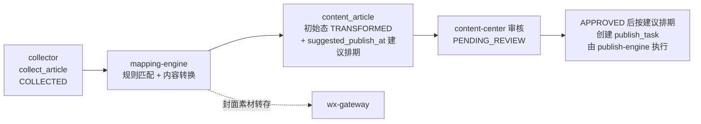

设计原则:

1. **规则即数据**:所有映射逻辑落在 `mapping_rule` 主表与 `mapping_rule_source` 关联表中,以 JSON 描述条件与动作,引擎只做解释执行,新增规则不改代码;
2. **幂等与去重**:同一篇采集文章对同一目标公众号只允许生成一份 `content_article`(数据库唯一约束兜底);
3. **转换不可逆但可追溯**:`content_article` 永远保留 `source_article_id` 指回 `collect_article`,并记录命中的 `rule_id`;
4. **默认人工审核**:映射引擎产出一律进入 `PENDING_REVIEW`;**映射引擎自身不提供任何跳过审核的配置**,跳过审核由发布引擎侧的审核开关(全局 `PUBLISH_REVIEW_ENABLED` + 号级 `mp_account.need_review`,仅 super_admin 可修改)统一控制,且每次自动过审均写入 audit_record 留痕(见第7章)——这是版权与内容安全的最后闸门(教学上须强调:全自动化指流程自动,不等于免审)。

### 6.2 映射规则模型(mapping_rule)

#### 6.2.1 拓扑关系:一对多与多对一

采用"**一条规则 = N 个采集源 → 1 个目标公众号**"的建模,规则与采集源的关联不用 JSON 数组字段,而是用独立关联表 `mapping_rule_source` 保留可索引的外键(便于"按源找规则"的高频查询):

- **多对一**:在关联表 `mapping_rule_source` 中给单条规则挂多个 `collect_source`(每源一行,唯一键 `(rule_id, source_id)`),即"3 个科技源汇入 1 个号";
- **一对多**:同一个采集源出现在多条规则的关联记录中,分别指向不同目标号,即"1 个源分发到 3 个号"。

每条规则只对应一个目标号,好处是排期策略(时间窗口、每日限量)天然按目标号收敛,不需要在一条规则里维护多套排期,教学实现复杂度低且语义清晰。

#### 6.2.2 表结构 DDL

```sql
CREATE TABLE mapping_rule (
    id                    BIGINT UNSIGNED AUTO_INCREMENT PRIMARY KEY,
    rule_name             VARCHAR(64)  NOT NULL COMMENT '规则名称',
    target_mp_account_id  BIGINT UNSIGNED NOT NULL COMMENT '目标公众号, 引用 mp_account.id',
    match_condition_json  JSON         NOT NULL COMMENT '触发条件, 见 6.2.3',
    transform_action_json JSON         NOT NULL COMMENT '转换动作, 见 6.2.4',
    schedule_policy_json  JSON         NOT NULL COMMENT '排期策略, 见 6.2.5',
    priority              INT          NOT NULL DEFAULT 100 COMMENT '数值越大优先级越高, 匹配按 priority DESC',
    enabled               TINYINT      NOT NULL DEFAULT 1 COMMENT '1启用 0停用',
    created_by            BIGINT UNSIGNED NOT NULL COMMENT '创建人, 引用 sys_user.id',
    created_at            DATETIME     NOT NULL DEFAULT CURRENT_TIMESTAMP,
    updated_at            DATETIME     NOT NULL DEFAULT CURRENT_TIMESTAMP ON UPDATE CURRENT_TIMESTAMP,
    KEY idx_target (target_mp_account_id),
    KEY idx_enabled_priority (enabled, priority)
) ENGINE=InnoDB COMMENT='映射规则(主表)';

CREATE TABLE mapping_rule_source (
    id         BIGINT UNSIGNED AUTO_INCREMENT PRIMARY KEY,
    rule_id    BIGINT UNSIGNED NOT NULL COMMENT '引用 mapping_rule.id',
    source_id  BIGINT UNSIGNED NOT NULL COMMENT '引用 collect_source.id',
    UNIQUE KEY uk_rule_source (rule_id, source_id),
    KEY idx_source (source_id)
) ENGINE=InnoDB COMMENT='映射规则-采集源关联表(多对一挂源)';
```

配套在 `content_article` 上建立去重约束(由 content-center 建表,此处引用):

```sql
-- content_article 中与映射相关的关键列
-- source_article_id    BIGINT   引用 collect_article.id (自建原创文章时为 NULL)
-- mapping_rule_id      BIGINT   命中的规则
-- mp_id                BIGINT   目标公众号
-- suggested_publish_at DATETIME NULL, 映射引擎计算的建议排期时间(审核通过后据此创建 publish_task)
UNIQUE KEY uk_src_target (source_article_id, mp_id)  -- 同源同目标去重的硬约束
```

#### 6.2.3 触发条件 match_condition_json

```json
{
  "logic": "AND",
  "keywords_include": ["AI", "大模型", "芯片"],
  "keywords_include_mode": "ANY",
  "keywords_exclude": ["测评开箱", "优惠券", "广告"],
  "match_field": "title_and_content",
  "categories": ["科技"],
  "tags": ["深度", "行业分析"],
  "min_word_count": 800
}
```

| 字段 | 语义 |
|---|---|
| `logic` | 各条件组之间 AND / OR |
| `keywords_include` + `keywords_include_mode` | 包含关键词;`ANY` 命中任一即可,`ALL` 须全部命中 |
| `keywords_exclude` | **排除词一票否决**,命中任一直接不匹配(优先级高于包含词) |
| `match_field` | 匹配范围:`title` / `content` / `title_and_content` |
| `categories` / `tags` | 与 collector 打在 `collect_article` 上的分类、标签取交集,非空交集即命中;留空表示不限 |
| `min_word_count` | 过滤过短的快讯类内容,可选 |

#### 6.2.4 转换动作 transform_action_json

```json
{
  "title_template": "【转】{title}",
  "body_pipeline": [
    {"type": "regex_replace", "pattern": "关注我们.{0,30}$", "replacement": "", "flags": "ms"},
    {"type": "remove_paragraph", "match": "contains", "value": "扫码关注"},
    {"type": "remove_paragraph", "match": "regex", "value": "^(点击.*阅读原文|推荐阅读[::])"},
    {"type": "strip_external_links", "keep_text": true},
    {"type": "rehost_images", "mode": "mark_only"},
    {"type": "append_block", "position": "tail",
     "template": "<hr/><p style=\"color:#888;font-size:13px\">本文转载自公众号「{source_name}」,原文标题《{title}》,发布于 {publish_time}。版权归原作者所有,如有侵权请联系删除。</p>"}
  ],
  "cover_strategy": {
    "mode": "RANDOM_MATERIAL",
    "fixed_media_id": null,
    "material_tag": "tech-cover"
  },
  "ai_rewrite": {
    "enabled": false,
    "prompt_profile": "tech_paraphrase_v1",
    "similarity_ceiling": 0.85,
    "mark_template": "<p style=\"color:#888;font-size:12px\">注:本文在原文基础上由 AI 辅助改写整理。</p>"
  }
}
```

说明:

- **标题模板**:占位符支持 `{title}` `{source_name}` `{category}` `{date}`,如 `"【转】{title}"`、`"{title}|每日科技速递"`;渲染后超 64 字自动截断(微信草稿标题上限);
- **正文规则链(body_pipeline)**:按数组顺序依次执行,每步是一个纯函数 `html -> html`,内置算子:`regex_replace`(正则替换)、`remove_paragraph`(按包含文本/正则删除整段,典型用于剔除原号的引流段落)、`strip_external_links`(微信正文不允许外链,去 a 标签保留文字)、`rehost_images`(**仅标记待转存**:扫描正文中非微信域名的外链图片,生成外链图片清单随 `content_article` 一并保存,本模块不实际上传;实际转存由 content-center 在文章提审的 HTML 处理管道中统一经 wx-gateway 调 `/cgi-bin/media/uploadimg` 执行,并配合 `content_material_wx_ref` 按 `(mp_account_id, file_hash)` 去重——转存不完成,正文图片在微信端必然裂图,因此提审管道强制执行该步,见第4章)、`append_block`(头/尾追加来源与版权声明块,教学上要求所有转载规则必配此步);
- **封面策略**:`ORIGINAL` 沿用原文头图(经 `/cgi-bin/material/add_material` 转存为永久素材拿 `thumb_media_id`)/ `FIXED` 固定图(直接给 `fixed_media_id`)/ `RANDOM_MATERIAL` 从 `content_material` 中按 `material_tag` 随机取一张;`ORIGINAL` 转存失败自动降级为 `RANDOM_MATERIAL`;
- **AI 改写扩展点**:默认 `enabled=false`。启用后在规则链执行完插入一步调用外部 LLM 按 `prompt_profile` 改写;**强制约束**:改写产物必须在文末追加 `mark_template` 标注(响应《生成式人工智能服务管理暂行办法》及深度合成内容标识要求,不允许配置为空),且相似度高于 `similarity_ceiling` 时视为"改写无效"仍按转载规范保留来源声明。教学实现中该扩展点只要求留出接口(Strategy 模式),不要求真接大模型。

#### 6.2.5 排期策略 schedule_policy_json

```json
{
  "time_windows": [["08:00", "09:30"], ["19:00", "21:00"]],
  "daily_limit": 2,
  "min_interval_minutes": 120,
  "overflow": "NEXT_DAY"
}
```

| 字段 | 语义 |
|---|---|
| `time_windows` | 目标号的发布时间窗口,建议排期只会落在窗口内 |
| `daily_limit` | 该规则每日最多允许的发布篇数(按"已创建的 publish_task + 已写建议排期的待审文章"合计统计);同目标号多条规则的合计还受 mp_account 级日限额约束(mp-manager 维护) |
| `min_interval_minutes` | 同号两次发布的最小间隔 |
| `overflow` | 当日配额满时:`NEXT_DAY` 顺延到次日窗口 / `DROP` 丢弃(文章停在 TRANSFORMED,不写建议排期、不提审) |

### 6.3 规则执行引擎

#### 6.3.1 触发与总体流程

collector 每落库一篇 `collect_article`(状态 `COLLECTED`),即向 Redis 投递 Celery 任务 `mapping.match_article(article_id)`;另有 scheduler 每 10 分钟兜底扫描一次滞留在 `COLLECTED` 的文章(防丢消息)。

```mermaid
sequenceDiagram
    participant CO as collector
    participant ME as mapping-engine(Celery worker)
    participant DB as MySQL
    participant WG as wx-gateway

    CO->>ME: match_article(article_id)
    ME->>DB: 读 collect_article + 经 mapping_rule_source 按来源加载启用规则(priority DESC)
    ME->>ME: 原创拦截: is_original_marked=1 且源 whitelist_confirmed=0 → 置 UNMATCHED 并记录原因
    ME->>ME: 逐条评估 match_condition_json
    ME->>ME: 同目标去重: 每个 target_mp_account_id 只保留最高优先级规则
    ME->>ME: 执行 transform_action_json(标题/正文链/封面; rehost_images 仅标记外链图片清单)
    ME->>WG: 封面素材转存(material/add_material)
    ME->>DB: 插入 content_article(status=TRANSFORMED, uk_src_target 唯一约束防重)
    ME->>DB: 按 schedule_policy_json 计算建议排期, 写 suggested_publish_at(不创建 publish_task)
    ME->>DB: 提交审核 → PENDING_REVIEW(publish_task 由 APPROVED 后的回调创建, 见第7章)
```

#### 6.3.2 执行伪代码

```python
@celery_app.task(queue="mapping", acks_late=True, max_retries=3)
def match_article(collect_article_id: int):
    art = repo.get_collect_article(collect_article_id)
    if art is None or art.status != "COLLECTED":
        return                                        # 幂等: 已处理过直接返回

    # 0) 版权拦截(见 6.8): 带原创声明 且 来源未经人工确认授权 → 置 UNMATCHED 并记录原因
    src_cfg = repo.get_collect_source(art.source_id)
    if art.is_original_marked == 1 and src_cfg.whitelist_confirmed == 0:
        repo.update_collect_article(art.id, status="UNMATCHED",
                                    unmatched_reason="原创未确认授权")
        return

    # 1) 候选规则: 启用中 且 经 mapping_rule_source 关联该文章来源, 按 priority 降序
    rules = repo.find_rules_by_source(source_id=art.source_id, enabled=1,
                                      order_by="priority DESC, id ASC")

    # 2) 条件匹配
    hits = [r for r in rules if evaluate(r.match_condition_json, art)]

    # 3) 冲突消解: 同一目标号只保留优先级最高的一条(见 6.4)
    winner_by_target = {}
    for r in hits:
        winner_by_target.setdefault(r.target_mp_account_id, r)

    produced = 0
    for mp_id, rule in winner_by_target.items():
        # 4) 同源同目标去重(应用层预查 + uk_src_target 唯一约束在插入时兜底)
        if repo.exists_content(source_article_id=art.id, mp_id=mp_id):
            continue
        # 5) 内容指纹去重: 指纹 = 第2章 collect_article 的 simhash 生成列 + 归一化标题
        #    (字段定义与分段索引见第2章), 同目标 30 天窗口内查重
        if repo.fingerprint_seen(simhash=art.simhash, norm_title=art.norm_title,
                                 mp_id=mp_id, days=30):
            continue
        transform_article.delay(art.id, mp_id, rule.id)   # 异步转换, 产出 content_article
        produced += 1

    # 6) 采集文章状态推进(引用第2章统一状态机: 命中≥1条即 MAPPED;
    #    无命中置 UNMATCHED —— 正式枚举值, 便于运营复盘)
    repo.update_collect_article(art.id,
        status="MAPPED" if produced else "UNMATCHED")


@celery_app.task(queue="mapping", max_retries=3, retry_backoff=True)
def transform_article(collect_article_id: int, mp_id: int, rule_id: int):
    src  = repo.get_collect_article(collect_article_id)
    rule = repo.get_rule(rule_id)
    act  = rule.transform_action_json

    title = render(act["title_template"], src)[:64]
    html  = src.clean_html
    pending_images = []                               # rehost_images 仅收集外链图片清单, 不上传
    for step in act["body_pipeline"]:                 # 顺序执行规则链
        html = PIPELINE_OPS[step["type"]](html, step, ctx=src, marks=pending_images)
    if act["ai_rewrite"]["enabled"]:                  # 扩展点, 默认关闭
        html = ai_rewrite(html, act["ai_rewrite"]) + act["ai_rewrite"]["mark_template"]

    thumb_media_id = resolve_cover(act["cover_strategy"], src, mp_id)

    # 产出 content_article: 初始态即 TRANSFORMED(第2章统一状态机),
    # uk_src_target 唯一约束防重(IntegrityError 静默跳过);
    # pending_images 为待转存外链图片清单, 实际转存由 content-center 提审管道执行(见第4章)
    content = repo.create_content_article(
        source_article_id=src.id, mp_id=mp_id, mapping_rule_id=rule.id,
        title=title, content_html=html, thumb_media_id=thumb_media_id,
        pending_images=pending_images, status="TRANSFORMED")

    # 7) 建议排期: 只计算建议发布时刻写入 suggested_publish_at, 不创建 publish_task;
    #    publish_task 由审核通过(APPROVED)后的回调按该建议时间创建(见第7章)
    slot = suggest_slot(rule.schedule_policy_json, mp_id, rule.id)
    if slot is None and rule.schedule_policy_json["overflow"] == "DROP":
        repo.update_collect_article(src.id, status="TRANSFORMED")
        return                                        # 停在 TRANSFORMED, 不提审
    repo.update_content_article(content.id, suggested_publish_at=slot)
    repo.submit_review(content.id)                    # TRANSFORMED → PENDING_REVIEW
    repo.update_collect_article(src.id, status="TRANSFORMED")  # 采集侧状态推进(第2章状态机)


def suggest_slot(policy, mp_id, rule_id, day=today()):
    """在时间窗口内计算最早可用的建议发布时刻; 当日配额满则按 overflow 顺延.
    仅产出建议值(写入 content_article.suggested_publish_at);
    审核通过回调创建 publish_task 时会按当时配额复核, 必要时顺延(见第7章)."""
    while True:
        if repo.count_planned(rule_id=rule_id, day=day) < policy["daily_limit"] \
           and repo.mp_daily_quota_ok(mp_id, day):
            # count_planned 口径 = 已创建的 publish_task + 已写建议排期的待审文章
            for win_start, win_end in policy["time_windows"]:
                t = next_free_time(mp_id, day, win_start, win_end,
                                   policy["min_interval_minutes"])
                if t: return t
        if policy["overflow"] != "NEXT_DAY": return None
        day = day + 1_day
```

条件评估 `evaluate()` 的短路顺序固定为:**排除词 → 包含词 → 分类 → 标签 → 字数**,排除词命中立即返回 False,保证"排除优先"语义稳定。

### 6.4 规则冲突与优先级

| 冲突场景 | 消解策略 |
|---|---|
| 同一文章命中多条指向**同一目标号**的规则 | 按 `priority DESC, id ASC` 只取一条执行(数值越大优先级越高,见伪代码第 3 步),避免同号重复成文;执行记录中登记"被压制规则",便于运营排查 |
| 同一文章命中多条指向**不同目标号**的规则 | 全部执行——这正是"一对多"分发的正常形态 |
| 同源同目标重复触发(重试/兜底扫描) | 应用层 `exists_content` 预查 + `uk_src_target` 唯一约束兜底,捕获 `IntegrityError` 静默跳过 |
| 同一原文被多个采集源转载后重复采回 | 内容指纹(第2章 `collect_article` 的 simhash 生成列 + 归一化标题组合,字段定义见第2章)在同目标号 30 天窗口内查重 |
| 两条规则 priority 相同 | 以 `id ASC`(先建先赢)兜底,前端保存时给出"存在同目标同优先级规则"警告 |
| 规则修改后是否影响已生成内容 | 不影响;规则快照思想——`content_article.mapping_rule_id` 只表示"当时命中",转换结果不回溯重算,如需重算走"规则回放"API |

### 6.5 规则配置前端界面(条件构建器)

页面路径 `视图: /mapping/rules`,基于 Element Plus 实现,分四步 Tab:

1. **基本信息**:规则名、优先级(数字输入,旁注"越大越先")、启用开关(`enabled`);采集源用多选下拉(数据来自 collect_source 列表,保存时展开写入 `mapping_rule_source` 关联表,每源一行),`target_mp_account_id` 用单选下拉(仅展示当前登录运营被 `mp_account_assign` 分配的公众号——权限由 auth-rbac 控制,运营配不了别人的号);
2. **触发条件——条件构建器**:可视化组装 `match_condition_json`。顶部 AND/OR 切换;包含词、排除词用 `el-select` tag 模式(输入回车成 chip,排除词 chip 红色);分类、标签为多选;右侧常驻**实时测试面板**:粘贴一段标题/正文或选一篇历史 `collect_article`,即时显示"命中/未命中"及未命中原因(命中了哪个排除词等)——本质是调用 6.6 的 dry-run 接口;
3. **转换动作**:标题模板输入框(占位符按钮点击插入,下方实时预览渲染结果);正文规则链用可拖拽排序的步骤列表(`el-table` + 拖拽),每步一行选算子类型、填参数;封面策略三选一单选组,选素材库随机时联动 `material_tag` 下拉;AI 改写折叠面板默认收起,展开须勾选"我已知悉 AI 生成内容需标注"复选框方可启用;
4. **排期策略**:时间窗口用多组 `el-time-picker` 区间(可加减行)、每日限量与最小间隔数字输入、超额策略单选。

保存前前端调用"规则预检"接口做一致性校验(窗口不重叠、限量>0、模板占位符合法、正则可编译)。

### 6.6 核心 REST API 清单

统一前缀 `/api/v1/mapping`,鉴权走 auth-rbac 的 JWT;权限点为 `mapping:rule:view`(查询/试算类)与 `mapping:rule:manage`(增删改/回放类),编码遵循附录A全局权限点字典。

| 方法 | 路径 | 权限 | 说明 |
|---|---|---|---|
| GET | `/rules` | `mapping:rule:view` | 分页查询规则,支持按 `source_id`(经 `mapping_rule_source` 关联过滤)/ `target_mp_account_id` / `enabled` / 关键字过滤 |
| POST | `/rules` | `mapping:rule:manage` | 新建规则(服务端二次校验 JSON schema 与正则合法性;入参中的采集源数组展开写入 `mapping_rule_source`) |
| GET | `/rules/{id}` | `mapping:rule:view` | 规则详情 |
| PUT | `/rules/{id}` | `mapping:rule:manage` | 全量更新规则(含重建 `mapping_rule_source` 关联) |
| PATCH | `/rules/{id}/status` | `mapping:rule:manage` | 启用/停用(切换 `enabled`,即时生效,不影响已产出的 content_article 与已创建的 publish_task) |
| DELETE | `/rules/{id}` | `mapping:rule:manage` | 逻辑删除(有关联 content_article 时禁止物理删) |
| POST | `/rules/dry-run` | `mapping:rule:view` | **条件试算**:入参为条件 JSON + 样本文章(ID 或文本),返回命中结果与逐条件判定明细,供条件构建器测试面板用 |
| POST | `/rules/{id}/preview` | `mapping:rule:view` | **转换预览**:对指定 `collect_article` 套用该规则的转换动作,返回渲染后标题/正文 HTML/封面,不落库 |
| POST | `/rules/{id}/replay` | `mapping:rule:manage` | **规则回放**:对时间范围内历史 `COLLECTED/UNMATCHED` 文章重跑该规则(异步 Celery 任务,返回 task_id) |
| GET | `/executions` | `mapping:rule:view` | 映射执行记录查询(文章、命中规则、被压制规则、去重原因、产出 content_article_id) |
| GET | `/rules/{id}/metrics` | `mapping:rule:view` | 命中率统计:近 N 天匹配数/去重数/产出数/发布成功数 |

### 6.7 典型映射场景示例

**场景A|多对一:3 个科技源汇入 1 个自有号,每天最多 2 篇,标题加前缀**

```json
{
  "rule_name": "科技三源→AI前沿观察",
  "source_ids": [11, 12, 13],
  "target_mp_account_id": 5,
  "priority": 100,
  "match_condition_json": {"logic": "AND", "keywords_include": [], "keywords_exclude": ["广告", "抽奖"], "match_field": "title_and_content", "categories": ["科技"], "min_word_count": 600},
  "transform_action_json": {"title_template": "【转】{title}",
    "body_pipeline": [{"type": "strip_external_links", "keep_text": true}, {"type": "rehost_images", "mode": "mark_only"}, {"type": "append_block", "position": "tail", "template": "<hr/><p>本文转载自「{source_name}」,版权归原作者所有。</p>"}],
    "cover_strategy": {"mode": "ORIGINAL"}, "ai_rewrite": {"enabled": false}},
  "schedule_policy_json": {"time_windows": [["19:00", "21:00"]], "daily_limit": 2, "min_interval_minutes": 60, "overflow": "NEXT_DAY"}
}
```
(`source_ids` 仅为 API 入参的便捷写法,服务端展开为 `mapping_rule_source` 关联表的 3 行记录,数据库不存 JSON 数组。)三个源当天共采到 7 篇合格文章时,按转换完成先后取得 2 个当日建议槽位,其余 5 篇的建议排期顺延次日窗口,始终不突破日限;publish_task 在各篇审核通过后按建议时间创建。

**场景B|一对多:1 个财经头部源分发到 3 个自有号,标题风格各异**
建 3 条规则,均经 `mapping_rule_source` 只挂采集源 21,`target_mp_account_id` 分别为 6/7/8,标题模板分别为 `"{title}"`、`"【荐读】{title}"`、`"{title}|财经晚报"`,排期窗口错开(早/午/晚)。同一篇文章命中 3 条规则、目标号互不相同,引擎全部执行,产出 3 篇独立的 `content_article`,各自走各号的审核与排期;`uk_src_target` 保证每号仅一份。

**场景C|关键词分流 + 排除 + AI 改写(演示优先级与合规标注)**
同一个综合源 31 下建两条规则:规则 R1(priority=200)条件含 `keywords_include:["新能源","电池"]` → 目标号"新能源观察";规则 R2(priority=100)条件为空(兜底全收)→ 目标号"每日精选",且 R2 开启 `ai_rewrite.enabled=true`(文末自动追加"本文由 AI 辅助改写"标注)。一篇标题含"电池"的文章同时命中 R1、R2:目标号不同,两条都执行;若把 R2 的目标也改成"新能源观察",则按 priority(数值越大越优先)只有 R1 生效,R2 被压制并记入执行记录。含排除词"内推招聘"的文章则两条规则都直接不命中,停在 `UNMATCHED`。

### 6.8 合规红线(本模块强制约束)

1. **版权**:微信不提供任何可查询他人公众号转载白名单的 API,授权状态采用**人工登记**:运营线下取得源方授权后,在 `collect_source` 上手工置 `whitelist_confirmed=1` 并登记授权凭证链接 `auth_proof_url`。映射引擎在匹配阶段直接拦截:`collect_article.is_original_marked=1 AND collect_source.whitelist_confirmed=0` → 文章置 `UNMATCHED` 并记录拦截原因("原创未确认授权");系统不做也无法做任何"自动校验源号转载白名单"的动作。所有转载规则的 `body_pipeline` 必须包含来源声明 `append_block`,服务端保存规则时校验,缺失则拒绝保存;
2. **AI 标注**:`ai_rewrite.mark_template` 不允许为空串,生成内容必须显式标识,符合生成式 AI 与深度合成内容标识的监管要求;
3. **不可跳过人工审核**:映射引擎自身不提供任何跳过审核的配置项;跳过审核由发布引擎的审核开关(全局 `PUBLISH_REVIEW_ENABLED` + 号级 `mp_account.need_review`,仅 super_admin 可修改)统一控制,且每次自动过审均写入 audit_record(action=AUTO_APPROVE)留痕(见第7章);
4. **教学声明**:采集与转载仅限已获授权或明确允许转载的内容源,课程实验环境应使用自建测试公众号与自产内容,不得用于对第三方内容的规模化搬运。

## 7 发布引擎与微信API网关

本章覆盖 **publish-engine(发布引擎)** 与 **wx-gateway(微信API网关)** 两个模块,对应客户需求 6"全自动化发文"。两者职责边界:

- **wx-gateway**:系统内**唯一**与微信公众平台服务器通信的出口。中控维护所有公众号的 access_token,封装统一 HTTP 客户端(签名、重试、错误码翻译、限流),对内提供语义化方法(如 `draft_add`、`freepublish_submit`),对外屏蔽微信 API 的全部细节。内置 MockChannel(见 7.1.5):`mp_account.account_type=3`(测试/模拟号)时 draft/freepublish 类调用路由到本地模拟实现。其他模块(collector 除外,采集走公开网页不经此网关)一律禁止直连 `api.weixin.qq.com`。
- **publish-engine**:驱动 `publish_task` 状态机(SCHEDULED→PUBLISHING→PUBLISHED/FAILED,任务仅在 `content_article` 达到 APPROVED 后创建),负责封面素材落地、正文图片兜底校验(正文图片转存归 content-center,见第 4 章)、草稿构建、提交发布、结果轮询、定时调度、失败重试与告警,并回写 `publish_task` / `publish_log`。

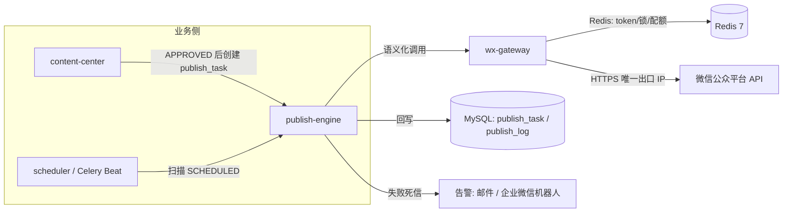

> 部署约束:wx-gateway 所在宿主机的**出口 IP 必须加入每个公众号后台的 IP 白名单**,这也是"全系统只允许网关一个出口"的根本原因——白名单只需维护一处。

### 7.1 wx-gateway 设计

#### 7.1.1 access_token 中控:Redis Key 设计

access_token 通过 `GET /cgi-bin/token`(grant_type=client_credential)获取,有效期 7200 秒。微信侧刷新会使旧 token 短暂并存,但**并发重复刷新会互相挤掉对方的 token**,因此必须中控 + 分布式锁。

| Redis Key | 类型 | 内容 | TTL | 说明 |
|---|---|---|---|---|
| `wx:token:{appid}` | string | access_token 明文 | `expires_in - 300`(≈6900s) | 主动缩短 5 分钟,保证读到的 token 至少还有 5 分钟寿命 |
| `wx:lock:token:{appid}` | string | 随机 uuid(锁持有者标识) | 10s | 刷新分布式锁,`SET NX EX` |
| `wx:token:failcnt:{appid}` | string | 连续刷新失败次数 | 3600s | ≥3 次触发熔断:暂停该号所有任务并告警 |
| `wx:quota:{appid}:{api}:{yyyymmdd}` | string | 当日接口调用计数 | 到次日零点 | 网关侧软限流,先于微信 45009 拦截 |
| `wx:publock:{task_id}` | string | 发布提交幂等锁 | 300s | 见 7.8 防重复发布 |

#### 7.1.2 提前刷新 + 分布式锁防并发刷新(伪代码)

策略:**读时惰性刷新**(TTL 不足即刷)+ **Beat 定时预刷新**(每 5 分钟扫描所有启用的 `mp_account`,对剩余 TTL < 600s 的号提前刷)。双保险,正常情况下业务调用永远命中缓存。

```python
# wx_gateway/token_store.py
class TokenStore:
    TOKEN_KEY = "wx:token:{appid}"
    LOCK_KEY  = "wx:lock:token:{appid}"
    SAFE_TTL  = 300

    def get(self, appid: str) -> str:
        key = self.TOKEN_KEY.format(appid=appid)
        token = redis.get(key)
        if token and redis.ttl(key) > 0:      # 写入时已扣除安全窗口
            return token
        return self._refresh(appid)

    def invalidate(self, appid: str):
        """收到 40001/42001 时调用: 删缓存, 下次读强制刷新"""
        redis.delete(self.TOKEN_KEY.format(appid=appid))

    def _refresh(self, appid: str) -> str:
        lock_key, lock_id = self.LOCK_KEY.format(appid=appid), uuid4().hex
        if redis.set(lock_key, lock_id, nx=True, ex=10):        # 抢到锁 → 我来刷
            try:
                secret = secret_vault.decrypt(appid)            # app_secret_cipher 密文落库, 内存解密(见第2章)
                data = httpx.get(WX_BASE + "/cgi-bin/token", params={
                    "grant_type": "client_credential",
                    "appid": appid, "secret": secret,
                }, timeout=5).json()
                if "access_token" not in data:                  # 40164/40125 等
                    redis.incr(f"wx:token:failcnt:{appid}")
                    raise WxTokenError(data)
                redis.set(self.TOKEN_KEY.format(appid=appid),
                          data["access_token"],
                          ex=data["expires_in"] - self.SAFE_TTL)    # TTL = expires_in - 300
                redis.delete(f"wx:token:failcnt:{appid}")
                return data["access_token"]
            finally:
                release_lock(lock_key, lock_id)   # Lua: GET==lock_id 才 DEL, 防误删他人锁
        else:                                     # 没抢到锁 → 自旋等待刷新者写回
            for _ in range(20):
                time.sleep(0.25)
                token = redis.get(self.TOKEN_KEY.format(appid=appid))
                if token:
                    return token
            raise WxTokenError(f"{appid} token refresh wait timeout")
```

教学要点:锁的释放必须用 Lua 脚本做"比较持有者再删除"(CAS),否则刷新者超时后可能删掉下一个持有者的锁;等待方不重复发起刷新请求,避免微信侧 token 被反复挤刷。

#### 7.1.3 常见错误码处理表

wx-gateway 统一把微信 `errcode` 翻译为三类语义异常:`WxRetryableError`(可重试)、`WxTokenError`(刷 token 后重试一次)、`WxFatalError`(不可重试,任务转 FAILED/告警)。

| errcode | 含义 | 归类 | 网关处理策略 |
|---|---|---|---|
| -1 | 系统繁忙 | 可重试 | 指数退避重试(1s/2s/4s,最多 3 次) |
| 40001 | access_token 无效(被挤刷/错误) | token 类 | `invalidate(appid)` → 强刷 → 原请求重放 1 次 |
| 42001 | access_token 已过期 | token 类 | 同 40001 |
| 40164 | 调用 IP 不在白名单 | 致命 | **不重试**;熔断该 appid 全部任务;立即告警运维(附当前出口 IP) |
| 45009 | 接口日调用量超限 | 致命(当日) | 不重试;任务挂起至次日;告警;检查 `wx:quota` 软限流为何未拦住 |
| 45011 | API 调用太频繁(分钟级频控) | 可重试 | 退避 60s 后重试 |
| 40007 | 无效 media_id | 致命 | 清除本地素材映射缓存,重走素材落地;二次仍失败转 FAILED |
| 48001 | 无该接口权限(如未认证号无发布能力) | 致命 | 任务 FAILED;`mp_account` 标记能力缺失,阻止后续同类任务 |
| 53503 | 草稿未通过发布检查 | 致命 | 任务 FAILED,驳回给内容编辑修改(常见:内容含违规/死链) |
| 53504 | 需前往公众平台官网操作草稿 | 致命 | 任务 FAILED,转人工 |
| 53505 | 请手动保存成功后再发表 | 致命 | 任务 FAILED,转人工 |

#### 7.1.4 统一 HTTP 客户端封装与重试

```python
# wx_gateway/client.py
class WxClient:
    RETRYABLE = {-1, 45011}
    TOKEN_ERR = {40001, 42001}

    def call(self, appid: str, method: str, path: str, *,
             files=None, json_body=None, retries: int = 3) -> dict:
        quota_guard.check(appid, path)                      # 软限流, 先于 45009
        last_err = None
        for attempt in range(retries + 1):
            token = token_store.get(appid)
            resp = self._http.request(                      # httpx, 连接池复用
                method, WX_BASE + path,
                params={"access_token": token},
                json=json_body, files=files,
                timeout=httpx.Timeout(connect=3, read=15, write=30, pool=5))
            data = resp.json()
            code = data.get("errcode", 0)
            if code == 0 or "access_token" in data:
                publish_log_hook(appid, path, code, cost_ms(resp))   # 埋点
                return data
            if code in self.TOKEN_ERR:
                token_store.invalidate(appid); last_err = data; continue
            if code in self.RETRYABLE and attempt < retries:
                time.sleep(60 if code == 45011 else 2 ** attempt)
                last_err = data; continue
            raise map_wx_error(code, data)                  # 转语义化异常(见 7.1.3)
        raise WxRetryableError(last_err)

    # ---- 对内暴露的语义化方法(publish-engine 只认识这些) ----
    def upload_material(self, appid, file_bytes, media_type) -> str: ...   # /cgi-bin/material/add_material → media_id
    def upload_img(self, appid, file_bytes) -> str: ...                    # /cgi-bin/media/uploadimg → url(由 content-center 调用, 见第4章)
    def draft_add(self, appid, articles: list[dict]) -> str: ...           # /cgi-bin/draft/add → draft media_id(回写 content_article / content_draft_group)
    def freepublish_submit(self, appid, draft_media_id) -> dict: ...       # → publish_id
    def freepublish_get(self, appid, publish_id) -> dict: ...              # → publish_status
    def mass_sendall(self, appid, draft_media_id) -> dict: ...             # 显式群发, 见 7.7
```

注意:JSON body 需 `ensure_ascii=False` 序列化(中文标题),素材上传为 multipart;所有请求/响应快照脱敏(去 token、secret)后写 `publish_log`。

#### 7.1.5 MockChannel(教学模拟通道)

网关内置 **MockChannel**:当目标号 `mp_account.account_type=3`(测试/模拟号)时,所有 draft/freepublish 类调用(`draft_add` / `freepublish_submit` / `freepublish_get` 等)**不出网**,由网关路由到本地模拟实现,并返回**可配置结果**——默认全部成功;也可按号配置返回指定 `errcode` 或 `publish_status`(如 2/3/4),用于课堂演练失败重试、死信告警等分支。

```python
# wx_gateway/client.py — call() 入口处的路由判断
if account_repo.by_appid(appid).account_type == 3 and is_publish_api(path):
    return mock_channel.handle(appid, path, json_body)   # 本地模拟, 结果可按号配置
```

上层 publish-engine 代码**零改动**:状态机迁移、`publish_log` 落库、轮询与告警链路全部真实走通。这使得**全部功能与状态机可在无认证公众号条件下完成教学验收**(Mock 通道为主线验收路径,见第 8 章);真实链路终验依赖教师/课程组提供至少一个已认证公众号。

### 7.2 发布流水线完整状态机

全局状态机的**状态全集与属主关系以第 2 章为唯一事实源,本章只引用**,状态分属三张表:

- `collect_article.status`:COLLECTED / UNMATCHED / MAPPED / TRANSFORMED,由 collector / mapping-engine 驱动(见第 5–6 章);
- `content_article.status`:TRANSFORMED / PENDING_REVIEW / APPROVED / REJECTED / DRAFT_CREATED,审核迁移由 content-center 驱动(见第 4 章与 7.5),APPROVED→DRAFT_CREATED 由 publish-engine 在建稿成功时写入,`draft_media_id` 亦存于 content_article(多图文组存 content_draft_group);
- `publish_task.status`:SCHEDULED / PUBLISHING / PUBLISHED / FAILED,**publish-engine 拥有 publish_task 全部迁移的唯一写权**。`publish_task` 仅在 `content_article` 达到 APPROVED 后创建,初始态即 SCHEDULED(立即发布 = `scheduled_at` 取当前时刻),任务只存 `publish_id` 回执、不存 `draft_media_id`。

本章状态机图只画 `publish_task` 段:

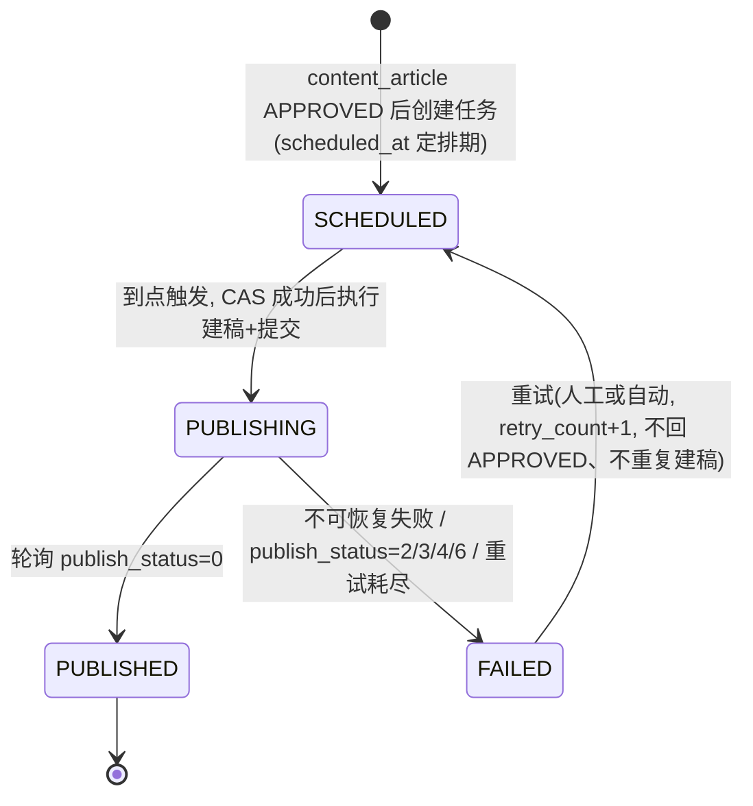

迁移规则:所有状态更新必须走 `UPDATE publish_task SET status=:new WHERE id=:id AND status=:expected`(乐观 CAS),影响行数为 0 即说明并发下状态已被他人变更,当前操作直接放弃——这是幂等的第一道防线。

`publish_task` 关键字段(建表细节见第 2 章数据设计,`biz_key` / `dispatched` 的 DDL 定义亦在第 2 章,此处列出本章依赖的列):

| 字段 | 类型 | 说明 |
|---|---|---|
| `biz_key` | varchar(64) **UNIQUE** | 幂等键,取 `article:{content_article_id}` 或 `group:{draft_group_id}`(拼接目标号),防重复建任务 |
| `status` | varchar(20) | SCHEDULED / PUBLISHING / PUBLISHED / FAILED(全集与属主见第 2 章) |
| `content_article_id` / `draft_group_id` | bigint | **二选一非空(CHECK 约束)**:单图文任务 / 多图文组任务(见 7.3.3 与第 4 章) |
| `scheduled_at` | datetime | 计划发布时间(立即发布=创建时刻) |
| `dispatched` | tinyint | Beat 是否已投递到队列(防重复投递) |
| `publish_id` | varchar(128) | 微信发布单 id 回执,断点续跑锚点;`draft_media_id` 不在本表,归 content_article(组任务归 content_draft_group) |
| `retry_count` / `fail_reason` | int / text | 重试计数(上限 `max_retry=5`)与最后失败原因 |

### 7.3 全自动发文执行流程

#### 7.3.1 端到端时序

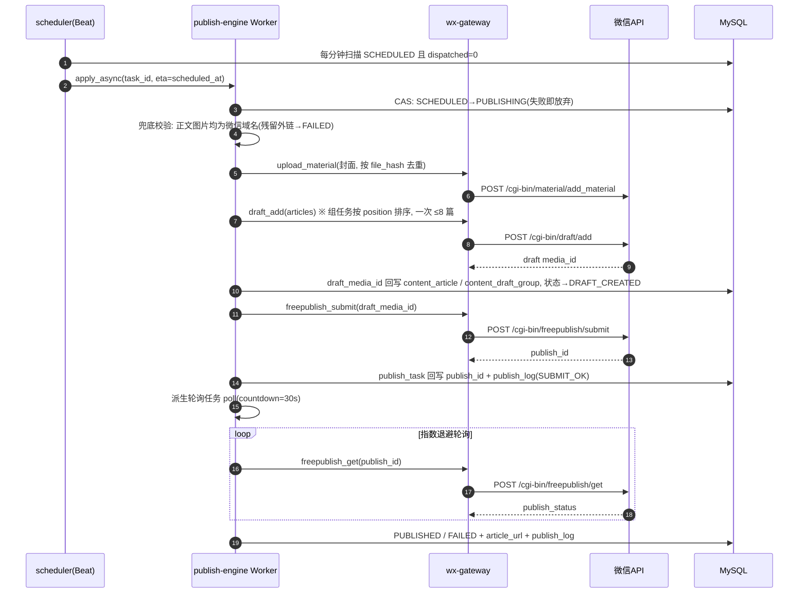

#### 7.3.2 素材落地与正文图片兜底校验

1. **封面图**:调 `POST /cgi-bin/material/add_material?type=image`(永久素材)取得 `thumb_media_id`。永久图片素材有总量上限(5000 张),因此采用两层素材模型(见第 2 章):`content_material`(本地素材,与号无关,`file_hash` 用 SHA-256 去重)+ `content_material_wx_ref`(素材在某公众号的微信侧引用:`mp_account_id, media_id/wx_url`),按 `(mp_account_id, file_hash)` 去重,**同一图片对同一公众号只上传一次**。
2. **正文内图片**:采集来源的图片外链在微信正文中会被屏蔽。图片转存(逐张下载后调 `POST /cgi-bin/media/uploadimg` 换取 `https://mmbiz.qpic.cn/...` URL 并替换回 HTML 的 ``,限 jpg/png、1MB 以内,超限先压缩)**唯一归属 content-center,在文章提审时的 HTML 处理管道中执行**(见第 4 章)。publish-engine **只做兜底校验**:建草稿前扫描正文,发现残留非微信域名的 `` → 任务置 FAILED 并给出明确错误(见 7.3.3),发布期不做补偿上传。
3. 封面落地结果写入 `content_material_wx_ref` 并在 `publish_log` 中记 phase=`MATERIAL`。

#### 7.3.3 构建草稿与提交发布(Celery 任务伪代码)

```python
# publish_engine/tasks.py
@shared_task(bind=True, acks_late=True, max_retries=5,
             autoretry_for=(WxRetryableError,),
             retry_backoff=60, retry_backoff_max=3600, retry_jitter=True)
def execute_publish(self, task_id: int):
    with db.begin():
        task = repo.get_for_update(task_id)                 # SELECT ... FOR UPDATE
        if not task or task.status != "SCHEDULED":
            return "skip: illegal state"                    # 幂等防线①
        if not redis.set(f"wx:publock:{task_id}", 1, nx=True, ex=300):
            return "skip: another worker running"           # 幂等防线②
        repo.cas_status(task_id, "SCHEDULED", "PUBLISHING")

    appid = repo.load_appid(task.mp_account_id)

    # 1) 加载文章: content_article_id / draft_group_id 二选一非空(CHECK 约束)
    if task.draft_group_id:
        articles = repo.load_group_articles(task.draft_group_id)   # 按 position 排序
        assert 1 <= len(articles) <= 8                             # 一次 draft/add 最多 8 篇
        if any(a.status not in ("APPROVED", "DRAFT_CREATED") for a in articles):
            repo.finish(task_id, "FAILED",
                        fail_reason="draft_group 内存在未过审文章")   # 建任务期已在前端阻断, 此处兜底
            return
    else:
        articles = [repo.load_article(task.content_article_id)]

    # 2) 兜底校验: 正文图片必须已由 content-center 转存为微信域名(见 7.3.2)
    for a in articles:
        bad = find_non_wx_images(a.html)          # 非 mmbiz.qpic.cn 等微信域名的 
        if bad:
            repo.finish(task_id, "FAILED",
                        fail_reason=f"article#{a.id} 正文残留非微信域图片: {bad[:3]}")
            dead_letter_alert.delay(task_id, {"errmsg": "正文图片未转存, 请回内容中心重新提审"})
            return

    # 3) 封面素材落地(content_material_wx_ref 按 (mp_account_id, file_hash) 去重)
    payload = []
    for a in articles:
        payload.append({
            "title": a.title[:64],
            "author": a.author or "",
            "digest": a.digest[:120],
            "content": a.html,                               # 已是 mmbiz 图片URL
            "thumb_media_id": material.ensure_cover(appid, a.cover_url),
            "need_open_comment": 0, "only_fans_can_comment": 0,
        })

    # 4) 构建草稿 —— draft_media_id 存 content_article(组任务存 content_draft_group), 断点续跑锚点
    draft_id = repo.get_draft_media_id(task)      # 读 content_article / content_draft_group
    if not draft_id:
        draft_id = wxgw.draft_add(appid, payload)
        repo.save_draft_media_id(task, draft_id)  # 回写属主表, 非 publish_task
        repo.mark_articles(articles, "DRAFT_CREATED")   # content_article: APPROVED→DRAFT_CREATED
        repo.log(task_id, phase="DRAFT", errcode=0, detail=draft_id)

    # 5) 提交发布 —— 提交前再查一次, 已有 publish_id 则跳过(断点续跑)
    task = repo.reload(task_id)
    if not task.publish_id:
        resp = wxgw.freepublish_submit(appid, draft_id)
        repo.save_publish_id(task_id, resp["publish_id"])   # publish_task 只存 publish_id 回执
        repo.log(task_id, phase="SUBMIT", errcode=0, detail=resp)

    # 6) 交给轮询任务
    poll_publish_result.apply_async(args=[task_id], countdown=30)


@shared_task(bind=True, max_retries=40)                      # 30s起步指数退避,封顶10min
def poll_publish_result(self, task_id: int):
    task  = repo.get(task_id)
    appid = repo.load_appid(task.mp_account_id)
    resp  = wxgw.freepublish_get(appid, task.publish_id)
    st = resp["publish_status"]         # 0成功 1发布中 2原创失败 3常规失败 4平台审核不通过 5成功后被删 6被系统封禁
    if st == 1:
        raise self.retry(countdown=min(30 * 2 ** self.request.retries, 600))
    if st == 0:
        url = resp["article_detail"]["item"][0]["article_url"]
        repo.finish(task_id, "PUBLISHED", article_url=url)
        repo.log(task_id, phase="RESULT", errcode=0, detail=resp)
    else:
        repo.finish(task_id, "FAILED", fail_reason=f"publish_status={st}")
        repo.log(task_id, phase="RESULT", errcode=st, detail=resp)
        if st == 2:                       # 原创校验失败: 自动回写来源登记状态, 形成闭环
            repo.reset_source_whitelist(task)   # 该文章来源 collect_source.whitelist_confirmed=0
        dead_letter_alert.delay(task_id, resp)               # 见 7.6
```

要点:freepublish 是**发布到公众号主页**(可被搜索、可分享),不会主动推送给粉丝;`publish_status=2` 常因转载文章带"原创"标而目标号未被源公众号加入**转载白名单**(白名单无 API 可查,系统采用人工登记模式,见第 2/5 章),该错误直接 FAILED 的同时**自动回写该来源 `collect_source.whitelist_confirmed=0` 并告警**,提示运营重新走线下授权流程后再手工置位,禁止通过去标、洗稿规避。

#### 7.3.4 回写 publish_log

每个 phase(MATERIAL / DRAFT / SUBMIT / RESULT / RETRY / ALERT)一条记录:`task_id, phase, errcode, errmsg, req_snapshot(脱敏), resp_snapshot, cost_ms, worker_host, created_at`,用于问题回溯与教学演示"一次发文在系统里留下的完整脚印"。

### 7.4 定时发布实现(Beat 扫描 + ETA)

采用"**数据库为准、队列只做触发**"的两级模型,避免纯 ETA 方案在 Redis broker 重启后丢任务:

```python
# scheduler: Celery Beat, 每 60s
@shared_task
def scan_scheduled_tasks():
    horizon = utcnow() + timedelta(minutes=10)               # 只看未来10分钟窗口
    rows = repo.pick(                                        # WHERE status='SCHEDULED'
        status="SCHEDULED", dispatched=0,                    #   AND dispatched=0
        scheduled_before=horizon, limit=200,                 #   AND scheduled_at<=:horizon
        skip_locked=True)                                    # FOR UPDATE SKIP LOCKED, 多Beat安全
    for t in rows:
        execute_publish.apply_async(
            args=[t.id],
            eta=max(t.scheduled_at, utcnow()))               # 到点执行, 过期任务立即补跑
        repo.mark_dispatched(t.id)
```

- `dispatched` 标记防止下一轮扫描重复投递;Worker 端的状态 CAS 与 Redis 锁再兜底(纵深防御)。
- 补偿任务:每 30 分钟扫描 `dispatched=1 且 status='SCHEDULED' 且 scheduled_at 已过 15 分钟` 的"投递后失踪"任务,重置 `dispatched=0` 让其重新入队。
- 取消定时:仅允许 `SCHEDULED` 态取消(关闭任务并释放其 `biz_key`,对应 `content_article` 停留在 APPROVED/DRAFT_CREATED,可重新创建任务);`PUBLISHING` 后不可取消。

### 7.5 人工审核开关

| 层级 | 存放位置 | 语义 |
|---|---|---|
| 全局开关 | 配置项 `PUBLISH_REVIEW_ENABLED`(env/配置文件,启动加载,支持热更新到 Redis) | 关闭时全系统 TRANSFORMED 直接进 APPROVED |
| 公众号级 | `mp_account.need_review` (tinyint, 默认 1) | 全局开启时,按号覆盖;**默认锁死开启**(先审后发是内容安全底线,教学与生产同口径) |

判定逻辑:`需要审核 = PUBLISH_REVIEW_ENABLED and mp_account.need_review`。**两级开关默认全部开启,仅 `super_admin` 可修改(权限点 `system:config:manage`),每一次开关改动写 `audit_record`**;开关关闭导致的每一次自动过审同样写一条 `audit_record(auditor_id=0, action='AUTO_APPROVE')`,保证审计链完整。

审核动作本身**由 content-center 承担**,审核对象是 `content_article`,接口为 `POST /api/v1/articles/{id}/audit`(见第 4 章,权限点 `content:article:audit`,审核员角色由 auth-rbac 控制);**本章不提供任何审核接口**:

- 审核通过 → `content_article` CAS `PENDING_REVIEW→APPROVED`,写 `audit_record(article_id, auditor_id, action='APPROVE', reason, created_at)`;通过回调中按 `content_article.suggested_publish_at`(映射引擎暂存的建议排期,见第 6 章)创建 `publish_task`(初始态 SCHEDULED),publish-engine 自此接管。
- 审核驳回 → CAS `PENDING_REVIEW→REJECTED`,`reason` 必填,同样写 `audit_record`;驳回后可由 content-center 修改内容重新提审。

### 7.6 失败重试与死信告警

分层重试策略:

| 层 | 触发 | 策略 |
|---|---|---|
| 网关层 | errcode ∈ {-1, 45011} | 同步短重试:1s/2s/4s(45011 固定 60s),最多 3 次 |
| 任务层 | `WxRetryableError` 抛出到 Celery | `retry_backoff=60, retry_backoff_max=3600, retry_jitter=True`,即 60s→120s→240s→…2 倍递增封顶 3600s,`max_retry=5`,`retry_count` 同步回写 |
| 致命错误 | `WxFatalError`(40164/45009/48001/53503…) | 不重试,直接 FAILED + 死信告警 |
| 人工 | FAILED 任务详情页"重试"按钮 | `FAILED→SCHEDULED`,`retry_count+1`,复用 content_article / content_draft_group 已有 `draft_media_id` 断点续跑,不重复建稿 |

死信告警(重试耗尽或致命错误):

```python
@shared_task
def dead_letter_alert(task_id: int, err: dict):
    task = repo.get(task_id)
    text = (f"【发文失败】task#{task_id} 公众号:{task.mp_name}\n"
            f"文章:《{task.title}》 状态:{task.status}\n"
            f"错误:{err.get('errcode')} {err.get('errmsg','')}\n"
            f"重试:{task.retry_count}/5  详情:{ADMIN_URL}/publish/tasks/{task_id}")
    # 渠道1: 企业微信群机器人 webhook
    httpx.post(settings.WECOM_WEBHOOK_URL,     # https://qyapi.weixin.qq.com/cgi-bin/webhook/send?key=xxx
               json={"msgtype": "markdown", "markdown": {"content": text}}, timeout=5)
    # 渠道2: 邮件(SMTP), 发给该公众号在 mp_account_assign 中的负责运营 + 管理员
    mailer.send(to=repo.owners_email(task.mp_account_id), subject="发文失败告警", body=text)
    repo.log(task_id, phase="ALERT", errcode=-9, detail=text)
```

特殊熔断:`40164`(IP 白名单)与 token 连续刷新失败 ≥3 次时,除告警外将该 `mp_account` 置为"网关熔断"标记,Beat 扫描时跳过其全部任务,避免雪崩式重试打爆微信频控。

### 7.7 freepublish 与 mass/sendall 的对比与取舍

| 维度 | 发布能力 `/cgi-bin/freepublish/submit` | 群发 `/cgi-bin/message/mass/sendall` |
|---|---|---|
| 是否推送粉丝 | **否**,仅发布到公众号主页,可被搜一搜/分享触达 | **是**,直接推送到粉丝会话 |
| 频次限制 | 无群发次数限制(仅受 API 日常频控) | 认证订阅号 **1 次/天**,服务号 **4 次/月**,消耗不可逆 |
| 结果获取 | 返回 `publish_id`,轮询 `freepublish/get` | 回调/查询群发状态 |
| 失误代价 | 低(可删除已发布文章) | 高(打扰全体粉丝,次数被消耗,撤回影响大) |
| 适用场景 | 矩阵批量铺内容、SEO 沉淀、日更 | 重要通知、精选内容触达粉丝 |

**系统决策**:全自动流水线**默认且仅使用 freepublish**;群发是稀缺且高风险资源,设计为**显式人工操作**——独立接口 `POST /api/v1/publish/mass-send`,仅管理员角色可调,要求二次确认(前端输入公众号名称确认),调用前网关校验当日/当月剩余群发额度,操作全程写 `audit_record` 与 `publish_log`。自动任务永远不会隐式消耗群发次数。

### 7.8 幂等与防重复发布

重复发文是本模块最严重的事故(矩阵号批量重复发布会触发平台处置),设计四道防线:

1. **建任务防重**:`publish_task.biz_key` 唯一索引(幂等键,取 `article:{content_article_id}` 或 `group:{draft_group_id}` 拼接目标号,字段与索引 DDL 见第 2 章),重复创建返回已有任务(HTTP 409 + 原 task_id)。
2. **投递防重**:Beat 的 `dispatched` 标记 + `FOR UPDATE SKIP LOCKED`,同一任务只投递一次。
3. **执行防重**:Worker 启动即 CAS 状态(仅 `SCHEDULED→PUBLISHING` 允许通过)+ Redis 锁 `wx:publock:{task_id}`;Celery 侧 `acks_late=True` 配合该锁,Worker 宕机重投也不会二次提交。
4. **提交防重**:调用 `freepublish/submit` 前重读 `publish_id`——已存在则跳过提交直接进入轮询(断点续跑);`draft_media_id`(存于 content_article / content_draft_group)同理,重试不会重复建草稿、重复上传素材(封面素材经 `content_material_wx_ref` 按 `(mp_account_id, file_hash)` 映射去重)。

补充校验:提交前调 `/cgi-bin/freepublish/batchget` 核对该号近期已发布列表中是否存在相同标题+摘要指纹,命中则任务置 FAILED 并提示疑似重复(防御上游映射引擎产生的重复文章)。

### 7.9 核心 REST API 清单

对外接口(经 Nginx,`/api/v1` 前缀,JWT 鉴权,权限点引用附录 A 全局权限点字典,由 auth-rbac 定义;运营只能操作 `mp_account_assign` 分配给自己的公众号):

| 方法 | 路径 | 说明 | 权限点(角色) |
|---|---|---|---|
| POST | `/api/v1/publish/tasks` | 创建发布任务(`content_article_id` 或 `draft_group_id` 二选一 + `mp_account_id` + `scheduled_at`;支持批量;仅 APPROVED 文章可建,组任务要求组内**全部 APPROVED**,否则前端阻断) | `publish:task:manage`(运营) |
| GET | `/api/v1/publish/tasks` | 任务分页查询(状态/公众号/时间范围筛选) | `publish:task:view`(运营) |
| GET | `/api/v1/publish/tasks/{id}` | 任务详情(含状态轨迹、微信侧 id) | `publish:task:view`(运营) |
| POST | `/api/v1/publish/tasks/{id}/cancel` | 取消(仅 SCHEDULED 态) | `publish:task:manage`(运营) |
| POST | `/api/v1/publish/tasks/{id}/retry` | 失败重试(FAILED→SCHEDULED) | `publish:task:manage`(运营/管理员) |
| GET | `/api/v1/publish/tasks/{id}/logs` | 该任务 `publish_log` 明细 | `publish:log:view`(运营/审核员) |
| POST | `/api/v1/publish/mass-send` | 显式群发(二次确认 + 额度校验) | `publish:task:manage`,且仅 admin/super_admin |
| GET | `/api/v1/publish/stats` | 发布成功率/失败分布看板数据 | `publish:task:view`(运营/管理员) |

> 注:早期版本的 `/api/v1/publish/review/*`(pending/approve/reject)三个接口**已删除**——审核对象是 `content_article`,统一由 content-center 的 `POST /api/v1/articles/{id}/audit` 承担(见第 4 章与 7.5)。

wx-gateway 内网接口(仅集群内可达,Nginx 不暴露):

| 方法 | 路径 | 说明 |
|---|---|---|
| POST | `/internal/wx/{appid}/call` | 统一代理调用(供 publish-engine 之外的模块偶发使用) |
| POST | `/internal/wx/{appid}/token/refresh` | 手动强刷 token(运维排障) |
| GET | `/internal/wx/{appid}/health` | 该号 token 剩余 TTL / 熔断状态 / 当日配额 |

### 7.10 合规红线声明

- **只使用微信官方公开 API**(本章列出的 token/draft/freepublish/material/uploadimg/mass 接口),不逆向、不模拟登录公众平台后台、不使用第三方非授权自动化工具,遵守《微信公众平台服务协议》与《微信公众平台运营规范》。
- **转载合规**:带"原创"标的采集文章,必须由源公众号将本方公众号加入其**转载白名单**后方可发布;微信**无任何 API 可查询他人白名单**,系统采用人工登记模式(`collect_source.whitelist_confirmed` + `auth_proof_url`,运营线下取得授权后手工置位,见第 2/5 章);发布失败(publish_status=2)时自动回写 `whitelist_confirmed=0` 并告警,不做任何技术规避,只走线下授权。
- **先审后发**:双层审核开关默认锁死开启(仅 super_admin 可改且留痕),审核记录完整落 `audit_record`,发布内容须符合《网络信息内容生态治理规定》等法规要求;教学环境使用自有测试公众号或 Mock 通道,不得对第三方内容做未授权商用分发。
- **频控自律**:网关软限流先于平台限制生效,不实施刷量、诱导分享等违规行为。

## 8 合规风险与教学实施规划

### 8.1 合规与风险

本系统涉及"采集他人内容 → 加工 → 再发布"的完整链路,天然贴近版权与平台规范的红线。本节给出风险清单、系统内置的技术护栏,以及默认关闭的危险能力,确保课题在教学与演示场景下零合规风险。

#### 8.1.1 版权风险(最高优先级)

**风险定性**:未经授权转载他人图文,构成对信息网络传播权的侵权(《著作权法》第十条、第五十二/五十三条),权利人可主张删除、赔礼道歉与赔偿;若批量搬运,还可能被认定为经营性侵权,风险显著放大。"标注来源"不等于"获得授权",这是学生最容易误解的一点,必须在文档与课堂上反复强调。

**系统内置的四道护栏**(与 mapping-engine / publish-engine / content-center 联动):

| # | 护栏 | 落地机制 |
|---|------|----------|
| 1 | 优先取得转载授权(人工登记) | 微信**没有任何 API 可查询他人公众号的转载白名单**,授权状态只能人工登记:`collect_source` 表增加 `whitelist_confirmed TINYINT`(授权已确认)与 `auth_proof_url VARCHAR`(授权凭证链接),由运营线下取得源方授权、留存凭证后手工置位;系统不做也无法做自动校验,一律以人工登记为准 |
| 2 | 进入源号转载白名单 | 对带"原创"声明的文章(`collect_article.is_original_marked = 1`),必须由源公众号将我方目标号加入其转载白名单,否则微信侧会直接拒绝或替换为分享卡片。映射引擎的拦截条件:`is_original_marked = 1 AND whitelist_confirmed = 0` → 文章置为 `UNMATCHED` 并记录拦截原因;若发布后 `freepublish/get` 返回 `publish_status = 2`(原创校验失败),系统自动回写该源 `whitelist_confirmed = 0` 并触发告警,形成"人工登记 → 发布校验 → 自动回写"的闭环 |
| 3 | 显著标注来源 | TRANSFORMED 阶段由模板引擎强制在正文头部注入来源块(源公众号名称、原文标题、原文链接、授权声明),该模板不可被运营删除,只可追加内容;`content_article` 保存 `source_article_id` 外键实现全链路溯源 |
| 4 | 一键删除下架 | 提供 `POST /api/v1/articles/{id}/takedown`:调用 wx-gateway 删除已发布图文(`/cgi-bin/freepublish/delete`)→ 同步删除草稿 → 状态置为 `REJECTED` → 写 `audit_record`(操作人、原因、时间)。收到权利人投诉时可在分钟级完成全矩阵下架 |

#### 8.1.2 平台规范风险

《微信公众平台运营规范》对"抄袭/搬运他人内容"设有明确的**阶梯式处罚**,系统设计必须让使用者清楚每一级的代价:

| 违规次数 | 平台处罚(规范原则,具体以官方为准) |
|----------|-----------------------------------|
| 第 1 次 | 删除违规内容并警告 |
| 第 2 次 | 删除内容 + 封禁公众号能力(如群发)7 天 |
| 第 3 次 | 封禁 14 天 |
| 第 4 次 | 封禁 30 天 |
| 第 5 次 | **永久封号** |

配套还有"洗稿"投诉合议机制:即使做了伪原创改写,仍可能被合议判定为洗稿。因此本系统**明确不提供**任何"伪原创/同义词替换/AI 洗稿"功能,TRANSFORMED 阶段只做排版清洗、来源标注、外链图片标记待转存(实际转存由 content-center 在提审管道中经 `/cgi-bin/media/uploadimg` 完成)等格式层变换,不做语义层改写——这是产品层面的合规声明,写入需求边界。

其他平台规范约束在发布引擎中硬编码为规则:

- 群发接口仅认证号可用,群发频次(认证订阅号 1 次/天、认证服务号 4 次/月)由 publish-engine 在任务创建时校验拦截,而非等微信 API 报错;
- `freepublish` 仅发布到公众号主页、不推送粉丝,教学演示默认走此通道,避免误触达真实用户;
- 出口 IP 白名单:部署文档要求将服务器出口 IP 登记到每个公众号后台,wx-gateway 对 `40164`(IP 不在白名单)错误码给出明确告警文案。

#### 8.1.3 数据安全

系统持有多个公众号的 AppSecret,等同于持有这些号的"最高操作权",必须按凭据类资产管理:

- **凭据加密存储**:`mp_account.app_secret_cipher` 落库前用 AES-256-GCM 加密,主密钥来自环境变量 `MP_SECRET_MASTER_KEY`(base64),AAD = `app_id`,支持 `key_version` 轮换(生产环境建议接入 KMS),严禁明文入库、严禁出现在日志与接口响应中;所有 API 返回该字段一律脱敏为 `sk-****`。
- **access_token 只进 Redis 不落库**:由 wx-gateway 中控刷新(Redis TTL 取 `expires_in - 300`,约 6900 秒,即提前 300 秒刷新),业务模块只能通过内部接口取用,拿不到 AppSecret 本身。
- **最小权限(RBAC)**:依托 auth-rbac 模块,运营账号只能操作 `mp_account_assign` 中分配给自己的公众号;"查看 AppSecret 明文""删除公众号"等高危动作仅限管理员角色,"修改全局审核开关(`PUBLISH_REVIEW_ENABLED`)"仅限 super_admin,且每次执行都写 `audit_record`。
- **操作审计**:`audit_record` 记录操作人、动作、目标对象、前后快照(JSON diff)、IP、时间,覆盖:公众号增删改、分配变更、审核通过/驳回、发布/下架、映射规则修改。审计日志只增不删,普通角色无删除权限。
- **口令与会话**:sys_user 密码 bcrypt 哈希;JWT 短有效期 + 刷新令牌;登录失败次数限制。

#### 8.1.4 采集合规边界

collector 模块的设计原则是"**只走正门**":

1. **默认三种正规采集渠道**(`collect_source.adapter_type`,取值 `mock / rss / manual`):
   - `mock`(MockAdapter):内置模拟数据源,产出结构与真实文章一致的假数据,教学演示首选;
   - `rss`(RssAdapter):仅订阅内容方自己发布的、公开且明示允许聚合的 RSS/Atom 源(博客、新闻站等);教学环境使用教师自建博客/普通网站的 RSS;
   - `manual`(ManualAdapter):人工授权后手工导入(粘贴 URL/上传 HTML/富文本粘贴),由人确认内容来源合法后入库。
2. **尊重 robots.txt 与服务条款**:RSS 之外若扩展任何 HTTP 抓取,必须先解析并遵守目标站 robots 协议,遵守其 ToS;对明确禁止抓取的站点直接拒绝配置为采集源。
3. **不做反爬对抗**:系统不实现也不预留验证码识别、模拟登录他人账号、伪造设备指纹、Cookie 池、代理池轮换等任何反反爬能力。特别地,**不模拟登录/逆向微信客户端接口抓取公众号历史文章**——该行为同时违反微信服务协议并可能触碰《反不正当竞争法》乃至刑法关于非法获取计算机信息系统数据的规定,属于本课题的绝对禁区。
4. **灰色渠道定性(与第 5 章渠道对比结论完全一致)**:wewe-rss、RSSHub 的微信公众号路由依赖逆向或灰色通道,与搜狗微信搜索同列——本系统仅保留适配器扩展点、不予实现,课堂上明确讲解其合规风险;因此教学数据源定稿为 **MockAdapter + 教师自建博客/普通网站 RSS**,本课题不承诺"采集真实公众号文章"。
5. **限速与留痕**:采集任务默认频率不高于 1 请求/5 秒/源,采集行为写入 `publish_log` 同级的采集日志,可追溯"何时从哪个源取了什么"。

### 8.2 教学定位建议:测试号 + MockAdapter 全流程演示

真实认证公众号申请门槛高(企业主体、认证费),不适合课堂环境。推荐组合:**微信公众平台"接口测试号"验证真实 API 交互 + MockAdapter(即第 7 章 wx-gateway 内置的 MockChannel)跑通全状态机**;真实的草稿 → 发布链路终验依赖**教师/课程组提供至少一个已认证公众号**,该条件已写入 8.3 里程碑 M2 的硬性前置条件。

**测试号能力边界**(申请地址:mp.weixin.qq.com 开发者工具 → 公众平台测试帐号,个人扫码即得):

| 能力 | 测试号是否支持 | 教学处理方式 |
|------|:---:|--------------|
| 获取 access_token(`/cgi-bin/token`) | 支持 | 真实调用,验证 wx-gateway 中控刷新、7200s 过期与 IP 白名单逻辑 |
| 接收/回复消息、自定义菜单、模板消息、网页授权 | 支持 | 可选演示,非本课题主线 |
| 临时素材与图文内图片上传(`/cgi-bin/media/upload`、`/cgi-bin/media/uploadimg`) | 支持 | 真实调用,演示素材上传链路 |
| 永久素材上传(`/cgi-bin/material/add_material`) | **受限** | 教学按"不可用"保守处理,走 MockChannel |
| 草稿箱(`/cgi-bin/draft/*`) | **不支持** | 走 MockChannel(MockAdapter) |
| 发布能力(`/cgi-bin/freepublish/*`) | **不支持** | 走 MockChannel(MockAdapter) |
| 群发(`/cgi-bin/message/mass/sendall`) | **不支持**(仅认证号可用:认证订阅号 1 次/天、认证服务号 4 次/月) | 走 MockChannel,且教学环境永久禁用真实群发 |
| 粉丝上限 | 100 个体验用户 | 足够课堂演示 |

**未认证订阅号的保守口径**:未认证订阅号无群发接口;其草稿箱/发布接口的可用性存在权限不确定性,须在里程碑 M1 中以官方《接口权限说明》页与真机验证为准逐项确认;在确认之前,设计上一律按"不可用"做保守假设。

**MockAdapter 设计要点**:wx-gateway 内部定义 `WxApiAdapter` 接口(`add_draft / submit_publish / get_publish_result / upload_material / uploadimg ...`),提供 `RealAdapter` 与 `MockAdapter`(即网关内置的 MockChannel)两个实现,按 `mp_account.account_type` 路由:`account_type = 3`(测试/模拟号)时,所有 draft/freepublish 调用路由到本地模拟实现并返回可配置结果。MockAdapter 忠实模拟微信语义:返回随机 `media_id` / `publish_id`;`freepublish/get` 前两次轮询返回"发布中"、第三次返回成功(可配置概率注入失败,演示 FAILED 分支与重试);模拟 45009(频率超限)、40164(IP 白名单)等典型错误码,以及 `publish_status = 2`(原创校验失败)回执,用于演示 `whitelist_confirmed` 自动回写闭环。这样 `COLLECTED → … → PUBLISHED` 全状态机、Celery 轮询、失败重试、审核驳回等所有工程要点都能在零外部依赖、零合规风险的条件下完整演示与自动化测试;**MockAdapter + MockChannel 为主线验收路径,全部功能与状态机可在无认证号条件下演示**;答辩时再用测试号真实演示 access_token 生命周期,并在已认证公众号(依赖 M2 前置条件)上终验真实草稿 → 发布链路,证明系统具备接真实 API 的能力。

### 8.3 分阶段实施规划

假设团队为 3 人学生小组(1 后端主力、1 前端主力、1 全栈/测试),总周期约 16 周。人日为单人有效工作日估算(学生按每周约 2.5 有效人日/人折算)。

| 阶段 | 范围 | 交付物 | 验收点 | 预估工作量 |
|------|------|--------|--------|-----------|
| **M1 基础框架 + RBAC + 公众号管理**(第 1–4 周) | Docker Compose 环境(MySQL/Redis/Nginx)、FastAPI 骨架、auth-rbac、mp-manager | ① 可一键 `docker compose up` 的开发环境;② `sys_user/sys_role/sys_user_role/mp_account/mp_account_assign` 建表迁移;③ 登录/JWT/角色权限接口;④ 公众号 CRUD(AppSecret 加密)与运营分配界面;⑤ 接口权限核验清单:以官方《接口权限说明》页与真机验证为准,逐项确认测试号/未认证订阅号的草稿箱、发布接口可用性(设计按"不可用"保守假设) | 管理员创建运营账号并分配公众号;运营登录后仅能看到自己名下的号;AppSecret 任何接口不回显明文;提交接口权限核验清单 | 22 人日 |
| **M2 内容中心 + wx-gateway + 手动发文**(第 5–8 周)。**~~硬性前置条件:教师/课程组提供至少一个已认证公众号~~(v1.1 已移除)** —— 按《重要设计声明》发布改走浏览器模拟,未认证个人订阅号即可发表,真实链路终验只需用户以自有订阅号扫码登录一次;`MockBrowserChannel` 为主线验收路径 | content-center、wx-gateway(含 MockAdapter/RealAdapter,MockChannel)、wangEditor 编辑器 | ① `content_article/content_material` 与素材库;② access_token 中控(Redis 缓存、提前刷新、并发锁);③ 图文编辑 → 建草稿 → 提交发布 → 轮询结果的手动链路;④ `publish_task/publish_log` 落库 | Mock 号(`account_type = 3`)上完成"编辑一篇图文 → DRAFT_CREATED → SCHEDULED → PUBLISHING → PUBLISHED"全程可视;测试号上真实演示 token 获取与过期刷新;已认证公众号上真实跑通建草稿 → 提交发布链路(依赖硬性前置条件);发布失败可查 publish_log 定位错误码 | 26 人日 |
| **M3 采集中心 + 映射引擎**(第 9–12 周) | collector(mock/rss/manual 三通道)、mapping-engine、Celery 定时采集 | ① `collect_source/collect_article` 与三类采集通道;② 采集去重(`url_hash` 唯一索引 + simhash 内容指纹);③ `mapping_rule`(含 `mapping_rule_source` 关联表)配置界面(多源 → 目标号,含 `is_original_marked/whitelist_confirmed` 原创转载拦截校验);④ TRANSFORMED 格式清洗(来源块注入、外链图片标记待转存,实际转存由 content-center 提审管道完成) | 配置一个 RSS 源定时采集入库无重复;命中映射规则的文章自动走到 TRANSFORMED;带"原创"声明且未确认授权(`whitelist_confirmed = 0`)的文章被置为 UNMATCHED 并记录拦截原因、给出明确提示 | 24 人日 |
| **M4 全自动流水线 + 审核 + 告警统计**(第 13–16 周) | publish-engine 自动化、scheduler(Celery Beat)、审核工作流、告警与统计 | ① 审核队列(PENDING_REVIEW → APPROVED/REJECTED,写 `audit_record`);② 定时策略(每号每日限量、发布时间窗);③ 失败重试(指数退避,60s 起步、2 倍递增、封顶 3600s,最多 5 次后置 FAILED)与告警(邮件/企业微信 webhook);④ 看板:各状态文章数、发布成功率;⑤ 一键下架 | 从 Mock 源自动采集到自动发布全程无人工干预(审核环节除外);注入 Mock 故障后系统自动重试(最多 5 次)并告警;驳回文章不再进入发布队列;演示一键下架 | 24 人日 |

合计约 **96 人日**,并预留约 10% 缓冲用于联调与答辩准备。

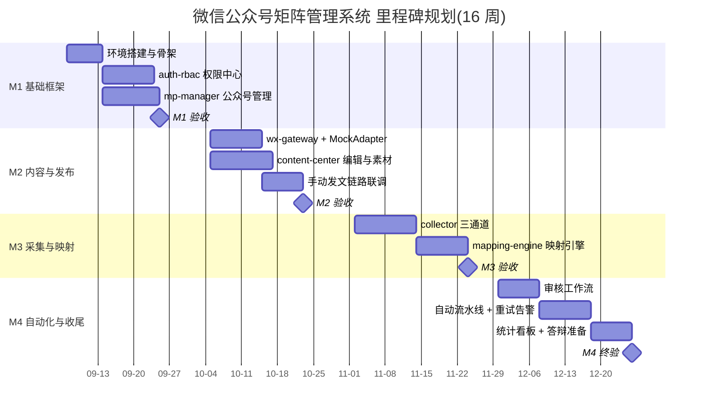

**实施建议**:每阶段末安排一次课堂验收(演示 + 代码走查);M2 是全课题的技术分水岭(状态机 + Celery + 中控 token),建议教师在该阶段提供参考实现片段;测试(pytest + MockAdapter)从 M2 起纳入验收标准,目标核心链路覆盖率 ≥ 60%。

### 8.4 可选扩展方向

供学有余力的小组选做,均不改动核心架构:

1. **数据统计看板**:基于 `publish_log`、`collect_article`、`audit_record` 做多维统计(各号发布量/成功率趋势、采集源产能、审核通过率、运营工作量),前端用 ECharts;进阶可接入微信图文分析接口(`/datacube` 系列,需认证号)拉取阅读量,教学环境用 Mock 数据代替。
2. **AI 标题/摘要辅助**:在 TRANSFORMED → PENDING_REVIEW 之间增加可选的 LLM 辅助环节,为审核人生成候选标题与摘要(仅"辅助建议、人工确认",不做正文改写,避免滑向洗稿);工程上练习异步调用、超时降级与 prompt 版本管理。
3. **多平台分发**:将 publish-engine 的适配器模式推广为 `PlatformAdapter`,扩展头条号/百家号/知乎等开放 API 平台(同样仅走官方 API、遵守各平台规范),练习"一份 `content_article`,多平台发布任务扇出"的架构抽象;每个新平台复用统一状态机与 `publish_task/publish_log` 表结构。

## 附录A 全局字典

> 本附录为全书统一口径的速查汇总,不展开实现细节;详细 DDL 见第2章,权限校验实现见第3章,重试与发布闭环见第7章。凡与正文表述不一致处,以本附录(即全局裁决)为准。

### A.1 数据表总览(18 张)

| # | 表名 | 一句话用途 | 属主模块 |
|---|---|---|---|
| 1 | sys_user | 系统用户账号(登录名、bcrypt 密码哈希、启用状态) | auth-rbac |
| 2 | sys_role | 角色定义(role_code;权限映射固化为代码常量,不存 perms_json) | auth-rbac |
| 3 | sys_user_role | 用户-角色多对多关系(代理主键 + 唯一键 + 外键) | auth-rbac |
| 4 | mp_account | 公众号档案(app_id、app_secret_cipher、account_type、need_review、key_version 等) | mp-manager |
| 5 | mp_account_assign | 运营-公众号分配(perm_level 数据权限 + deleted_flag 软删占位) | mp-manager |
| 6 | collect_source | 采集源配置(adapter_type/config_json/cursor_json/interval + 熔断态 + whitelist_confirmed/auth_proof_url) | collector |
| 7 | collect_article | 采集文章池(url_hash 精确去重 + simhash 生成列分段索引近似去重) | collector |
| 8 | content_article | 自有图文(绑定目标号;承载审核状态、draft_media_id、suggested_publish_at) | content-center |
| 9 | content_material | 本地素材(与号无关,file_hash 用 SHA-256 去重) | content-center |
| 10 | content_material_wx_ref | 素材在某公众号的微信侧引用(media_id/wx_url,按 (mp_account_id, file_hash) 去重) | content-center |
| 11 | content_draft_group | 多图文组(组内文章按 position 排序,含组状态) | content-center |
| 12 | content_style_template | 排版样式模板 | content-center |
| 13 | content_article_version | 文章内容版本历史 | content-center |
| 14 | mapping_rule | 映射规则主表(target_mp_account_id + 匹配/转换/排期策略 JSON + priority + enabled) | mapping-engine |
| 15 | mapping_rule_source | 规则-采集源关联表(多源→一目标;唯一键 (rule_id, source_id)) | mapping-engine |
| 16 | publish_task | 发布任务(scheduled_at、biz_key 幂等键、dispatched、publish_id 回执、draft_group_id) | publish-engine |
| 17 | publish_log | 发布流水日志(只追加,脱敏留痕) | publish-engine |
| 18 | audit_record | 审核留痕(含自动过审 action=AUTO_APPROVE、auditor_id=0;只追加) | content-center(审核) |

### A.2 状态机枚举与合法迁移总表

状态全集(任何模块不得私自增删):`COLLECTED, UNMATCHED, MAPPED, TRANSFORMED, PENDING_REVIEW, APPROVED, REJECTED, DRAFT_CREATED, SCHEDULED, PUBLISHING, PUBLISHED, FAILED`

| 状态 | 属主表 | 合法迁移(迁出) | 触发者 |
|---|---|---|---|
| COLLECTED | collect_article | → MAPPED(规则命中);→ UNMATCHED(无规则命中,或 is_original=1 且 whitelist_confirmed=0 被拦截) | mapping-engine 匹配任务 |
| UNMATCHED | collect_article | 无(终态,附拦截原因) | — |
| MAPPED | collect_article | → TRANSFORMED(转换完成,产出 content_article) | mapping-engine 转换任务 |
| TRANSFORMED | content_article | → PENDING_REVIEW(提审);→ APPROVED(审核开关关闭时自动过审) | 运营提审 / 系统自动过审(留痕 AUTO_APPROVE) |
| PENDING_REVIEW | content_article | → APPROVED;→ REJECTED | 审核人(content:article:audit) |
| APPROVED | content_article | → DRAFT_CREATED(草稿建成,draft_media_id 回填 content_article) | publish-engine 建草稿成功 |
| REJECTED | content_article | 无(终态) | — |
| DRAFT_CREATED | content_article | 无(后续流转由 publish_task 承载) | — |
| SCHEDULED | publish_task | → PUBLISHING | 调度器到点投递 execute_publish |
| PUBLISHING | publish_task | → PUBLISHED;→ FAILED | 微信接口调用结果 / freepublish 轮询 |
| PUBLISHED | publish_task | 无(终态) | — |
| FAILED | publish_task | → SCHEDULED(重试;不回 APPROVED、不重复建稿) | 自动重试(指数退避)或人工重试(publish:task:manage) |

补充口径:人工编排的自有文章直接在 content_article 以草稿态创建,从 PENDING_REVIEW 起点进入,与采集流汇合;publish_task 仅在 content_article 达到 APPROVED 后创建,排期时间取 suggested_publish_at 建议值。

### A.3 角色与权限点字典

#### A.3.1 权限点字典(格式 `域:资源:动作`,各章 API 清单"权限要求"列统一引用)

| 权限点编码 | 含义 |
|---|---|
| mp:account:view | 公众号档案查看 |
| mp:account:manage | 公众号新增/编辑/停用等管理 |
| user:manage | 用户与角色管理 |
| user:assign | 运营-公众号分配管理 |
| content:article:view | 图文查看 |
| content:article:edit | 图文编辑 |
| content:article:submit | 图文提审 |
| content:article:audit | 图文审核(通过/驳回) |
| content:article:delete | 图文删除 |
| content:material:view | 素材查看 |
| content:material:upload | 素材上传 |
| content:template:manage | 排版模板管理 |
| collect:source:view | 采集源查看 |
| collect:source:manage | 采集源管理 |
| collect:article:view | 采集文章查看 |
| mapping:rule:view | 映射规则查看 |
| mapping:rule:manage | 映射规则管理 |
| publish:task:view | 发布任务查看 |
| publish:task:manage | 发布任务创建/取消/重试 |
| publish:log:view | 发布日志查看 |
| system:config:manage | 全局配置管理(审核开关等,仅 super_admin) |

#### A.3.2 角色-权限矩阵(五角色,权限映射固化为代码常量)

| 权限点 | super_admin | admin | chief_editor | auditor | operator |
|---|---|---|---|---|---|
| mp:account:view | ✓ | ✓ | ✓ | — | — |
| mp:account:manage | ✓ | ✓ | — | — | — |
| user:manage | ✓ | ✓ | — | — | — |
| user:assign | ✓ | ✓ | — | — | — |
| content:article:view | ✓ | ✓ | ✓ | ✓ | ✓ |
| content:article:edit | ✓ | ✓ | ✓ | — | ✓ |
| content:article:submit | ✓ | ✓ | ✓ | — | ✓ |
| content:article:audit | ✓ | ✓ | ✓ | ✓ | — |
| content:article:delete | ✓ | ✓ | ✓ | — | — |
| content:material:view | ✓ | ✓ | ✓ | — | ✓ |
| content:material:upload | ✓ | ✓ | ✓ | — | ✓ |
| content:template:manage | ✓ | ✓ | ✓ | — | — |
| collect:source:view | ✓ | ✓ | ✓ | — | — |
| collect:source:manage | ✓ | ✓ | ✓ | — | — |
| collect:article:view | ✓ | ✓ | ✓ | — | ✓ |
| mapping:rule:view | ✓ | ✓ | ✓ | — | — |
| mapping:rule:manage | ✓ | ✓ | ✓ | — | — |
| publish:task:view | ✓ | ✓ | ✓ | — | ✓ |
| publish:task:manage | ✓ | ✓ | ✓ | — | — |
| publish:log:view | ✓ | ✓ | ✓ | ✓ | — |
| system:config:manage | ✓ | — | — | — | — |

数据范围口径:`super_admin / admin / chief_editor / auditor` 对全部公众号可见(角色特权);`operator` 仅见被分配号(mp_account_assign,查询恒加 `deleted_flag=0`),且号内操作受 `perm_level` 约束(1=只读,2=可编辑,3=可提审,4=可发布,逐级包含,校验为 `perm_level >= need_level`)。

### A.4 REST API 前缀总表

| 模块 | 前缀 | 备注 |
|---|---|---|
| auth-rbac | `/api/v1/auth/*`、`/api/v1/users/*`、`/api/v1/roles/*` | 登录/令牌、用户与角色管理 |
| mp-manager | `/api/v1/mp/*` | accounts / assigns |
| collector | `/api/v1/collect/*` | sources / articles |
| content-center | `/api/v1/articles/*`、`/api/v1/materials/*`、`/api/v1/templates/*`、`/api/v1/draft-groups/*` | 审核接口统一为 `POST /api/v1/articles/{id}/audit` |
| mapping-engine | `/api/v1/mapping/*` | rules / executions(全书统一为此前缀) |
| publish-engine | `/api/v1/publish/*` | tasks / logs;`/api/v1/publish/review/*` 三个接口已删除,审核归 content-center |
| 全局配置 | `/api/v1/system/*` | 审核总开关等,仅 super_admin |

### A.5 Celery 任务 → 队列对照表

Worker 启动命令:`celery -A app.celery_app worker -Q collect,mapping,publish,wxapi -c 4`

| 任务 | 队列 |
|---|---|
| collect_scan(Beat 每 5 分钟扫描 interval 到期采集源) | collect |
| collect_fetch(单源抓取) | collect |
| match_article(规则匹配) | mapping |
| transform_article(内容转换) | mapping |
| execute_publish(建草稿 + 发布提交) | publish |
| poll_publish_result(freepublish/get 轮询) | publish |
| access_token 预刷新及微信重调用类任务 | wxapi |

### A.6 关键参数速查

| 参数 | 取值 |
|---|---|
| access_token 缓存 | 仅存 Redis,TTL = `expires_in - 300`(约 6900s);不落 MySQL、不进日志 |
| 发布重试 | `max_retry=5`;指数退避 60s 起步、2 倍递增、封顶 3600s;重试迁移 FAILED → SCHEDULED |
| AppSecret 加密 | AES-256-GCM;主密钥环境变量 `MP_SECRET_MASTER_KEY`(base64);AAD = app_id;`key_version` 支持轮换 |
| 群发配额 | 仅认证号可用群发接口;认证订阅号 1 次/天,认证服务号 4 次/月 |
| 草稿容量 | 单次 `/cgi-bin/draft/add` ≤ 8 篇图文(多图文组按 position 排序一次提交,组内须全部 APPROVED) |
| 采集调度 | Beat 每 5 分钟扫描 `interval_minutes` 到期的采集源(附 jitter_seconds 抖动) |
| 审核开关 | 双层:全局 `PUBLISH_REVIEW_ENABLED` + 号级 `mp_account.need_review`,默认全开;仅 super_admin 可改;每次自动过审写 audit_record(action=AUTO_APPROVE, auditor_id=0) |
